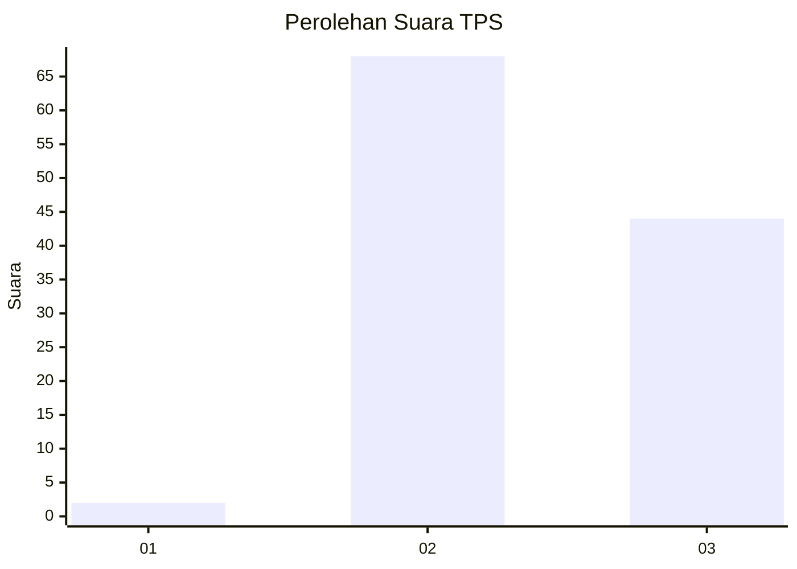
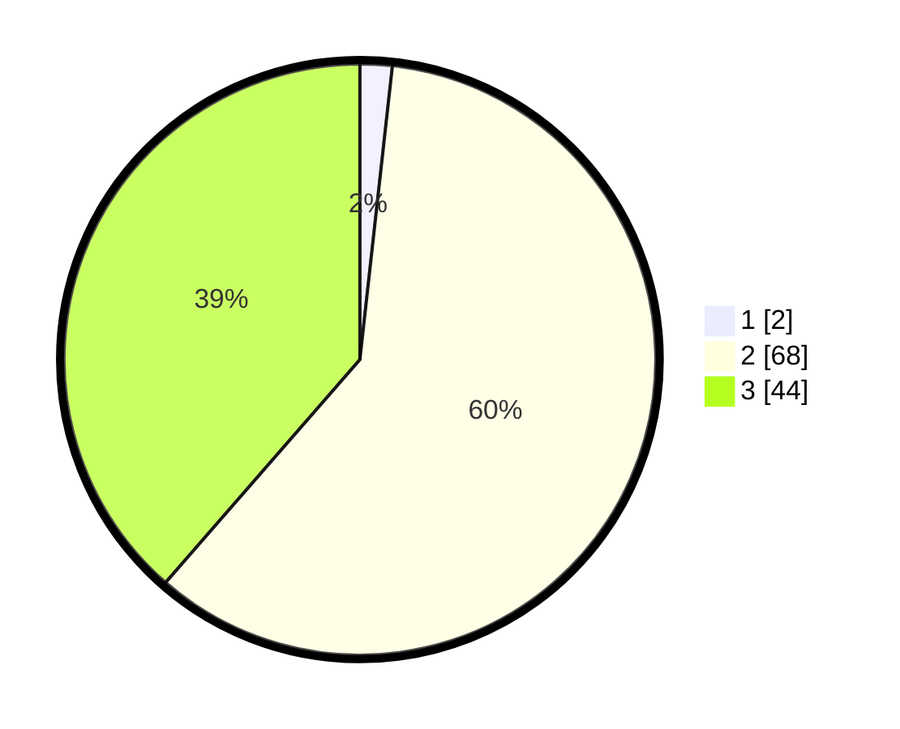

# Hasil

## Grafik

## Tabel

| No. | Nama Paslon    | Suara | Suara (raw) | Persentase |
|:--- |:-------------- | -----:| -----------:| ----------:|
| 1   | ANIES MUHAIMIN | 2     | [2][p-1]    | 1,75       |
| 2   | PRABOWO GIBRAN | 68    | [68][p-2]   | 59,65      |
| 3   | GANJAR MAHFUD  | 44    | [44][p-3]   | 38,60      |

[p-1]: https://github.com/gigit-pemilu/pemilu-2024-51-bali/blob/main/pilpres/hitung-suara/sub/51-bali/sub/07-karangasem/sub/07-selat/sub/2002-selat/sub/009-tps/sub/paslon-1.txt
[p-2]: https://github.com/gigit-pemilu/pemilu-2024-51-bali/blob/main/pilpres/hitung-suara/sub/51-bali/sub/07-karangasem/sub/07-selat/sub/2002-selat/sub/009-tps/sub/paslon-2.txt
[p-3]: https://github.com/gigit-pemilu/pemilu-2024-51-bali/blob/main/pilpres/hitung-suara/sub/51-bali/sub/07-karangasem/sub/07-selat/sub/2002-selat/sub/009-tps/sub/paslon-3.txt

## Foto C Plano

https://sirekap-obj-formc.kpu.go.id/5d63/pemilu/ppwp/51/07/07/20/02/5107072002009-20240214-223952--ca97bb1d-0c3b-4860-95cc-3da31112c5de.jpg

https://sirekap-obj-formc.kpu.go.id/5d63/pemilu/ppwp/51/07/07/20/02/5107072002009-20240214-224012--a785c832-9a26-4f34-8c1a-786848c8ea45.jpg

https://sirekap-obj-formc.kpu.go.id/5d63/pemilu/ppwp/51/07/07/20/02/5107072002009-20240214-224021--b7462bf8-431d-4cb2-b2b2-28ea245a1f8e.jpg

## Metadata

| Key        | Value               |
| ---------- | ------------------- |
| Time Stamp | 2024-02-15 15:00:29 |

## DATA PEMILIH TETAP

Jumlah pemilih dalam DPT: **147**.
 * L: **69**.
 * P: **78**.

## DATA PENGGUNA HAK PILIH

Jumlah pengguna hak pilih dalam DPT: **113**.
 * L: **55**.
 * P: **58**.

Jumlah pengguna hak pilih dalam DPTb: **0**.
 * L: **0**.
 * P: **0**.

Jumlah pengguna hak pilih dalam DPK: **3**.
 * L: **1**.
 * P: **2**.

Jumlah pengguna hak pilih: **116**.
 * L: **56**.
 * P: **60**.

## JUMLAH SUARA SAH DAN TIDAK SAH

JUMLAH SELURUH SUARA SAH: **114**.

JUMLAH SUARA TIDAK SAH: **2**.

JUMLAH SELURUH SUARA SAH DAN SUARA TIDAK SAH: **116**.

