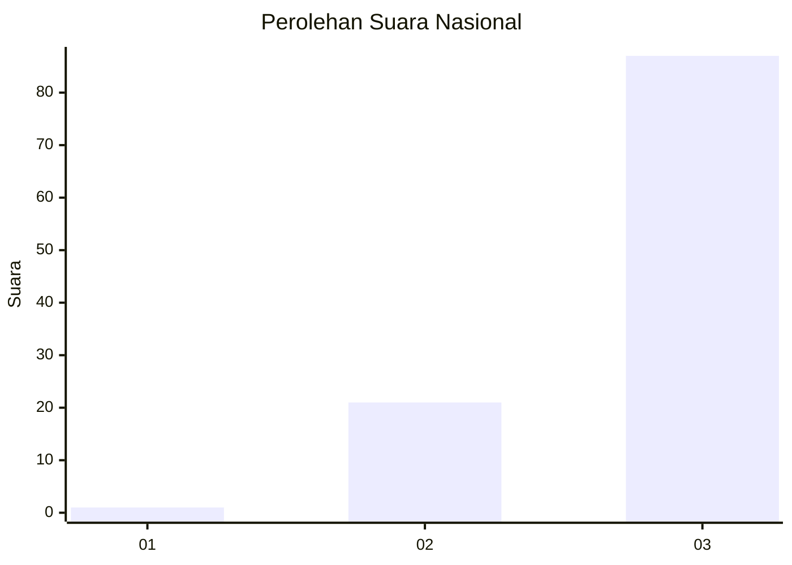
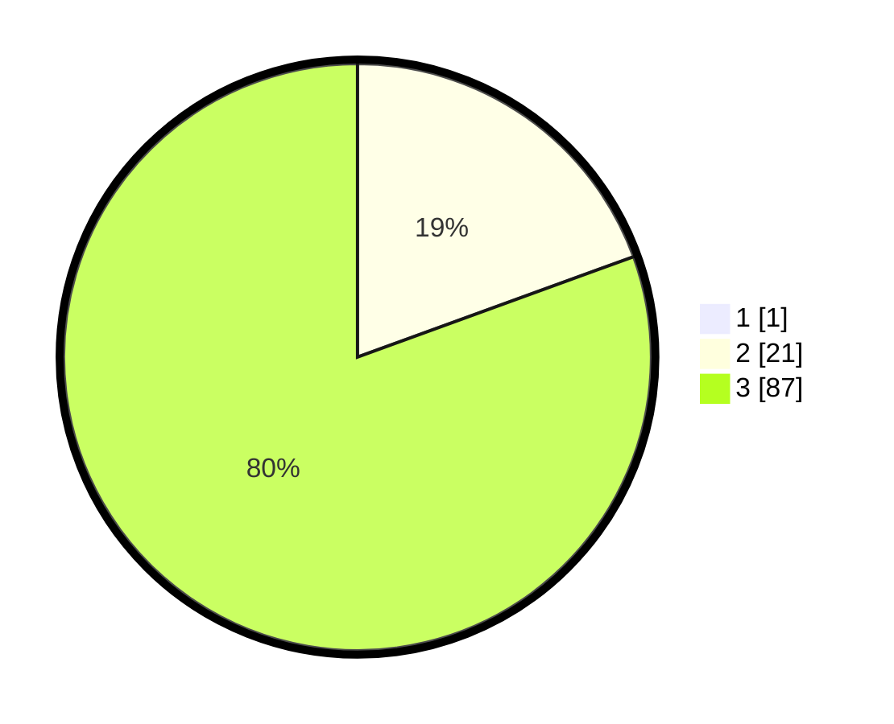

# Hasil

## Grafik

## Tabel

| No. | Nama Paslon    | Suara | Suara (raw) | Persentase |
|:--- |:-------------- | -----:| -----------:| ----------:|
| 1   | ANIES MUHAIMIN | 1     | [1][p-1]    | 0,92       |
| 2   | PRABOWO GIBRAN | 21    | [21][p-2]   | 19,27      |
| 3   | GANJAR MAHFUD  | 87    | [87][p-3]   | 79,82      |

[p-1]: https://github.com/gigit-pemilu/pemilu-2024/blob/main/pilpres/hitung-suara/sub/51-bali/sub/07-karangasem/sub/07-selat/sub/2002-selat/sub/010-tps/sub/paslon-1.txt
[p-2]: https://github.com/gigit-pemilu/pemilu-2024/blob/main/pilpres/hitung-suara/sub/51-bali/sub/07-karangasem/sub/07-selat/sub/2002-selat/sub/010-tps/sub/paslon-2.txt
[p-3]: https://github.com/gigit-pemilu/pemilu-2024/blob/main/pilpres/hitung-suara/sub/51-bali/sub/07-karangasem/sub/07-selat/sub/2002-selat/sub/010-tps/sub/paslon-3.txt

## Foto C Plano

https://sirekap-obj-formc.kpu.go.id/33f7/pemilu/ppwp/51/07/07/20/02/5107072002010-20240214-140944--e490ab94-ab8b-4688-b0a9-7d201093b543.jpg

https://sirekap-obj-formc.kpu.go.id/33f7/pemilu/ppwp/51/07/07/20/02/5107072002010-20240214-141054--594a5646-3fff-45b9-b3c3-882af24a79fb.jpg

https://sirekap-obj-formc.kpu.go.id/33f7/pemilu/ppwp/51/07/07/20/02/5107072002010-20240214-141246--9a247f74-71f6-467c-aefd-146b0b7af27a.jpg

## Metadata

| Key        | Value               |
| ---------- | ------------------- |
| Time Stamp | 2024-02-15 21:01:18 |

## DATA PEMILIH TETAP

Jumlah pemilih dalam DPT: **143**.
 * L: **70**.
 * P: **73**.

## DATA PENGGUNA HAK PILIH

Jumlah pengguna hak pilih dalam DPT: **120**.
 * L: **58**.
 * P: **62**.

Jumlah pengguna hak pilih dalam DPTb: **0**.
 * L: **0**.
 * P: **0**.

Jumlah pengguna hak pilih dalam DPK: **0**.
 * L: **0**.
 * P: **0**.

Jumlah pengguna hak pilih: **120**.
 * L: **58**.
 * P: **62**.

## JUMLAH SUARA SAH DAN TIDAK SAH

JUMLAH SELURUH SUARA SAH: **109**.

JUMLAH SUARA TIDAK SAH: **11**.

JUMLAH SELURUH SUARA SAH DAN SUARA TIDAK SAH: **120**.

