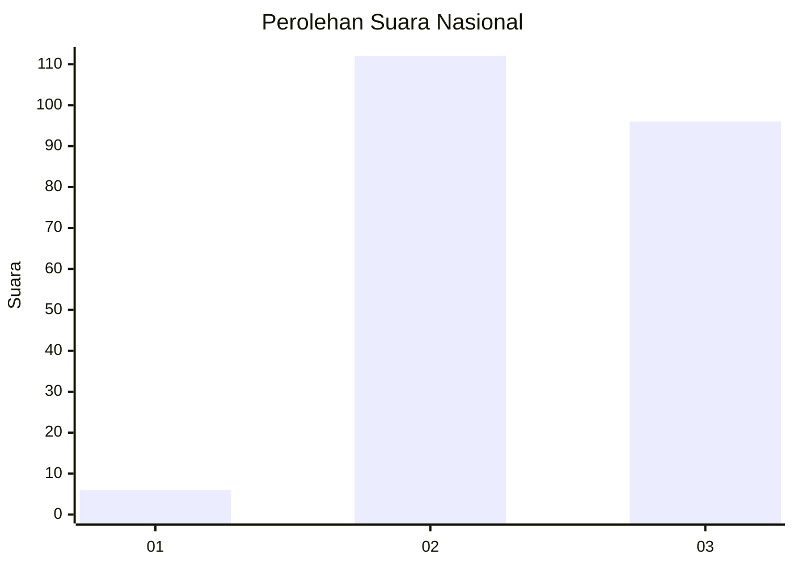
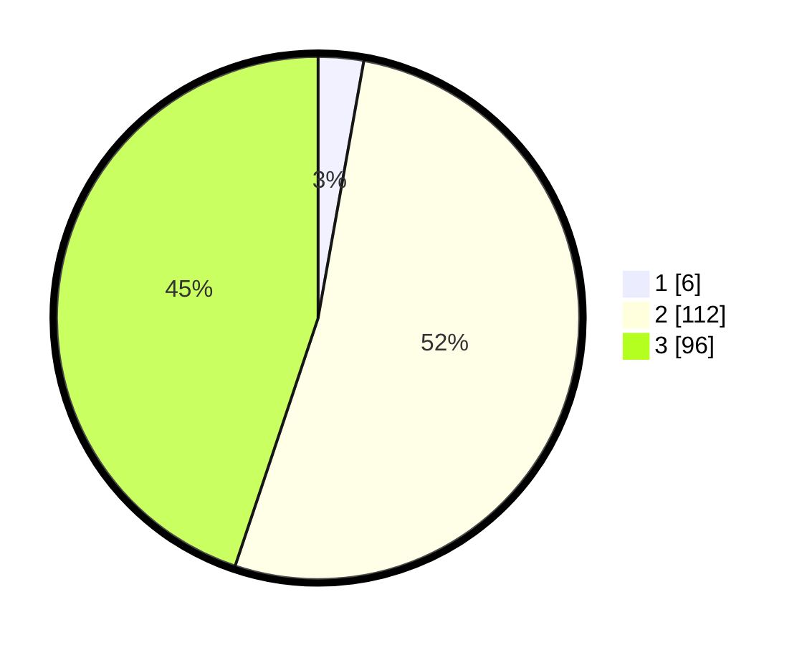

# Hasil

## Grafik

## Tabel

| No. | Nama Paslon    | Suara | Suara (raw) | Persentase |
|:--- |:-------------- | -----:| -----------:| ----------:|
| 1   | ANIES MUHAIMIN | 6     | [6][p-1]    | 2,80       |
| 2   | PRABOWO GIBRAN | 112   | [112][p-2]  | 52,34      |
| 3   | GANJAR MAHFUD  | 96    | [96][p-3]   | 44,86      |

[p-1]: https://github.com/gigit-pemilu/pemilu-2024/blob/main/pilpres/hitung-suara/sub/51-bali/sub/07-karangasem/sub/07-selat/sub/2003-duda/sub/005-tps/sub/paslon-1.txt
[p-2]: https://github.com/gigit-pemilu/pemilu-2024/blob/main/pilpres/hitung-suara/sub/51-bali/sub/07-karangasem/sub/07-selat/sub/2003-duda/sub/005-tps/sub/paslon-2.txt
[p-3]: https://github.com/gigit-pemilu/pemilu-2024/blob/main/pilpres/hitung-suara/sub/51-bali/sub/07-karangasem/sub/07-selat/sub/2003-duda/sub/005-tps/sub/paslon-3.txt

## Foto C Plano

https://sirekap-obj-formc.kpu.go.id/3e82/pemilu/ppwp/51/07/07/20/03/5107072003005-20240214-133015--37e278fb-3ad3-4dbf-8193-84f0d2420d3f.jpg

https://sirekap-obj-formc.kpu.go.id/3e82/pemilu/ppwp/51/07/07/20/03/5107072003005-20240214-132902--b6c830ce-faec-47a0-a85f-4e67d4a772ac.jpg

https://sirekap-obj-formc.kpu.go.id/3e82/pemilu/ppwp/51/07/07/20/03/5107072003005-20240214-133354--008efb58-1b78-4a46-9152-ac59d0aa01bf.jpg

## Metadata

| Key        | Value               |
| ---------- | ------------------- |
| Time Stamp | 2024-02-19 06:16:00 |

