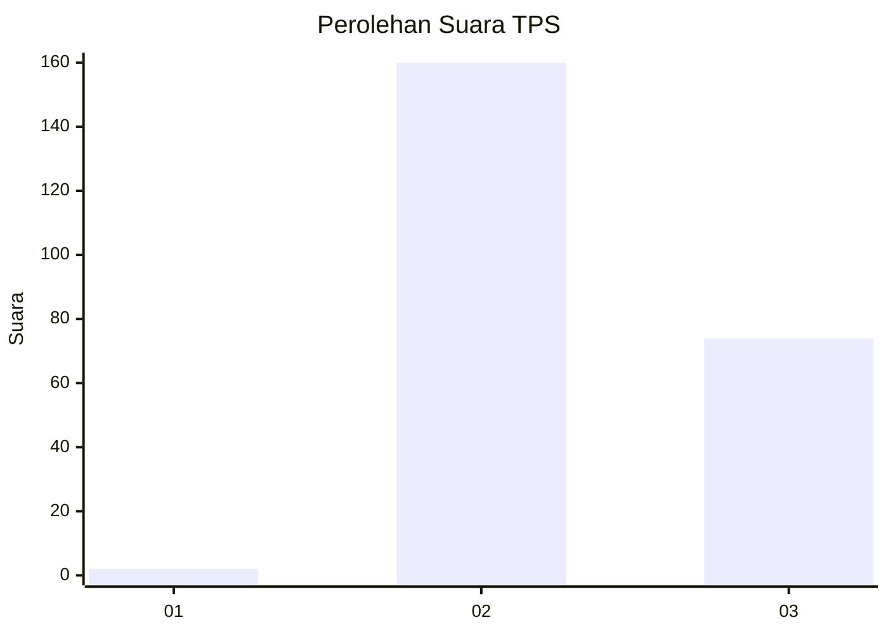
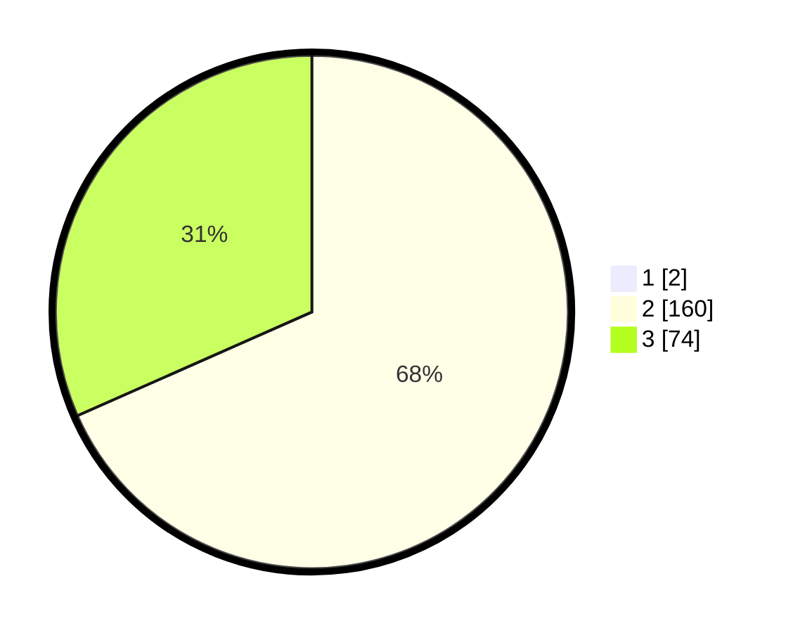

# Hasil

## Grafik

## Tabel

| No. | Nama Paslon    | Suara | Suara (raw) | Persentase |
|:--- |:-------------- | -----:| -----------:| ----------:|
| 1   | ANIES MUHAIMIN | 2     | [2][p-1]    | 0,85       |
| 2   | PRABOWO GIBRAN | 160   | [160][p-2]  | 67,80      |
| 3   | GANJAR MAHFUD  | 74    | [74][p-3]   | 31,36      |

[p-1]: https://github.com/gigit-pemilu/pemilu-2024-51-bali/blob/main/pilpres/hitung-suara/sub/51-bali/sub/07-karangasem/sub/07-selat/sub/2003-duda/sub/016-tps/sub/paslon-1.txt
[p-2]: https://github.com/gigit-pemilu/pemilu-2024-51-bali/blob/main/pilpres/hitung-suara/sub/51-bali/sub/07-karangasem/sub/07-selat/sub/2003-duda/sub/016-tps/sub/paslon-2.txt
[p-3]: https://github.com/gigit-pemilu/pemilu-2024-51-bali/blob/main/pilpres/hitung-suara/sub/51-bali/sub/07-karangasem/sub/07-selat/sub/2003-duda/sub/016-tps/sub/paslon-3.txt

## Foto C Plano

https://sirekap-obj-formc.kpu.go.id/4b5b/pemilu/ppwp/51/07/07/20/03/5107072003016-20240215-100427--4b83d701-f233-46f0-bfb4-958d8051bd55.jpg

https://sirekap-obj-formc.kpu.go.id/4b5b/pemilu/ppwp/51/07/07/20/03/5107072003016-20240215-145858--853bd094-bd80-4886-b030-9f5378d802e3.jpg

https://sirekap-obj-formc.kpu.go.id/4b5b/pemilu/ppwp/51/07/07/20/03/5107072003016-20240215-145919--79a640ad-f6c0-49db-905f-3b84349392dc.jpg

## Metadata

| Key        | Value               |
| ---------- | ------------------- |
| Time Stamp | 2024-02-19 06:16:00 |

