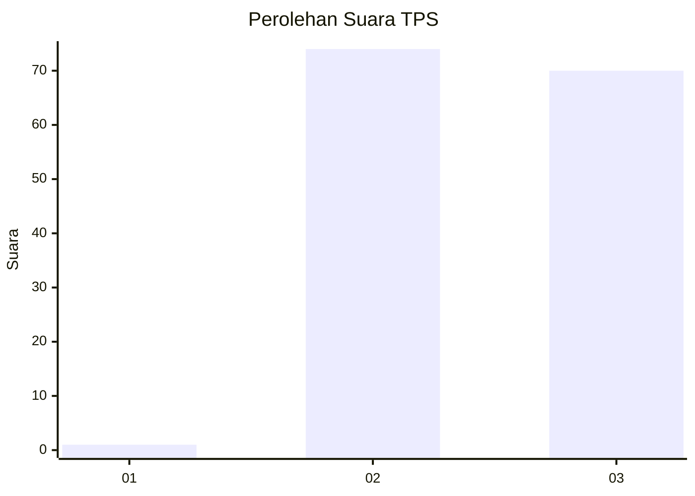
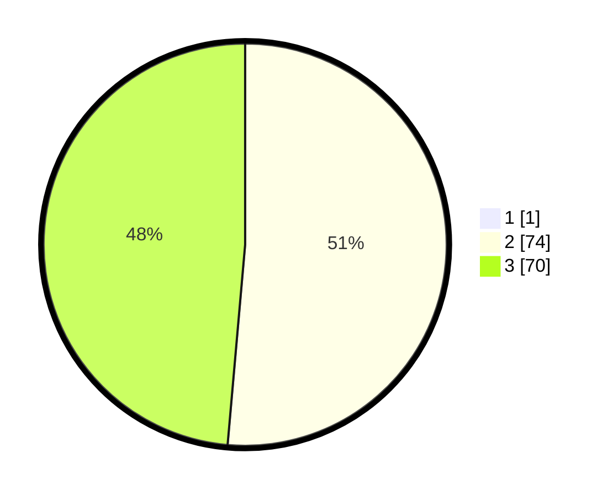

# Hasil

## Grafik

## Tabel

| No. | Nama Paslon    | Suara | Suara (raw) | Persentase |
|:--- |:-------------- | -----:| -----------:| ----------:|
| 1   | ANIES MUHAIMIN | 1     | [1][p-1]    | 0,69       |
| 2   | PRABOWO GIBRAN | 74    | [74][p-2]   | 51,03      |
| 3   | GANJAR MAHFUD  | 70    | [70][p-3]   | 48,28      |

[p-1]: https://github.com/gigit-pemilu/pemilu-2024-51-bali/blob/main/pilpres/hitung-suara/sub/51-bali/sub/07-karangasem/sub/07-selat/sub/2004-sebudi/sub/008-tps/sub/paslon-1.txt
[p-2]: https://github.com/gigit-pemilu/pemilu-2024-51-bali/blob/main/pilpres/hitung-suara/sub/51-bali/sub/07-karangasem/sub/07-selat/sub/2004-sebudi/sub/008-tps/sub/paslon-2.txt
[p-3]: https://github.com/gigit-pemilu/pemilu-2024-51-bali/blob/main/pilpres/hitung-suara/sub/51-bali/sub/07-karangasem/sub/07-selat/sub/2004-sebudi/sub/008-tps/sub/paslon-3.txt

## Foto C Plano

https://sirekap-obj-formc.kpu.go.id/2f27/pemilu/ppwp/51/07/07/20/04/5107072004008-20240214-131551--e946bf6b-b042-4bbf-b90a-91456a10429d.jpg

https://sirekap-obj-formc.kpu.go.id/2f27/pemilu/ppwp/51/07/07/20/04/5107072004008-20240214-131420--2f8a37c8-047b-4432-9729-7ec04bf28a1e.jpg

https://sirekap-obj-formc.kpu.go.id/2f27/pemilu/ppwp/51/07/07/20/04/5107072004008-20240214-131846--56560d54-4ab9-4301-9b2f-3a1ab91efe20.jpg

## Metadata

| Key        | Value               |
| ---------- | ------------------- |
| Time Stamp | 2024-02-14 21:46:01 |

## DATA PEMILIH TETAP

Jumlah pemilih dalam DPT: **146**.
 * L: **62**.
 * P: **84**.

## DATA PENGGUNA HAK PILIH

Jumlah pengguna hak pilih dalam DPT: **144**.
 * L: **61**.
 * P: **83**.

Jumlah pengguna hak pilih dalam DPTb: **1**.
 * L: **1**.
 * P: **0**.

Jumlah pengguna hak pilih dalam DPK: **0**.
 * L: **0**.
 * P: **0**.

Jumlah pengguna hak pilih: **145**.
 * L: **62**.
 * P: **83**.

## JUMLAH SUARA SAH DAN TIDAK SAH

JUMLAH SELURUH SUARA SAH: **145**.

JUMLAH SUARA TIDAK SAH: **0**.

JUMLAH SELURUH SUARA SAH DAN SUARA TIDAK SAH: **145**.

