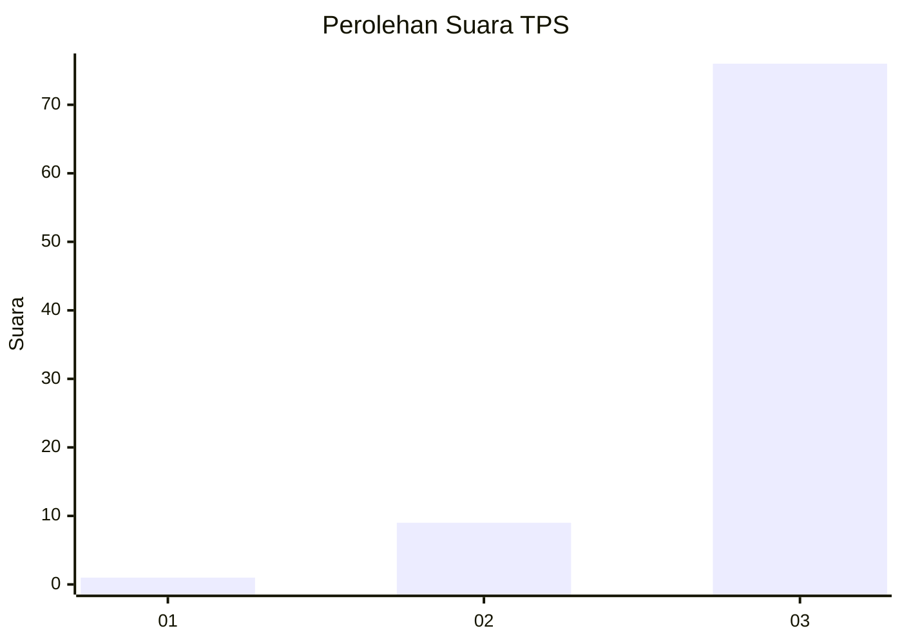
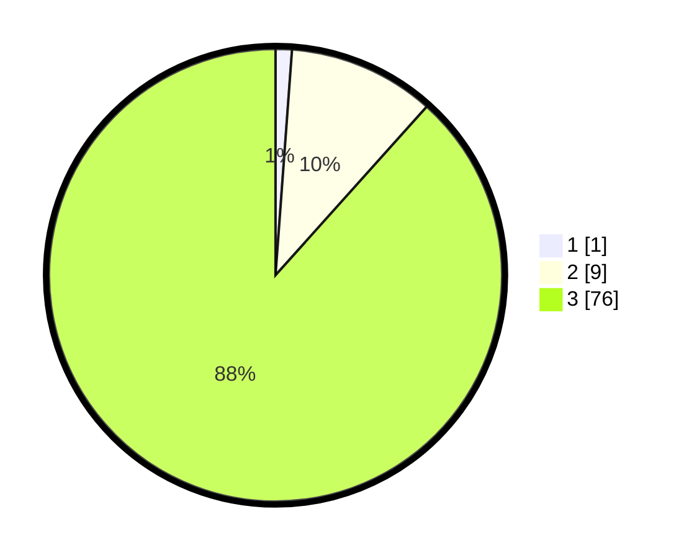

# Hasil

## Grafik

## Tabel

| No. | Nama Paslon    | Suara | Suara (raw) | Persentase |
|:--- |:-------------- | -----:| -----------:| ----------:|
| 1   | ANIES MUHAIMIN | 1     | [1][p-1]    | 1,16       |
| 2   | PRABOWO GIBRAN | 9     | [9][p-2]    | 10,47      |
| 3   | GANJAR MAHFUD  | 76    | [76][p-3]   | 88,37      |

[p-1]: https://github.com/gigit-pemilu/pemilu-2024-51-bali/blob/main/pilpres/hitung-suara/sub/51-bali/sub/07-karangasem/sub/07-selat/sub/2005-duda-utara/sub/002-tps/sub/paslon-1.txt
[p-2]: https://github.com/gigit-pemilu/pemilu-2024-51-bali/blob/main/pilpres/hitung-suara/sub/51-bali/sub/07-karangasem/sub/07-selat/sub/2005-duda-utara/sub/002-tps/sub/paslon-2.txt
[p-3]: https://github.com/gigit-pemilu/pemilu-2024-51-bali/blob/main/pilpres/hitung-suara/sub/51-bali/sub/07-karangasem/sub/07-selat/sub/2005-duda-utara/sub/002-tps/sub/paslon-3.txt

## Foto C Plano

https://sirekap-obj-formc.kpu.go.id/a406/pemilu/ppwp/51/07/07/20/05/5107072005002-20240214-131132--5a1d854e-63bf-4cdb-8a88-faf3eb277d2d.jpg

https://sirekap-obj-formc.kpu.go.id/a406/pemilu/ppwp/51/07/07/20/05/5107072005002-20240214-131351--99b26481-40d3-4d19-8a11-301f8ebcbdca.jpg

https://sirekap-obj-formc.kpu.go.id/a406/pemilu/ppwp/51/07/07/20/05/5107072005002-20240214-130937--0ed5f988-d85c-46e8-b8cc-364c674390d8.jpg

## Metadata

| Key        | Value               |
| ---------- | ------------------- |
| Time Stamp | 2024-02-24 22:31:28 |

