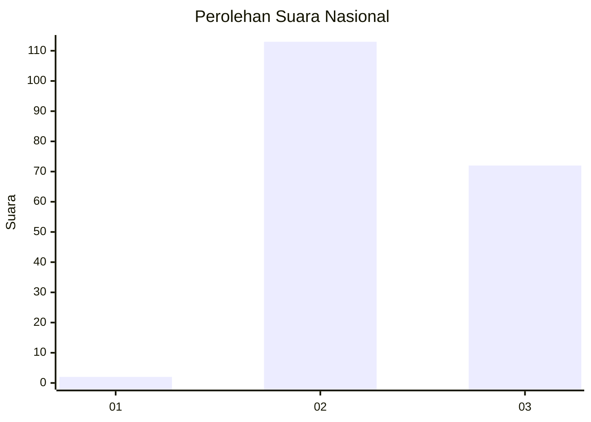
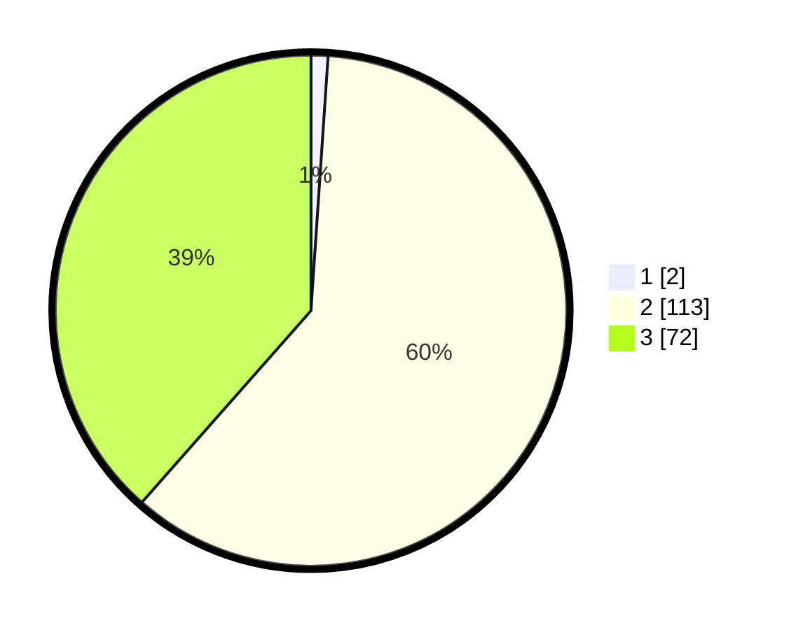

# Hasil

## Grafik

## Tabel

| No. | Nama Paslon    | Suara | Suara (raw) | Persentase |
|:--- |:-------------- | -----:| -----------:| ----------:|
| 1   | ANIES MUHAIMIN | 2     | [2][p-1]    | 1,07       |
| 2   | PRABOWO GIBRAN | 113   | [113][p-2]  | 60,43      |
| 3   | GANJAR MAHFUD  | 72    | [72][p-3]   | 38,50      |

[p-1]: https://github.com/gigit-pemilu/pemilu-2024/blob/main/pilpres/hitung-suara/sub/51-bali/sub/07-karangasem/sub/07-selat/sub/2005-duda-utara/sub/003-tps/sub/paslon-1.txt
[p-2]: https://github.com/gigit-pemilu/pemilu-2024/blob/main/pilpres/hitung-suara/sub/51-bali/sub/07-karangasem/sub/07-selat/sub/2005-duda-utara/sub/003-tps/sub/paslon-2.txt
[p-3]: https://github.com/gigit-pemilu/pemilu-2024/blob/main/pilpres/hitung-suara/sub/51-bali/sub/07-karangasem/sub/07-selat/sub/2005-duda-utara/sub/003-tps/sub/paslon-3.txt

## Foto C Plano

https://sirekap-obj-formc.kpu.go.id/28e3/pemilu/ppwp/51/07/07/20/05/5107072005003-20240214-205620--03675beb-0390-42db-bbe9-d144f77bd586.jpg

https://sirekap-obj-formc.kpu.go.id/28e3/pemilu/ppwp/51/07/07/20/05/5107072005003-20240214-205420--b8c59024-ad08-4002-87c8-b00e7cc8bd2e.jpg

https://sirekap-obj-formc.kpu.go.id/28e3/pemilu/ppwp/51/07/07/20/05/5107072005003-20240214-205621--862aa4cb-3b77-4b24-8a95-be96a4f56dfc.jpg

## Metadata

| Key        | Value               |
| ---------- | ------------------- |
| Time Stamp | 2024-02-15 00:41:44 |

## DATA PEMILIH TETAP

Jumlah pemilih dalam DPT: **219**.
 * L: **116**.
 * P: **103**.

## DATA PENGGUNA HAK PILIH

Jumlah pengguna hak pilih dalam DPT: **190**.
 * L: **103**.
 * P: **87**.

Jumlah pengguna hak pilih dalam DPTb: **2**.
 * L: **1**.
 * P: **1**.

Jumlah pengguna hak pilih dalam DPK: **0**.
 * L: **0**.
 * P: **0**.

Jumlah pengguna hak pilih: **192**.
 * L: **104**.
 * P: **88**.

## JUMLAH SUARA SAH DAN TIDAK SAH

JUMLAH SELURUH SUARA SAH: **187**.

JUMLAH SUARA TIDAK SAH: **5**.

JUMLAH SELURUH SUARA SAH DAN SUARA TIDAK SAH: **192**.

