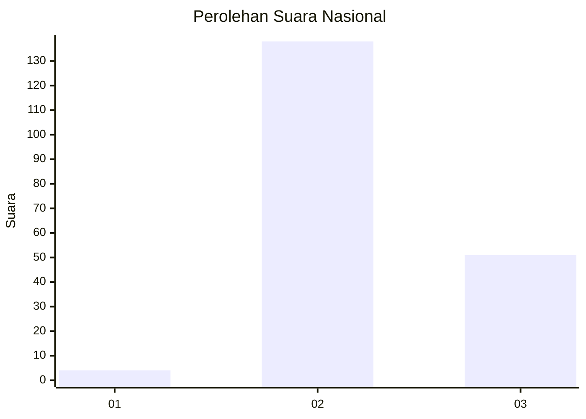
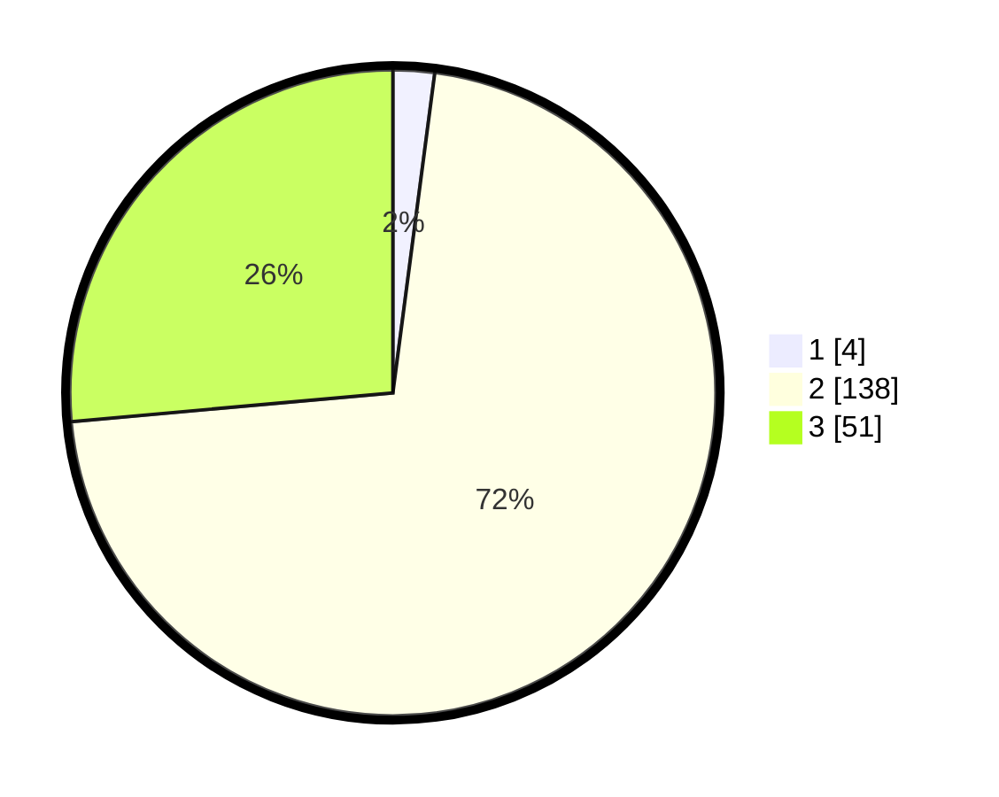

# Hasil

## Grafik

## Tabel

| No. | Nama Paslon    | Suara | Suara (raw) | Persentase |
|:--- |:-------------- | -----:| -----------:| ----------:|
| 1   | ANIES MUHAIMIN | 4     | [4][p-1]    | 2,07       |
| 2   | PRABOWO GIBRAN | 138   | [138][p-2]  | 71,50      |
| 3   | GANJAR MAHFUD  | 51    | [51][p-3]   | 26,42      |

[p-1]: https://github.com/gigit-pemilu/pemilu-2024/blob/main/pilpres/hitung-suara/sub/51-bali/sub/07-karangasem/sub/07-selat/sub/2005-duda-utara/sub/013-tps/sub/paslon-1.txt
[p-2]: https://github.com/gigit-pemilu/pemilu-2024/blob/main/pilpres/hitung-suara/sub/51-bali/sub/07-karangasem/sub/07-selat/sub/2005-duda-utara/sub/013-tps/sub/paslon-2.txt
[p-3]: https://github.com/gigit-pemilu/pemilu-2024/blob/main/pilpres/hitung-suara/sub/51-bali/sub/07-karangasem/sub/07-selat/sub/2005-duda-utara/sub/013-tps/sub/paslon-3.txt

## Foto C Plano

https://sirekap-obj-formc.kpu.go.id/fd69/pemilu/ppwp/51/07/07/20/05/5107072005013-20240214-224607--612e62d1-331f-4c9f-93f4-349c23a700f6.jpg

https://sirekap-obj-formc.kpu.go.id/fd69/pemilu/ppwp/51/07/07/20/05/5107072005013-20240214-224917--301d312d-88eb-48b0-bcca-57421b26f02a.jpg

https://sirekap-obj-formc.kpu.go.id/fd69/pemilu/ppwp/51/07/07/20/05/5107072005013-20240214-225008--abc72c3e-4e09-4408-9bc6-10430127b20b.jpg

## Metadata

| Key        | Value               |
| ---------- | ------------------- |
| Time Stamp | 2024-02-19 06:16:00 |

