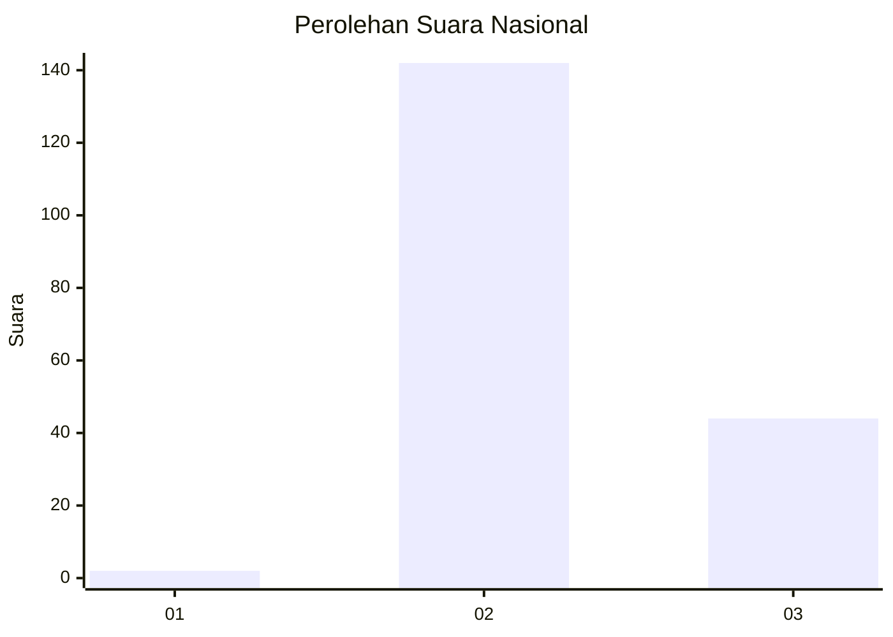
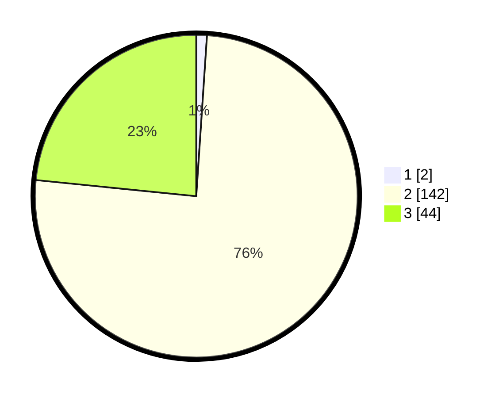

# Hasil

## Grafik

## Tabel

| No. | Nama Paslon    | Suara | Suara (raw) | Persentase |
|:--- |:-------------- | -----:| -----------:| ----------:|
| 1   | ANIES MUHAIMIN | 2     | [2][p-1]    | 1,06       |
| 2   | PRABOWO GIBRAN | 142   | [142][p-2]  | 75,53      |
| 3   | GANJAR MAHFUD  | 44    | [44][p-3]   | 23,40      |

[p-1]: https://github.com/gigit-pemilu/pemilu-2024/blob/main/pilpres/hitung-suara/sub/51-bali/sub/07-karangasem/sub/07-selat/sub/2005-duda-utara/sub/014-tps/sub/paslon-1.txt
[p-2]: https://github.com/gigit-pemilu/pemilu-2024/blob/main/pilpres/hitung-suara/sub/51-bali/sub/07-karangasem/sub/07-selat/sub/2005-duda-utara/sub/014-tps/sub/paslon-2.txt
[p-3]: https://github.com/gigit-pemilu/pemilu-2024/blob/main/pilpres/hitung-suara/sub/51-bali/sub/07-karangasem/sub/07-selat/sub/2005-duda-utara/sub/014-tps/sub/paslon-3.txt

## Foto C Plano

https://sirekap-obj-formc.kpu.go.id/cb69/pemilu/ppwp/51/07/07/20/05/5107072005014-20240215-023743--76f24d2b-a6f2-4290-a3bf-64bc6fb4d231.jpg

https://sirekap-obj-formc.kpu.go.id/cb69/pemilu/ppwp/51/07/07/20/05/5107072005014-20240215-023825--7ddd13d3-38bc-41cd-906b-e4c533467112.jpg

https://sirekap-obj-formc.kpu.go.id/cb69/pemilu/ppwp/51/07/07/20/05/5107072005014-20240215-023804--5b9b82ab-3c58-4ae1-a73b-c4b9e170651d.jpg

## Metadata

| Key        | Value               |
| ---------- | ------------------- |
| Time Stamp | 2024-02-19 06:16:00 |

