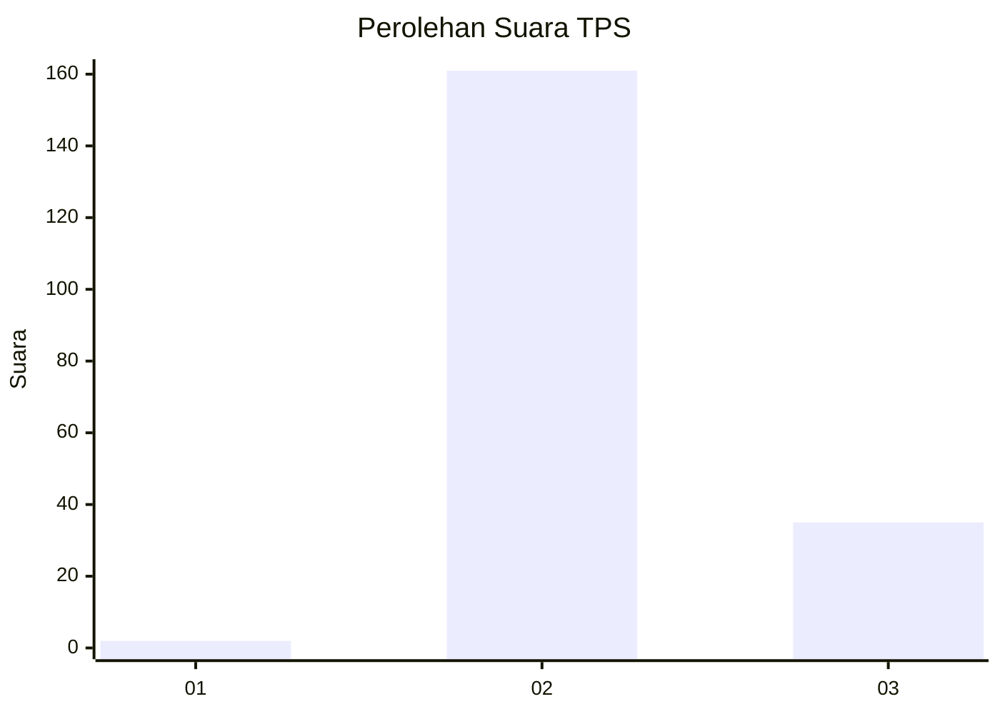
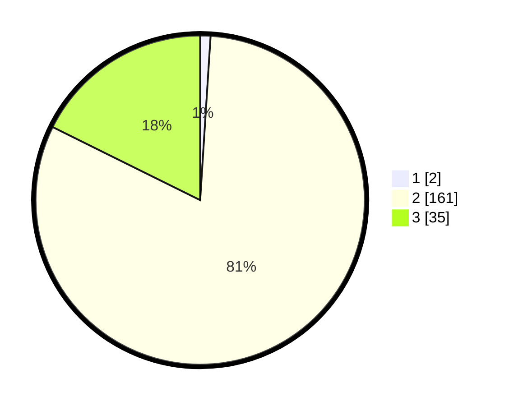

# Hasil

## Grafik

## Tabel

| No. | Nama Paslon    | Suara | Suara (raw) | Persentase |
|:--- |:-------------- | -----:| -----------:| ----------:|
| 1   | ANIES MUHAIMIN | 2     | [2][p-1]    | 1,01       |
| 2   | PRABOWO GIBRAN | 161   | [161][p-2]  | 81,31      |
| 3   | GANJAR MAHFUD  | 35    | [35][p-3]   | 17,68      |

[p-1]: https://github.com/gigit-pemilu/pemilu-2024-51-bali/blob/main/pilpres/hitung-suara/sub/51-bali/sub/07-karangasem/sub/07-selat/sub/2005-duda-utara/sub/021-tps/sub/paslon-1.txt
[p-2]: https://github.com/gigit-pemilu/pemilu-2024-51-bali/blob/main/pilpres/hitung-suara/sub/51-bali/sub/07-karangasem/sub/07-selat/sub/2005-duda-utara/sub/021-tps/sub/paslon-2.txt
[p-3]: https://github.com/gigit-pemilu/pemilu-2024-51-bali/blob/main/pilpres/hitung-suara/sub/51-bali/sub/07-karangasem/sub/07-selat/sub/2005-duda-utara/sub/021-tps/sub/paslon-3.txt

## Foto C Plano

https://sirekap-obj-formc.kpu.go.id/9cc0/pemilu/ppwp/51/07/07/20/05/5107072005021-20240214-214350--b26e1982-7b9d-4fe6-91ca-fb1532882fb7.jpg

https://sirekap-obj-formc.kpu.go.id/9cc0/pemilu/ppwp/51/07/07/20/05/5107072005021-20240214-214418--9282af6a-3396-4c1c-af45-cdbd8ee1c577.jpg

https://sirekap-obj-formc.kpu.go.id/9cc0/pemilu/ppwp/51/07/07/20/05/5107072005021-20240214-214427--4b51c4df-fad2-45ff-9325-114c72faf210.jpg

## Metadata

| Key        | Value               |
| ---------- | ------------------- |
| Time Stamp | 2024-02-19 06:16:00 |

