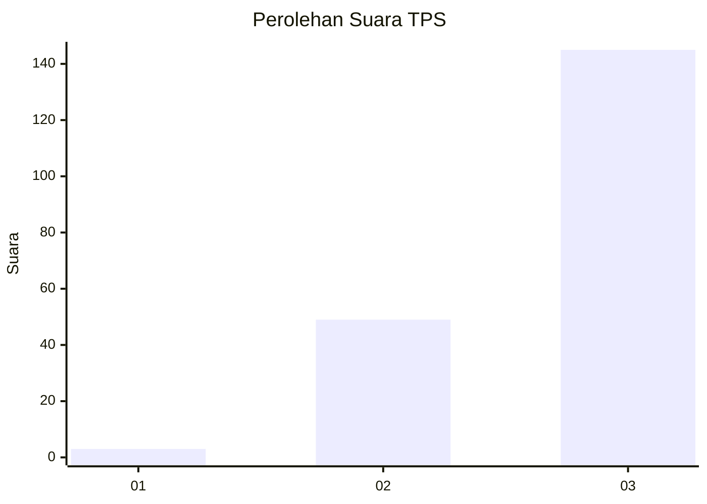
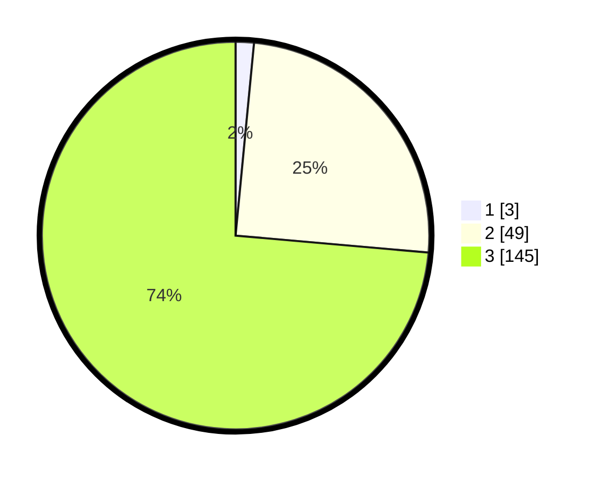

# Hasil

## Grafik

## Tabel

| No. | Nama Paslon    | Suara | Suara (raw) | Persentase |
|:--- |:-------------- | -----:| -----------:| ----------:|
| 1   | ANIES MUHAIMIN | 3     | [3][p-1]    | 1,52       |
| 2   | PRABOWO GIBRAN | 49    | [49][p-2]   | 24,87      |
| 3   | GANJAR MAHFUD  | 145   | [145][p-3]  | 73,60      |

[p-1]: https://github.com/gigit-pemilu/pemilu-2024-51-bali/blob/main/pilpres/hitung-suara/sub/51-bali/sub/07-karangasem/sub/07-selat/sub/2006-duda-timur/sub/008-tps/sub/paslon-1.txt
[p-2]: https://github.com/gigit-pemilu/pemilu-2024-51-bali/blob/main/pilpres/hitung-suara/sub/51-bali/sub/07-karangasem/sub/07-selat/sub/2006-duda-timur/sub/008-tps/sub/paslon-2.txt
[p-3]: https://github.com/gigit-pemilu/pemilu-2024-51-bali/blob/main/pilpres/hitung-suara/sub/51-bali/sub/07-karangasem/sub/07-selat/sub/2006-duda-timur/sub/008-tps/sub/paslon-3.txt

## Foto C Plano

https://sirekap-obj-formc.kpu.go.id/5d68/pemilu/ppwp/51/07/07/20/06/5107072006008-20240214-132335--6ce344df-ae6d-46c9-a318-e36d396dc6cf.jpg

https://sirekap-obj-formc.kpu.go.id/5d68/pemilu/ppwp/51/07/07/20/06/5107072006008-20240214-133100--50027b7c-8332-48dd-bd81-ac5977b85b29.jpg

https://sirekap-obj-formc.kpu.go.id/5d68/pemilu/ppwp/51/07/07/20/06/5107072006008-20240214-133049--a461c6e4-14d8-4585-9ab1-420b27846762.jpg

## Metadata

| Key        | Value               |
| ---------- | ------------------- |
| Time Stamp | 2024-02-19 06:16:00 |

