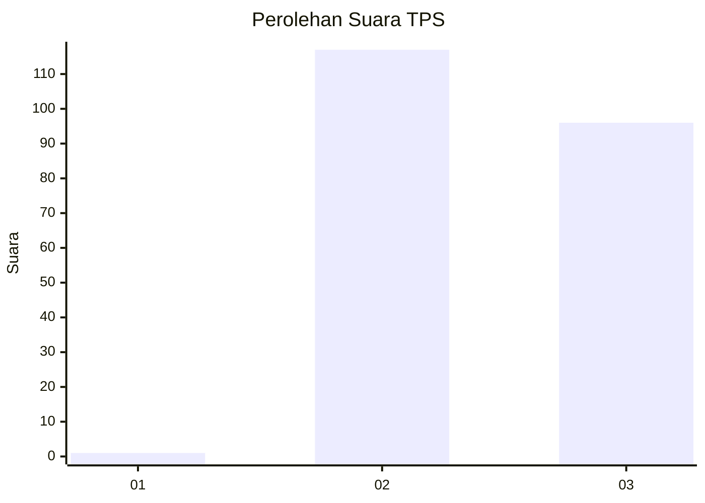
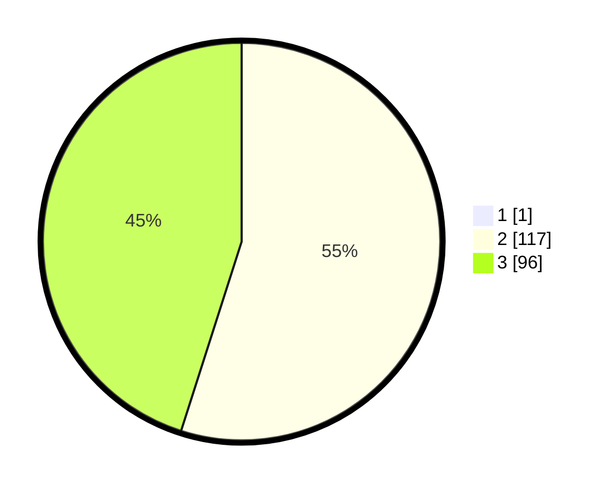

# Hasil

## Grafik

## Tabel

| No. | Nama Paslon    | Suara | Suara (raw) | Persentase |
|:--- |:-------------- | -----:| -----------:| ----------:|
| 1   | ANIES MUHAIMIN | 1     | [1][p-1]    | 0,47       |
| 2   | PRABOWO GIBRAN | 117   | [117][p-2]  | 54,67      |
| 3   | GANJAR MAHFUD  | 96    | [96][p-3]   | 44,86      |

[p-1]: https://github.com/gigit-pemilu/pemilu-2024-51-bali/blob/main/pilpres/hitung-suara/sub/51-bali/sub/07-karangasem/sub/07-selat/sub/2006-duda-timur/sub/013-tps/sub/paslon-1.txt
[p-2]: https://github.com/gigit-pemilu/pemilu-2024-51-bali/blob/main/pilpres/hitung-suara/sub/51-bali/sub/07-karangasem/sub/07-selat/sub/2006-duda-timur/sub/013-tps/sub/paslon-2.txt
[p-3]: https://github.com/gigit-pemilu/pemilu-2024-51-bali/blob/main/pilpres/hitung-suara/sub/51-bali/sub/07-karangasem/sub/07-selat/sub/2006-duda-timur/sub/013-tps/sub/paslon-3.txt

## Foto C Plano

https://sirekap-obj-formc.kpu.go.id/d6fc/pemilu/ppwp/51/07/07/20/06/5107072006013-20240214-141249--9bd259a5-c925-4fdd-8462-77556ca72bb6.jpg

https://sirekap-obj-formc.kpu.go.id/d6fc/pemilu/ppwp/51/07/07/20/06/5107072006013-20240214-141608--dda5c1da-fd7e-4c8c-86de-ba6c9a7caff4.jpg

https://sirekap-obj-formc.kpu.go.id/d6fc/pemilu/ppwp/51/07/07/20/06/5107072006013-20240214-141313--7e25104e-f380-4f7b-ab79-724603d62404.jpg

## Metadata

| Key        | Value               |
| ---------- | ------------------- |
| Time Stamp | 2024-02-19 06:16:00 |

