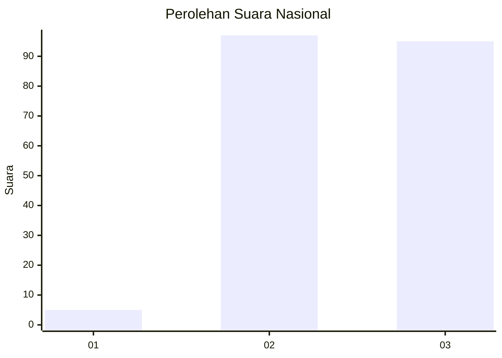
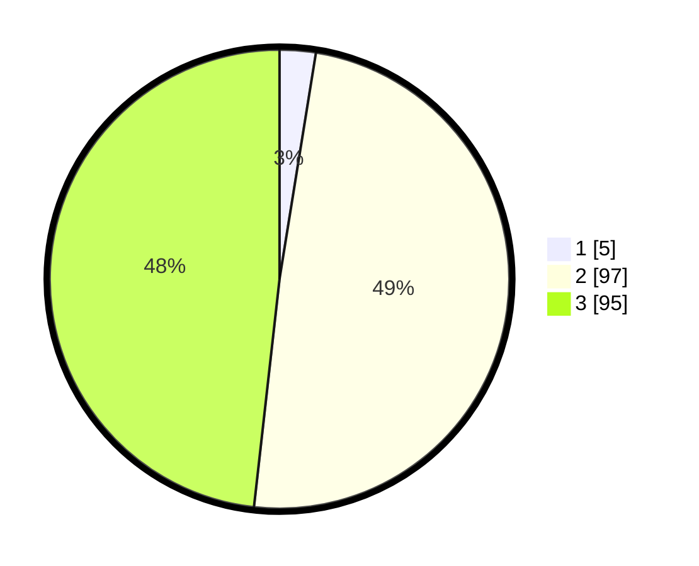

# Hasil

## Grafik

## Tabel

| No. | Nama Paslon    | Suara | Suara (raw) | Persentase |
|:--- |:-------------- | -----:| -----------:| ----------:|
| 1   | ANIES MUHAIMIN | 5     | [5][p-1]    | 2,54       |
| 2   | PRABOWO GIBRAN | 97    | [97][p-2]   | 49,24      |
| 3   | GANJAR MAHFUD  | 95    | [95][p-3]   | 48,22      |

[p-1]: https://github.com/gigit-pemilu/pemilu-2024/blob/main/pilpres/hitung-suara/sub/51-bali/sub/07-karangasem/sub/07-selat/sub/2006-duda-timur/sub/016-tps/sub/paslon-1.txt
[p-2]: https://github.com/gigit-pemilu/pemilu-2024/blob/main/pilpres/hitung-suara/sub/51-bali/sub/07-karangasem/sub/07-selat/sub/2006-duda-timur/sub/016-tps/sub/paslon-2.txt
[p-3]: https://github.com/gigit-pemilu/pemilu-2024/blob/main/pilpres/hitung-suara/sub/51-bali/sub/07-karangasem/sub/07-selat/sub/2006-duda-timur/sub/016-tps/sub/paslon-3.txt

## Foto C Plano

https://sirekap-obj-formc.kpu.go.id/6de2/pemilu/ppwp/51/07/07/20/06/5107072006016-20240215-160715--b62dabbc-3209-4edf-adc5-62356ef259e6.jpg

https://sirekap-obj-formc.kpu.go.id/6de2/pemilu/ppwp/51/07/07/20/06/5107072006016-20240215-160719--042df30c-8b3b-4a30-b2a8-5020e5ec6776.jpg

https://sirekap-obj-formc.kpu.go.id/6de2/pemilu/ppwp/51/07/07/20/06/5107072006016-20240215-160725--636c2209-088c-4594-a002-5eb462c263dc.jpg

## Metadata

| Key        | Value               |
| ---------- | ------------------- |
| Time Stamp | 2024-02-19 06:16:00 |

