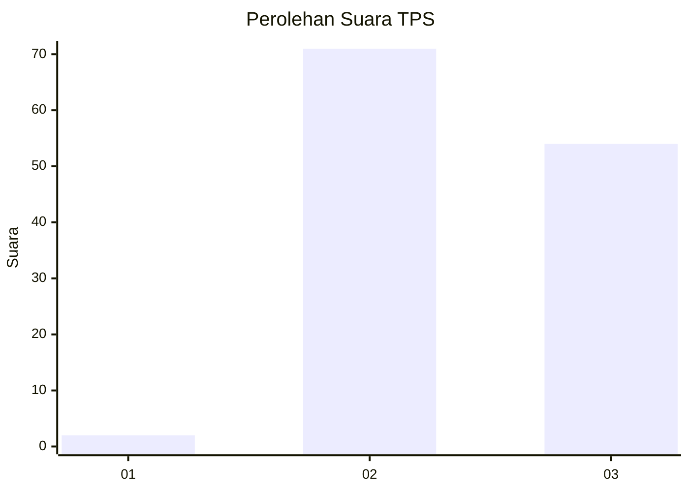
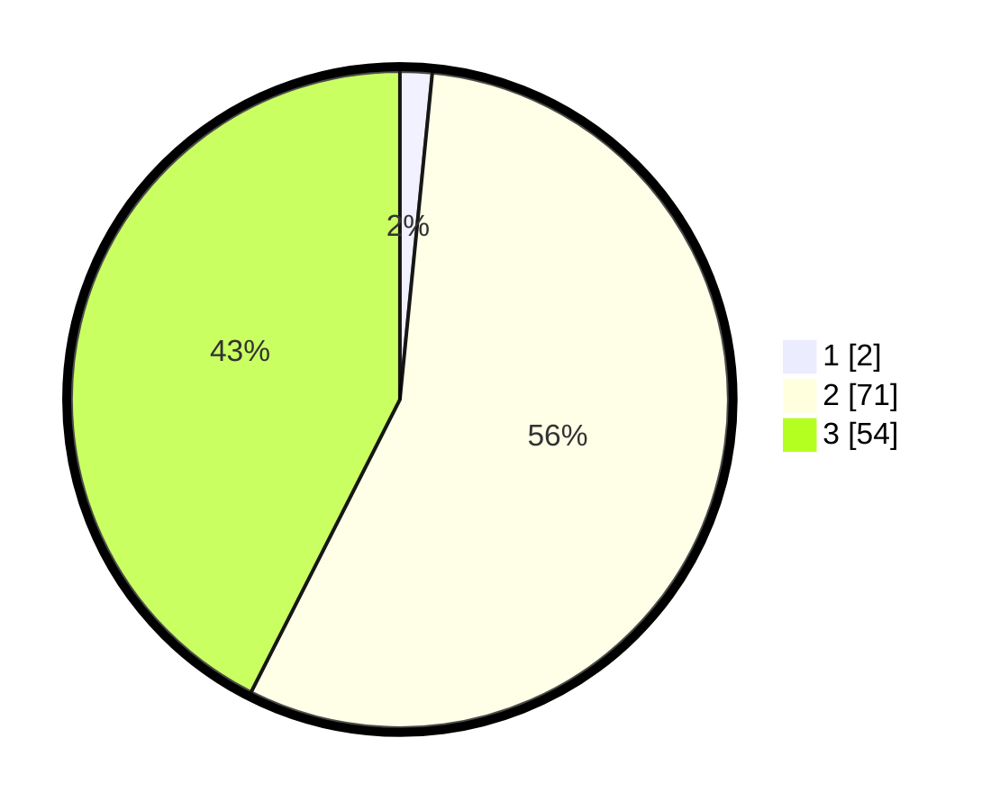

# Hasil

## Grafik

## Tabel

| No. | Nama Paslon    | Suara | Suara (raw) | Persentase |
|:--- |:-------------- | -----:| -----------:| ----------:|
| 1   | ANIES MUHAIMIN | 2     | [2][p-1]    | 1,57       |
| 2   | PRABOWO GIBRAN | 71    | [71][p-2]   | 55,91      |
| 3   | GANJAR MAHFUD  | 54    | [54][p-3]   | 42,52      |

[p-1]: https://github.com/gigit-pemilu/pemilu-2024-51-bali/blob/main/pilpres/hitung-suara/sub/51-bali/sub/07-karangasem/sub/07-selat/sub/2007-peringsari/sub/019-tps/sub/paslon-1.txt
[p-2]: https://github.com/gigit-pemilu/pemilu-2024-51-bali/blob/main/pilpres/hitung-suara/sub/51-bali/sub/07-karangasem/sub/07-selat/sub/2007-peringsari/sub/019-tps/sub/paslon-2.txt
[p-3]: https://github.com/gigit-pemilu/pemilu-2024-51-bali/blob/main/pilpres/hitung-suara/sub/51-bali/sub/07-karangasem/sub/07-selat/sub/2007-peringsari/sub/019-tps/sub/paslon-3.txt

## Foto C Plano

https://sirekap-obj-formc.kpu.go.id/6e2f/pemilu/ppwp/51/07/07/20/07/5107072007019-20240214-231218--49d3f1a0-0666-424e-87e4-0cdede117990.jpg

https://sirekap-obj-formc.kpu.go.id/6e2f/pemilu/ppwp/51/07/07/20/07/5107072007019-20240214-231353--0762a9ec-07c7-41ac-a1e7-54144316d438.jpg

https://sirekap-obj-formc.kpu.go.id/6e2f/pemilu/ppwp/51/07/07/20/07/5107072007019-20240214-231506--9d635e57-c727-47dd-8498-952605305c57.jpg

## Metadata

| Key        | Value               |
| ---------- | ------------------- |
| Time Stamp | 2024-02-24 22:31:28 |

