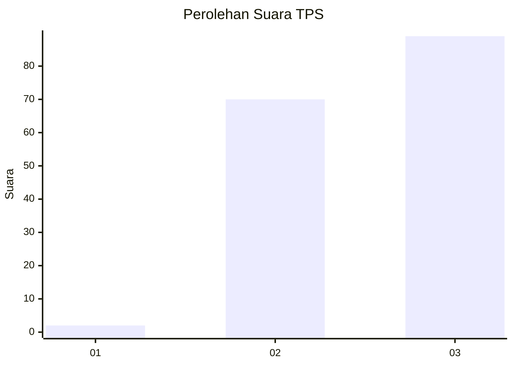
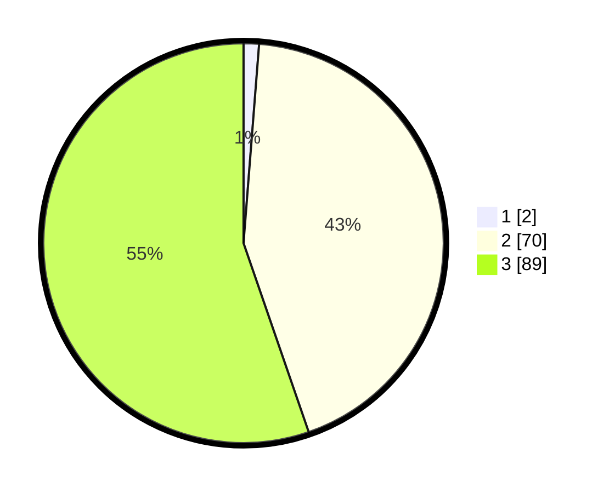

# Hasil

## Grafik

## Tabel

| No. | Nama Paslon    | Suara | Suara (raw) | Persentase |
|:--- |:-------------- | -----:| -----------:| ----------:|
| 1   | ANIES MUHAIMIN | 2     | [2][p-1]    | 1,24       |
| 2   | PRABOWO GIBRAN | 70    | [70][p-2]   | 43,48      |
| 3   | GANJAR MAHFUD  | 89    | [89][p-3]   | 55,28      |

[p-1]: https://github.com/gigit-pemilu/pemilu-2024-51-bali/blob/main/pilpres/hitung-suara/sub/51-bali/sub/07-karangasem/sub/07-selat/sub/2007-peringsari/sub/023-tps/sub/paslon-1.txt
[p-2]: https://github.com/gigit-pemilu/pemilu-2024-51-bali/blob/main/pilpres/hitung-suara/sub/51-bali/sub/07-karangasem/sub/07-selat/sub/2007-peringsari/sub/023-tps/sub/paslon-2.txt
[p-3]: https://github.com/gigit-pemilu/pemilu-2024-51-bali/blob/main/pilpres/hitung-suara/sub/51-bali/sub/07-karangasem/sub/07-selat/sub/2007-peringsari/sub/023-tps/sub/paslon-3.txt

## Foto C Plano

https://sirekap-obj-formc.kpu.go.id/826f/pemilu/ppwp/51/07/07/20/07/5107072007023-20240214-231222--92e49594-5270-498b-a92f-090cf50eb74f.jpg

https://sirekap-obj-formc.kpu.go.id/826f/pemilu/ppwp/51/07/07/20/07/5107072007023-20240214-231421--624a42ce-a966-4b07-843d-b8a112f4fb2b.jpg

https://sirekap-obj-formc.kpu.go.id/826f/pemilu/ppwp/51/07/07/20/07/5107072007023-20240214-231545--a9e309cc-7c32-42ae-999d-51ee19951800.jpg

## Metadata

| Key        | Value               |
| ---------- | ------------------- |
| Time Stamp | 2024-02-19 06:16:00 |

