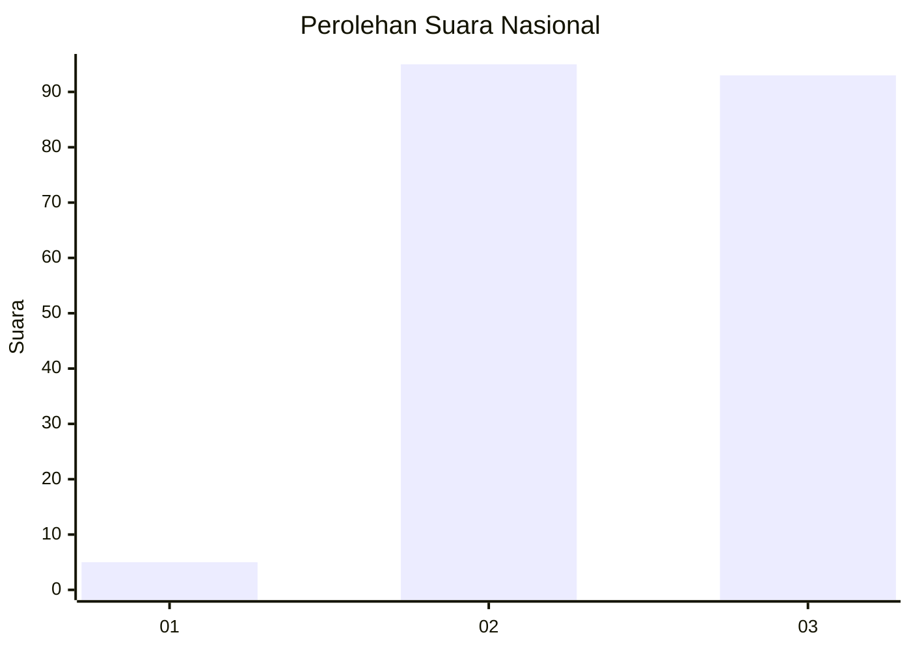
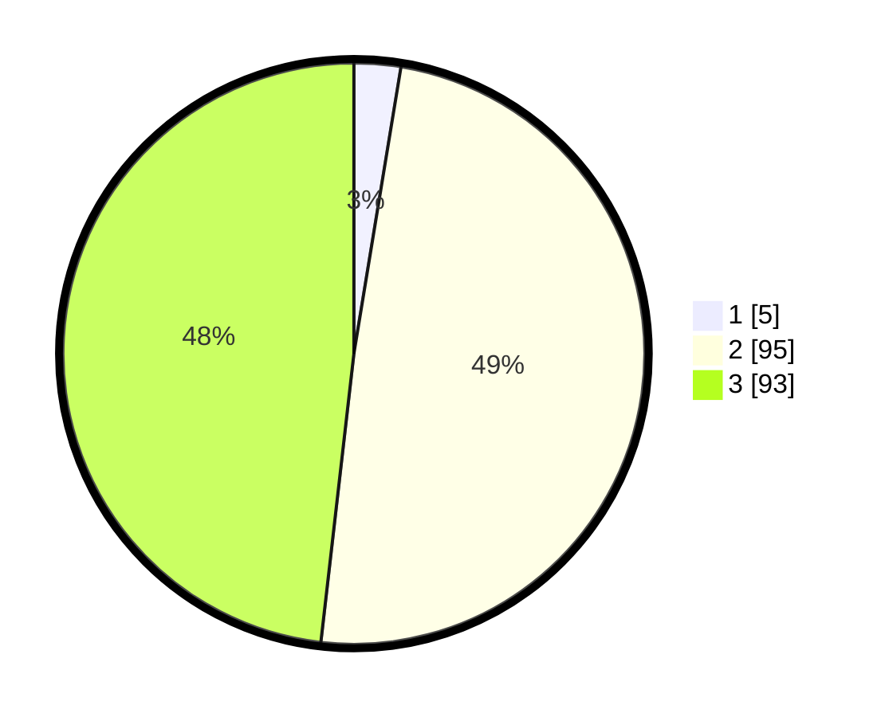

# Hasil

## Grafik

## Tabel

| No. | Nama Paslon    | Suara | Suara (raw) | Persentase |
|:--- |:-------------- | -----:| -----------:| ----------:|
| 1   | ANIES MUHAIMIN | 5     | [5][p-1]    | 2,59       |
| 2   | PRABOWO GIBRAN | 95    | [95][p-2]   | 49,22      |
| 3   | GANJAR MAHFUD  | 93    | [93][p-3]   | 48,19      |

[p-1]: https://github.com/gigit-pemilu/pemilu-2024/blob/main/pilpres/hitung-suara/sub/51-bali/sub/07-karangasem/sub/07-selat/sub/2008-amerta-bhuana/sub/001-tps/sub/paslon-1.txt
[p-2]: https://github.com/gigit-pemilu/pemilu-2024/blob/main/pilpres/hitung-suara/sub/51-bali/sub/07-karangasem/sub/07-selat/sub/2008-amerta-bhuana/sub/001-tps/sub/paslon-2.txt
[p-3]: https://github.com/gigit-pemilu/pemilu-2024/blob/main/pilpres/hitung-suara/sub/51-bali/sub/07-karangasem/sub/07-selat/sub/2008-amerta-bhuana/sub/001-tps/sub/paslon-3.txt

## Foto C Plano

https://sirekap-obj-formc.kpu.go.id/0c7a/pemilu/ppwp/51/07/07/20/08/5107072008001-20240216-142705--d6e925ca-10a2-4060-8ec7-1f39ecc1a1c9.jpg

https://sirekap-obj-formc.kpu.go.id/0c7a/pemilu/ppwp/51/07/07/20/08/5107072008001-20240216-142706--6f547711-b394-4f40-b5e9-1e02d86ab907.jpg

https://sirekap-obj-formc.kpu.go.id/0c7a/pemilu/ppwp/51/07/07/20/08/5107072008001-20240216-142705--bbf42a18-8096-44cf-b20c-7b162bb19b14.jpg

## Metadata

| Key        | Value               |
| ---------- | ------------------- |
| Time Stamp | 2024-02-16 16:25:10 |

## DATA PEMILIH TETAP

Jumlah pemilih dalam DPT: **248**.
 * L: **125**.
 * P: **123**.

## DATA PENGGUNA HAK PILIH

Jumlah pengguna hak pilih dalam DPT: **201**.
 * L: **112**.
 * P: **89**.

Jumlah pengguna hak pilih dalam DPTb: **0**.
 * L: **0**.
 * P: **0**.

Jumlah pengguna hak pilih dalam DPK: **0**.
 * L: **0**.
 * P: **0**.

Jumlah pengguna hak pilih: **201**.
 * L: **112**.
 * P: **89**.

## JUMLAH SUARA SAH DAN TIDAK SAH

JUMLAH SELURUH SUARA SAH: **193**.

JUMLAH SUARA TIDAK SAH: **8**.

JUMLAH SELURUH SUARA SAH DAN SUARA TIDAK SAH: **201**.

