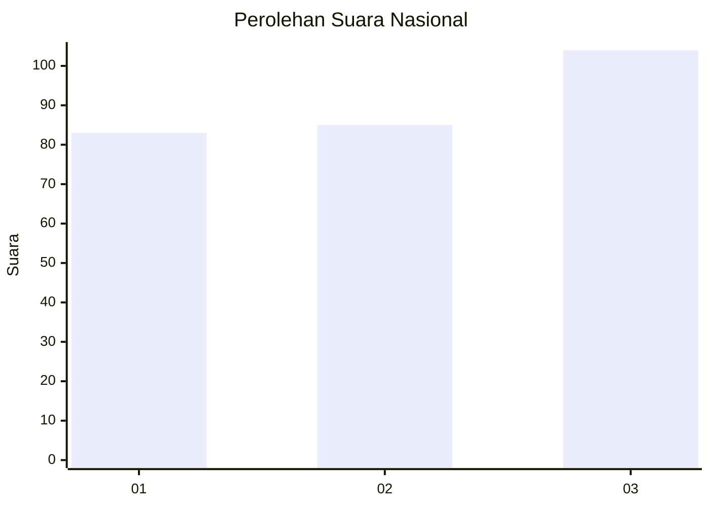
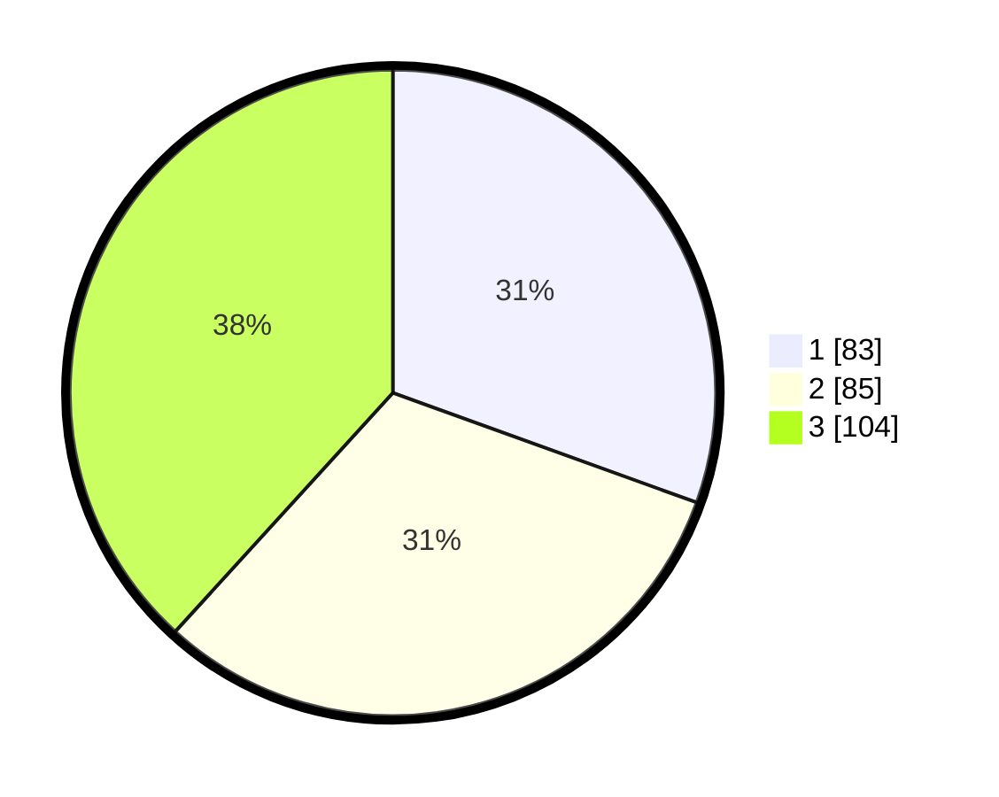

# Hasil

## Grafik

## Tabel

| No. | Nama Paslon    | Suara | Suara (raw) | Persentase |
|:--- |:-------------- | -----:| -----------:| ----------:|
| 1   | ANIES MUHAIMIN | 83    | [83][p-1]   | 30,51      |
| 2   | PRABOWO GIBRAN | 85    | [85][p-2]   | 31,25      |
| 3   | GANJAR MAHFUD  | 104   | [104][p-3]  | 38,24      |

[p-1]: https://github.com/gigit-pemilu/pemilu-2024/blob/main/pilpres/hitung-suara/sub/51-bali/sub/07-karangasem/sub/07-selat/sub/2008-amerta-bhuana/sub/002-tps/sub/paslon-1.txt
[p-2]: https://github.com/gigit-pemilu/pemilu-2024/blob/main/pilpres/hitung-suara/sub/51-bali/sub/07-karangasem/sub/07-selat/sub/2008-amerta-bhuana/sub/002-tps/sub/paslon-2.txt
[p-3]: https://github.com/gigit-pemilu/pemilu-2024/blob/main/pilpres/hitung-suara/sub/51-bali/sub/07-karangasem/sub/07-selat/sub/2008-amerta-bhuana/sub/002-tps/sub/paslon-3.txt

## Foto C Plano

https://sirekap-obj-formc.kpu.go.id/664a/pemilu/ppwp/51/07/07/20/08/5107072008002-20240216-152054--17a3e6e9-c9d4-45c2-bcc3-5decebc3d4d3.jpg

https://sirekap-obj-formc.kpu.go.id/664a/pemilu/ppwp/51/07/07/20/08/5107072008002-20240216-152055--a344dd3a-e010-4c48-b36b-4fc78f1e086a.jpg

https://sirekap-obj-formc.kpu.go.id/664a/pemilu/ppwp/51/07/07/20/08/5107072008002-20240216-152055--adc61c88-d53c-4a28-9c46-c3e56e6b2ffa.jpg

## Metadata

| Key        | Value               |
| ---------- | ------------------- |
| Time Stamp | 2024-02-16 16:25:10 |

## DATA PEMILIH TETAP

Jumlah pemilih dalam DPT: **253**.
 * L: **131**.
 * P: **122**.

## DATA PENGGUNA HAK PILIH

Jumlah pengguna hak pilih dalam DPT: **195**.
 * L: **106**.
 * P: **89**.

Jumlah pengguna hak pilih dalam DPTb: **0**.
 * L: **0**.
 * P: **0**.

Jumlah pengguna hak pilih dalam DPK: **0**.
 * L: **0**.
 * P: **0**.

Jumlah pengguna hak pilih: **195**.
 * L: **106**.
 * P: **89**.

## JUMLAH SUARA SAH DAN TIDAK SAH

JUMLAH SELURUH SUARA SAH: **192**.

JUMLAH SUARA TIDAK SAH: **3**.

JUMLAH SELURUH SUARA SAH DAN SUARA TIDAK SAH: **195**.

