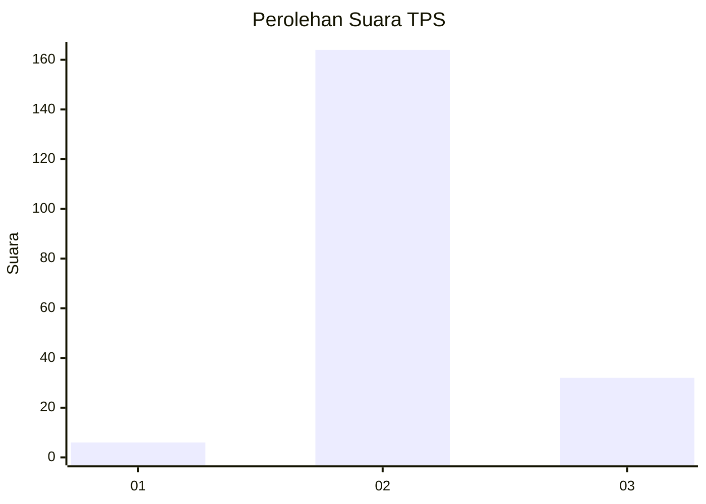
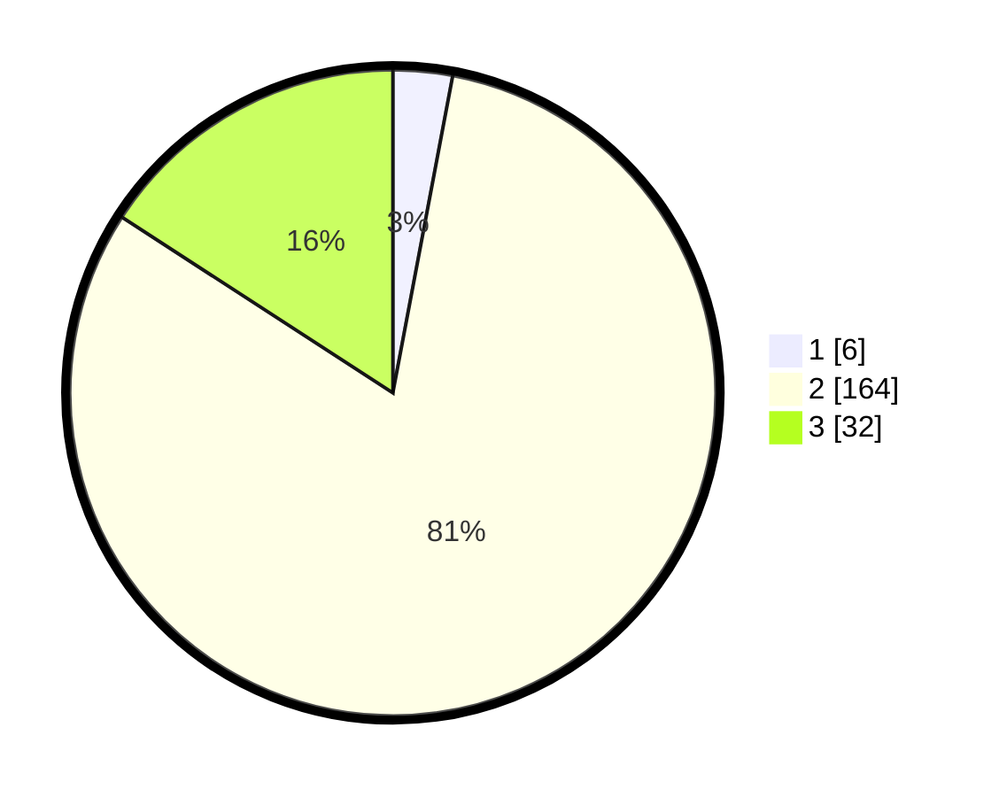

# Hasil

## Grafik

## Tabel

| No. | Nama Paslon    | Suara | Suara (raw) | Persentase |
|:--- |:-------------- | -----:| -----------:| ----------:|
| 1   | ANIES MUHAIMIN | 6     | [6][p-1]    | 2,97       |
| 2   | PRABOWO GIBRAN | 164   | [164][p-2]  | 81,19      |
| 3   | GANJAR MAHFUD  | 32    | [32][p-3]   | 15,84      |

[p-1]: https://github.com/gigit-pemilu/pemilu-2024-51-bali/blob/main/pilpres/hitung-suara/sub/51-bali/sub/07-karangasem/sub/08-kubu/sub/2001-ban/sub/006-tps/sub/paslon-1.txt
[p-2]: https://github.com/gigit-pemilu/pemilu-2024-51-bali/blob/main/pilpres/hitung-suara/sub/51-bali/sub/07-karangasem/sub/08-kubu/sub/2001-ban/sub/006-tps/sub/paslon-2.txt
[p-3]: https://github.com/gigit-pemilu/pemilu-2024-51-bali/blob/main/pilpres/hitung-suara/sub/51-bali/sub/07-karangasem/sub/08-kubu/sub/2001-ban/sub/006-tps/sub/paslon-3.txt

## Foto C Plano

https://sirekap-obj-formc.kpu.go.id/59a7/pemilu/ppwp/51/07/08/20/01/5107082001006-20240215-074602--e8364dc7-4a18-4ffc-b280-278eea102458.jpg

https://sirekap-obj-formc.kpu.go.id/59a7/pemilu/ppwp/51/07/08/20/01/5107082001006-20240215-074624--fd42e5ce-105a-4b93-8e3b-f0f13f8da310.jpg

## Metadata

| Key        | Value               |
| ---------- | ------------------- |
| Time Stamp | 2024-02-15 12:00:28 |

