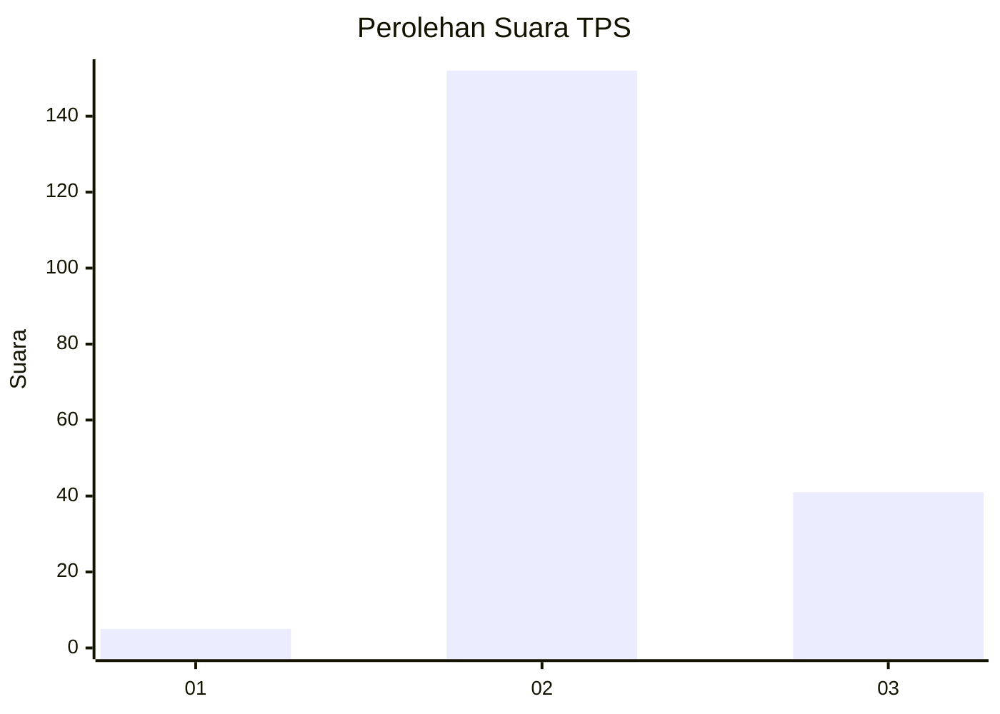

# Hasil

## Grafik

## Tabel

| No. | Nama Paslon    | Suara | Suara (raw) | Persentase |
|:--- |:-------------- | -----:| -----------:| ----------:|
| 1   | ANIES MUHAIMIN | 5     | [5][p-1]    | 2,53       |
| 2   | PRABOWO GIBRAN | 152   | [152][p-2]  | 76,77      |
| 3   | GANJAR MAHFUD  | 41    | [41][p-3]   | 20,71      |

[p-1]: https://github.com/gigit-pemilu/pemilu-2024-51-bali/blob/main/pilpres/hitung-suara/sub/51-bali/sub/07-karangasem/sub/08-kubu/sub/2001-ban/sub/015-tps/sub/paslon-1.txt
[p-2]: https://github.com/gigit-pemilu/pemilu-2024-51-bali/blob/main/pilpres/hitung-suara/sub/51-bali/sub/07-karangasem/sub/08-kubu/sub/2001-ban/sub/015-tps/sub/paslon-2.txt
[p-3]: https://github.com/gigit-pemilu/pemilu-2024-51-bali/blob/main/pilpres/hitung-suara/sub/51-bali/sub/07-karangasem/sub/08-kubu/sub/2001-ban/sub/015-tps/sub/paslon-3.txt

## Foto C Plano

https://sirekap-obj-formc.kpu.go.id/164f/pemilu/ppwp/51/07/08/20/01/5107082001015-20240216-005713--05ee69b3-1f9d-48ee-93d6-bdb10aec8456.jpg

https://sirekap-obj-formc.kpu.go.id/164f/pemilu/ppwp/51/07/08/20/01/5107082001015-20240216-005716--e20c0ab3-2985-4021-b9e1-2a4b0dec8087.jpg

https://sirekap-obj-formc.kpu.go.id/164f/pemilu/ppwp/51/07/08/20/01/5107082001015-20240216-005715--9ba6fdd0-942a-4592-adf0-a4a5c79d60b8.jpg

## Metadata

| Key        | Value               |
| ---------- | ------------------- |
| Time Stamp | 2024-02-16 08:00:28 |

## DATA PEMILIH TETAP

Jumlah pemilih dalam DPT: **251**.
 * L: **134**.
 * P: **117**.

## DATA PENGGUNA HAK PILIH

Jumlah pengguna hak pilih dalam DPT: **205**.
 * L: **114**.
 * P: **91**.

Jumlah pengguna hak pilih dalam DPTb: **1**.
 * L: **1**.
 * P: **0**.

Jumlah pengguna hak pilih dalam DPK: **0**.
 * L: **0**.
 * P: **0**.

Jumlah pengguna hak pilih: **206**.
 * L: **115**.
 * P: **91**.

## JUMLAH SUARA SAH DAN TIDAK SAH

JUMLAH SELURUH SUARA SAH: **198**.

JUMLAH SUARA TIDAK SAH: **8**.

JUMLAH SELURUH SUARA SAH DAN SUARA TIDAK SAH: **206**.

