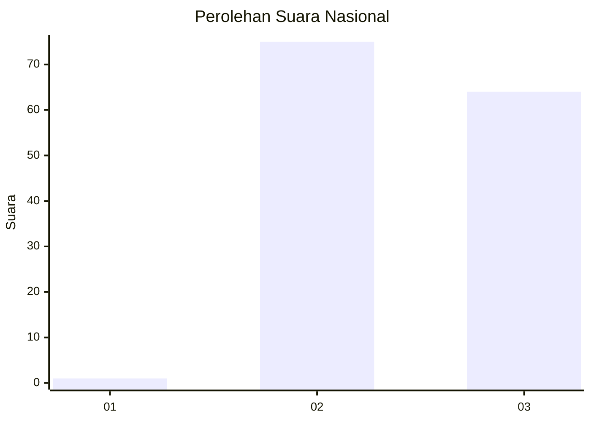
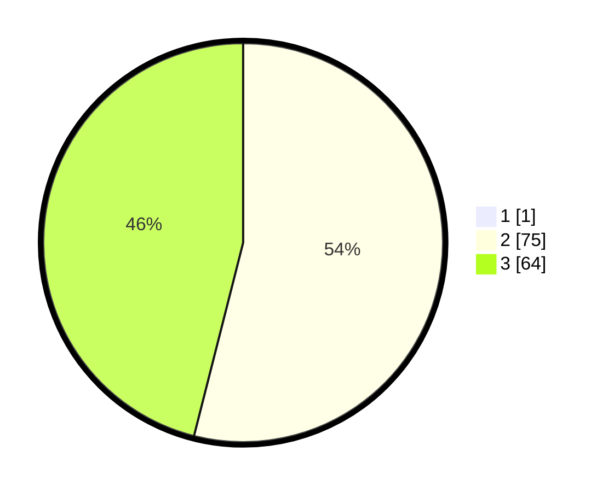

# Hasil

## Grafik

## Tabel

| No. | Nama Paslon    | Suara | Suara (raw) | Persentase |
|:--- |:-------------- | -----:| -----------:| ----------:|
| 1   | ANIES MUHAIMIN | 1     | [1][p-1]    | 0,71       |
| 2   | PRABOWO GIBRAN | 75    | [75][p-2]   | 53,57      |
| 3   | GANJAR MAHFUD  | 64    | [64][p-3]   | 45,71      |

[p-1]: https://github.com/gigit-pemilu/pemilu-2024/blob/main/pilpres/hitung-suara/sub/51-bali/sub/07-karangasem/sub/08-kubu/sub/2001-ban/sub/019-tps/sub/paslon-1.txt
[p-2]: https://github.com/gigit-pemilu/pemilu-2024/blob/main/pilpres/hitung-suara/sub/51-bali/sub/07-karangasem/sub/08-kubu/sub/2001-ban/sub/019-tps/sub/paslon-2.txt
[p-3]: https://github.com/gigit-pemilu/pemilu-2024/blob/main/pilpres/hitung-suara/sub/51-bali/sub/07-karangasem/sub/08-kubu/sub/2001-ban/sub/019-tps/sub/paslon-3.txt

## Foto C Plano

https://sirekap-obj-formc.kpu.go.id/97f6/pemilu/ppwp/51/07/08/20/01/5107082001019-20240214-204522--f977be15-7a9c-4aa8-9078-dc0e09932607.jpg

https://sirekap-obj-formc.kpu.go.id/97f6/pemilu/ppwp/51/07/08/20/01/5107082001019-20240214-204842--e0778df6-1869-4f0a-b2a4-34c7afaa5e26.jpg

https://sirekap-obj-formc.kpu.go.id/97f6/pemilu/ppwp/51/07/08/20/01/5107082001019-20240214-205552--c9874a06-14d0-4c13-a34c-d4ba7ff8d2b0.jpg

## Metadata

| Key        | Value               |
| ---------- | ------------------- |
| Time Stamp | 2024-02-15 12:00:28 |

