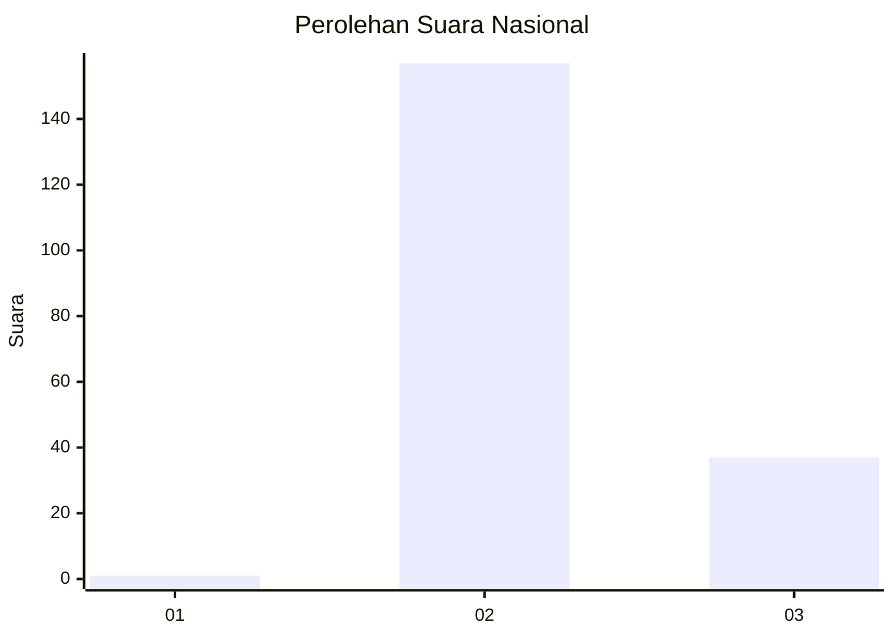
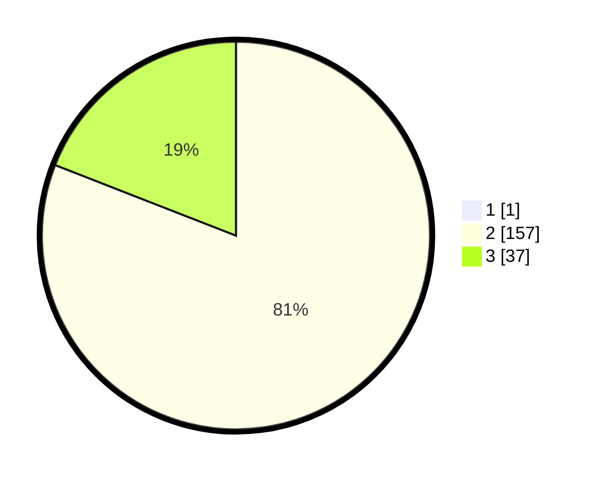

# Hasil

## Grafik

## Tabel

| No. | Nama Paslon    | Suara | Suara (raw) | Persentase |
|:--- |:-------------- | -----:| -----------:| ----------:|
| 1   | ANIES MUHAIMIN | 1     | [1][p-1]    | 0,51       |
| 2   | PRABOWO GIBRAN | 157   | [157][p-2]  | 80,51      |
| 3   | GANJAR MAHFUD  | 37    | [37][p-3]   | 18,97      |

[p-1]: https://github.com/gigit-pemilu/pemilu-2024/blob/main/pilpres/hitung-suara/sub/51-bali/sub/07-karangasem/sub/08-kubu/sub/2001-ban/sub/022-tps/sub/paslon-1.txt
[p-2]: https://github.com/gigit-pemilu/pemilu-2024/blob/main/pilpres/hitung-suara/sub/51-bali/sub/07-karangasem/sub/08-kubu/sub/2001-ban/sub/022-tps/sub/paslon-2.txt
[p-3]: https://github.com/gigit-pemilu/pemilu-2024/blob/main/pilpres/hitung-suara/sub/51-bali/sub/07-karangasem/sub/08-kubu/sub/2001-ban/sub/022-tps/sub/paslon-3.txt

## Foto C Plano

https://sirekap-obj-formc.kpu.go.id/841c/pemilu/ppwp/51/07/08/20/01/5107082001022-20240214-211236--11cf6db9-cb70-4af8-a85e-308a1c9c7661.jpg

https://sirekap-obj-formc.kpu.go.id/841c/pemilu/ppwp/51/07/08/20/01/5107082001022-20240214-211513--51da9a07-1db2-460c-9939-d3f3b67692ca.jpg

https://sirekap-obj-formc.kpu.go.id/841c/pemilu/ppwp/51/07/08/20/01/5107082001022-20240214-211636--7fc7a323-9bfe-4dd3-bf50-c39b1a26007b.jpg

## Metadata

| Key        | Value               |
| ---------- | ------------------- |
| Time Stamp | 2024-02-15 12:00:28 |

