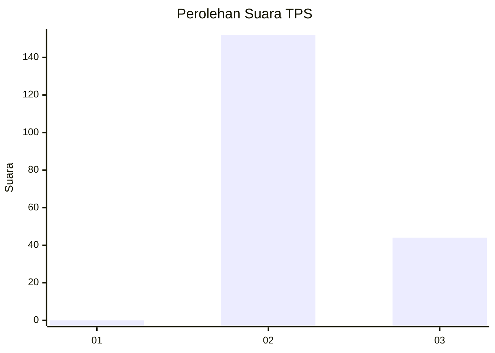
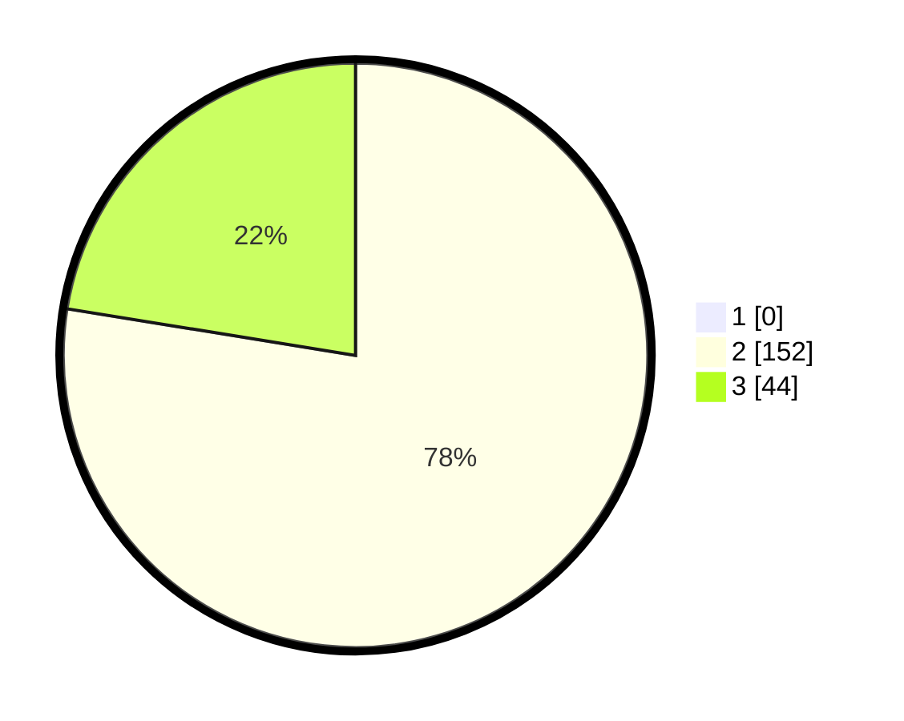

# Hasil

## Grafik

## Tabel

| No. | Nama Paslon    | Suara | Suara (raw) | Persentase |
|:--- |:-------------- | -----:| -----------:| ----------:|
| 1   | ANIES MUHAIMIN | 0     | [0][p-1]    | 0,00       |
| 2   | PRABOWO GIBRAN | 152   | [152][p-2]  | 77,55      |
| 3   | GANJAR MAHFUD  | 44    | [44][p-3]   | 22,45      |

[p-1]: https://github.com/gigit-pemilu/pemilu-2024-51-bali/blob/main/pilpres/hitung-suara/sub/51-bali/sub/07-karangasem/sub/08-kubu/sub/2001-ban/sub/028-tps/sub/paslon-1.txt
[p-2]: https://github.com/gigit-pemilu/pemilu-2024-51-bali/blob/main/pilpres/hitung-suara/sub/51-bali/sub/07-karangasem/sub/08-kubu/sub/2001-ban/sub/028-tps/sub/paslon-2.txt
[p-3]: https://github.com/gigit-pemilu/pemilu-2024-51-bali/blob/main/pilpres/hitung-suara/sub/51-bali/sub/07-karangasem/sub/08-kubu/sub/2001-ban/sub/028-tps/sub/paslon-3.txt

## Foto C Plano

https://sirekap-obj-formc.kpu.go.id/15d0/pemilu/ppwp/51/07/08/20/01/5107082001028-20240215-204959--8bbbe27c-c1d5-4962-9429-a0ad92b2f20b.jpg

https://sirekap-obj-formc.kpu.go.id/15d0/pemilu/ppwp/51/07/08/20/01/5107082001028-20240215-205018--f6405efd-349b-4d35-9d42-7e7d92700ef7.jpg

https://sirekap-obj-formc.kpu.go.id/15d0/pemilu/ppwp/51/07/08/20/01/5107082001028-20240215-205034--e4a70fe6-1a94-42e2-9c3b-9e33666296a8.jpg

## Metadata

| Key        | Value               |
| ---------- | ------------------- |
| Time Stamp | 2024-02-24 22:31:28 |

