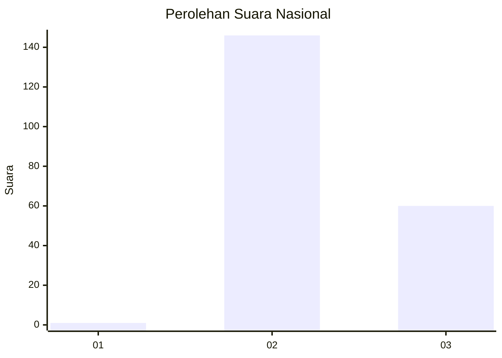
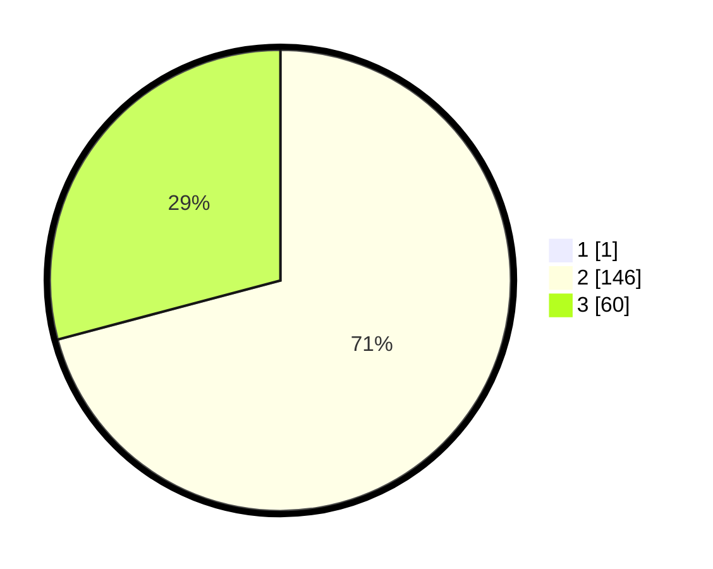

# Hasil

## Grafik

## Tabel

| No. | Nama Paslon    | Suara | Suara (raw) | Persentase |
|:--- |:-------------- | -----:| -----------:| ----------:|
| 1   | ANIES MUHAIMIN | 1     | [1][p-1]    | 0,48       |
| 2   | PRABOWO GIBRAN | 146   | [146][p-2]  | 70,53      |
| 3   | GANJAR MAHFUD  | 60    | [60][p-3]   | 28,99      |

[p-1]: https://github.com/gigit-pemilu/pemilu-2024/blob/main/pilpres/hitung-suara/sub/51-bali/sub/07-karangasem/sub/08-kubu/sub/2001-ban/sub/035-tps/sub/paslon-1.txt
[p-2]: https://github.com/gigit-pemilu/pemilu-2024/blob/main/pilpres/hitung-suara/sub/51-bali/sub/07-karangasem/sub/08-kubu/sub/2001-ban/sub/035-tps/sub/paslon-2.txt
[p-3]: https://github.com/gigit-pemilu/pemilu-2024/blob/main/pilpres/hitung-suara/sub/51-bali/sub/07-karangasem/sub/08-kubu/sub/2001-ban/sub/035-tps/sub/paslon-3.txt

## Foto C Plano

https://sirekap-obj-formc.kpu.go.id/bb1d/pemilu/ppwp/51/07/08/20/01/5107082001035-20240214-214121--6751f474-7501-4f06-8678-85cb5119729f.jpg

https://sirekap-obj-formc.kpu.go.id/bb1d/pemilu/ppwp/51/07/08/20/01/5107082001035-20240214-221339--6824ca83-a9d5-4200-b60d-a0ef86b46aa0.jpg

https://sirekap-obj-formc.kpu.go.id/bb1d/pemilu/ppwp/51/07/08/20/01/5107082001035-20240214-221846--16528401-f7bb-4681-80d3-958e273b1729.jpg

## Metadata

| Key        | Value               |
| ---------- | ------------------- |
| Time Stamp | 2024-02-15 18:30:25 |

