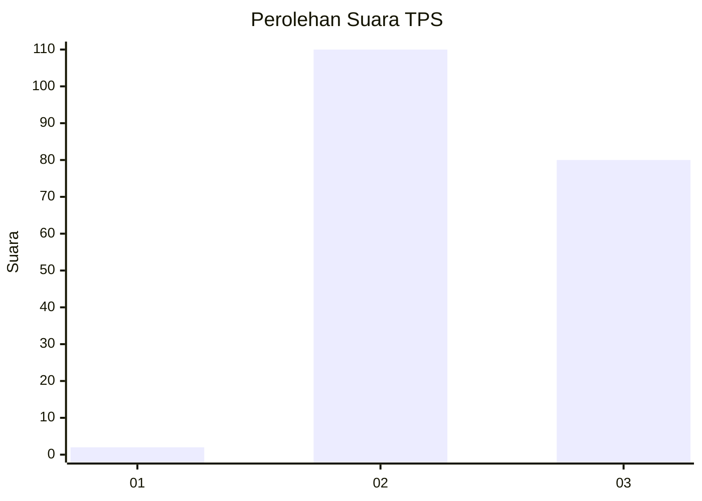
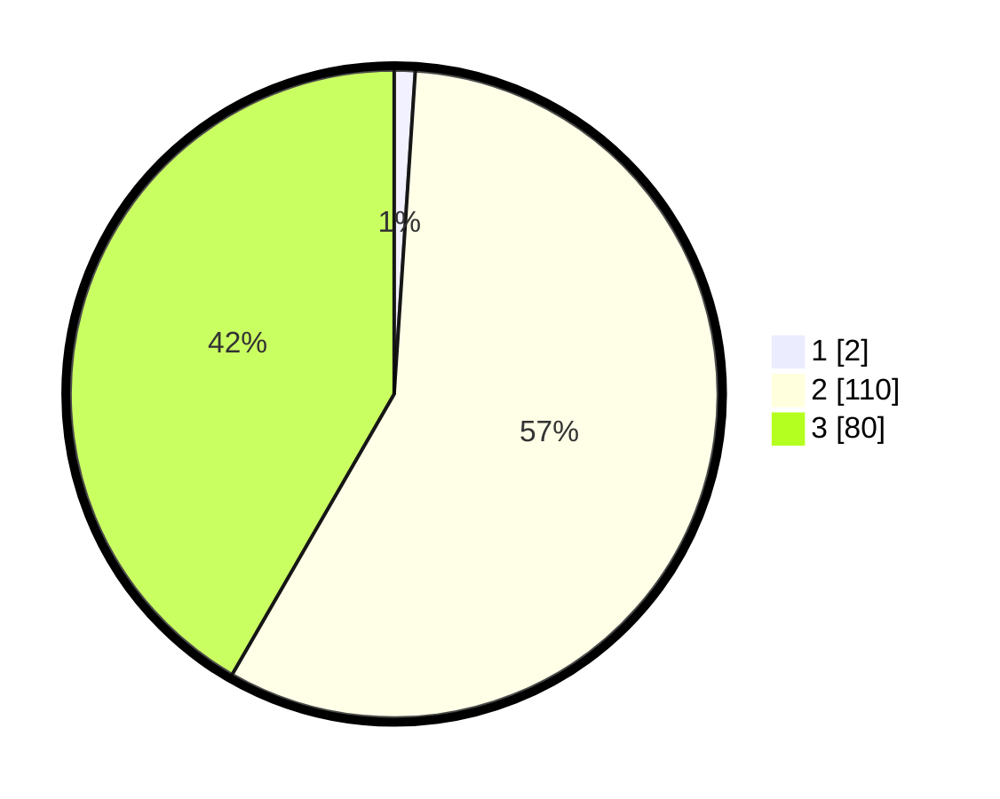

# Hasil

## Grafik

## Tabel

| No. | Nama Paslon    | Suara | Suara (raw) | Persentase |
|:--- |:-------------- | -----:| -----------:| ----------:|
| 1   | ANIES MUHAIMIN | 2     | [2][p-1]    | 1,04       |
| 2   | PRABOWO GIBRAN | 110   | [110][p-2]  | 57,29      |
| 3   | GANJAR MAHFUD  | 80    | [80][p-3]   | 41,67      |

[p-1]: https://github.com/gigit-pemilu/pemilu-2024-51-bali/blob/main/pilpres/hitung-suara/sub/51-bali/sub/07-karangasem/sub/08-kubu/sub/2001-ban/sub/042-tps/sub/paslon-1.txt
[p-2]: https://github.com/gigit-pemilu/pemilu-2024-51-bali/blob/main/pilpres/hitung-suara/sub/51-bali/sub/07-karangasem/sub/08-kubu/sub/2001-ban/sub/042-tps/sub/paslon-2.txt
[p-3]: https://github.com/gigit-pemilu/pemilu-2024-51-bali/blob/main/pilpres/hitung-suara/sub/51-bali/sub/07-karangasem/sub/08-kubu/sub/2001-ban/sub/042-tps/sub/paslon-3.txt

## Foto C Plano

https://sirekap-obj-formc.kpu.go.id/5df4/pemilu/ppwp/51/07/08/20/01/5107082001042-20240214-220721--6913147b-1ce7-4c23-95b9-01f09a0d7f06.jpg

https://sirekap-obj-formc.kpu.go.id/5df4/pemilu/ppwp/51/07/08/20/01/5107082001042-20240214-220730--55bedfd1-9758-4e8a-a667-c7bac3fa622e.jpg

https://sirekap-obj-formc.kpu.go.id/5df4/pemilu/ppwp/51/07/08/20/01/5107082001042-20240214-220736--a469cdb0-de7b-4021-b304-dab5b6cbf27f.jpg

## Metadata

| Key        | Value               |
| ---------- | ------------------- |
| Time Stamp | 2024-02-19 06:16:00 |

