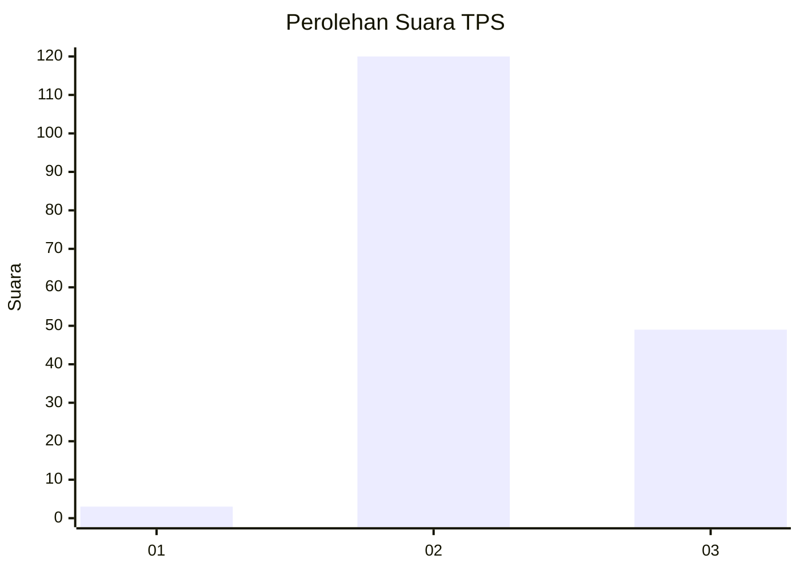
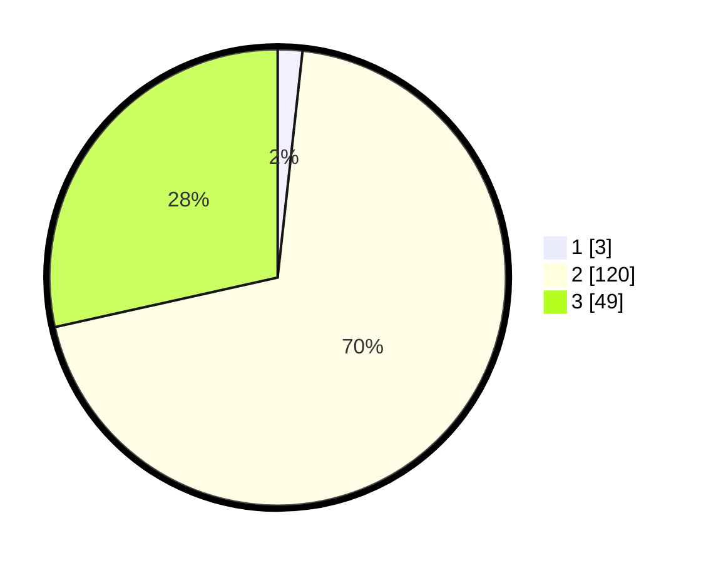

# Hasil

## Grafik

## Tabel

| No. | Nama Paslon    | Suara | Suara (raw) | Persentase |
|:--- |:-------------- | -----:| -----------:| ----------:|
| 1   | ANIES MUHAIMIN | 3     | [3][p-1]    | 1,74       |
| 2   | PRABOWO GIBRAN | 120   | [120][p-2]  | 69,77      |
| 3   | GANJAR MAHFUD  | 49    | [49][p-3]   | 28,49      |

[p-1]: https://github.com/gigit-pemilu/pemilu-2024-51-bali/blob/main/pilpres/hitung-suara/sub/51-bali/sub/07-karangasem/sub/08-kubu/sub/2002-dukuh/sub/008-tps/sub/paslon-1.txt
[p-2]: https://github.com/gigit-pemilu/pemilu-2024-51-bali/blob/main/pilpres/hitung-suara/sub/51-bali/sub/07-karangasem/sub/08-kubu/sub/2002-dukuh/sub/008-tps/sub/paslon-2.txt
[p-3]: https://github.com/gigit-pemilu/pemilu-2024-51-bali/blob/main/pilpres/hitung-suara/sub/51-bali/sub/07-karangasem/sub/08-kubu/sub/2002-dukuh/sub/008-tps/sub/paslon-3.txt

## Foto C Plano

https://sirekap-obj-formc.kpu.go.id/507f/pemilu/ppwp/51/07/08/20/02/5107082002008-20240214-132824--7481d462-17f0-4e8d-9f68-cf815fd76bf8.jpg

https://sirekap-obj-formc.kpu.go.id/507f/pemilu/ppwp/51/07/08/20/02/5107082002008-20240214-132528--b5542b3c-8087-4eee-b829-13863e01bd8c.jpg

https://sirekap-obj-formc.kpu.go.id/507f/pemilu/ppwp/51/07/08/20/02/5107082002008-20240214-133009--f04b1bf5-8f9d-4feb-b760-3005863f0974.jpg

## Metadata

| Key        | Value               |
| ---------- | ------------------- |
| Time Stamp | 2024-02-15 15:00:29 |

