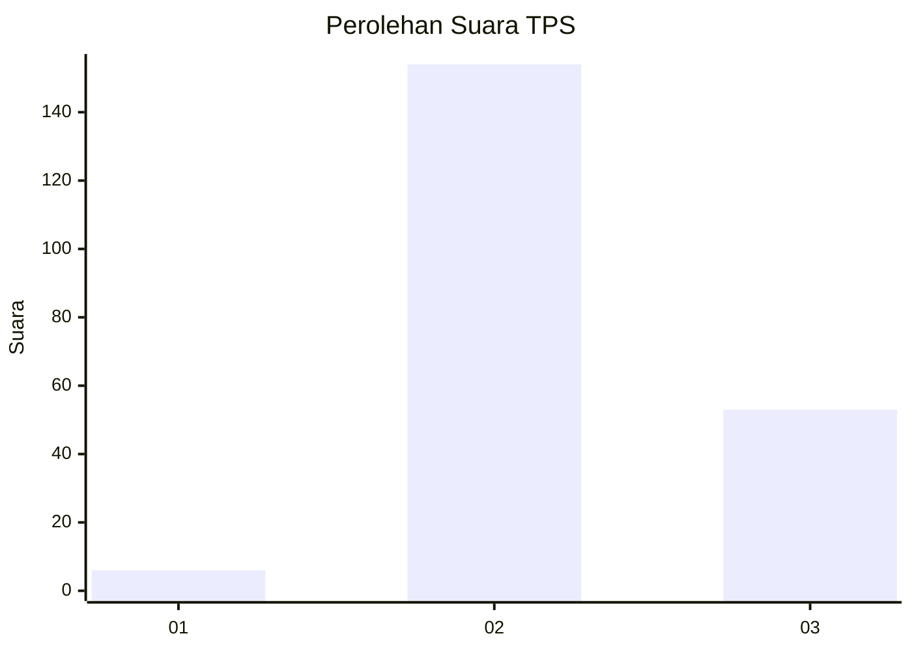
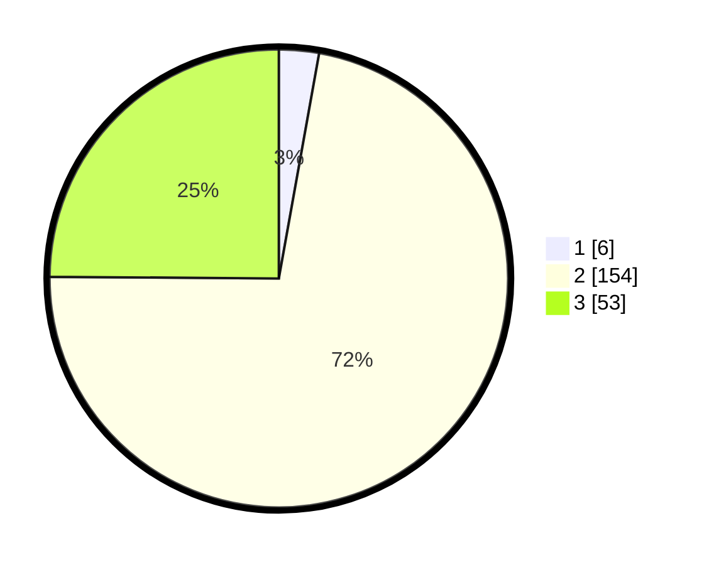

# Hasil

## Grafik

## Tabel

| No. | Nama Paslon    | Suara | Suara (raw) | Persentase |
|:--- |:-------------- | -----:| -----------:| ----------:|
| 1   | ANIES MUHAIMIN | 6     | [6][p-1]    | 2,82       |
| 2   | PRABOWO GIBRAN | 154   | [154][p-2]  | 72,30      |
| 3   | GANJAR MAHFUD  | 53    | [53][p-3]   | 24,88      |

[p-1]: https://github.com/gigit-pemilu/pemilu-2024-51-bali/blob/main/pilpres/hitung-suara/sub/51-bali/sub/07-karangasem/sub/08-kubu/sub/2002-dukuh/sub/010-tps/sub/paslon-1.txt
[p-2]: https://github.com/gigit-pemilu/pemilu-2024-51-bali/blob/main/pilpres/hitung-suara/sub/51-bali/sub/07-karangasem/sub/08-kubu/sub/2002-dukuh/sub/010-tps/sub/paslon-2.txt
[p-3]: https://github.com/gigit-pemilu/pemilu-2024-51-bali/blob/main/pilpres/hitung-suara/sub/51-bali/sub/07-karangasem/sub/08-kubu/sub/2002-dukuh/sub/010-tps/sub/paslon-3.txt

## Foto C Plano

https://sirekap-obj-formc.kpu.go.id/33c6/pemilu/ppwp/51/07/08/20/02/5107082002010-20240214-141002--8edd2955-2283-4d07-9074-ebc5e916633d.jpg

https://sirekap-obj-formc.kpu.go.id/33c6/pemilu/ppwp/51/07/08/20/02/5107082002010-20240214-141114--a17d8372-2f77-4c32-b465-bb98aa27fc0a.jpg

https://sirekap-obj-formc.kpu.go.id/33c6/pemilu/ppwp/51/07/08/20/02/5107082002010-20240214-141222--1c8f10a7-8f36-4aa3-b8d5-787325cdfb5e.jpg

## Metadata

| Key        | Value               |
| ---------- | ------------------- |
| Time Stamp | 2024-02-15 15:00:29 |

