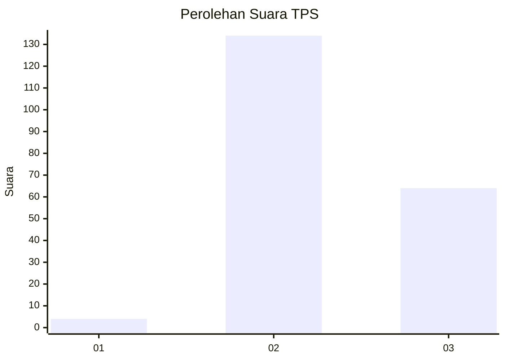
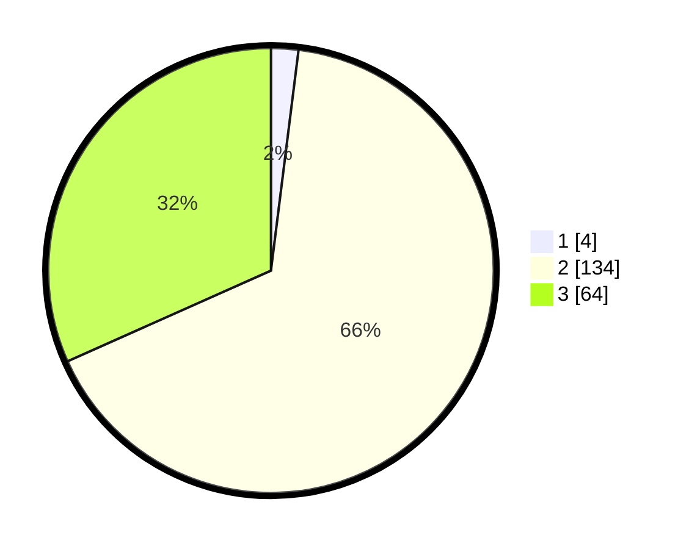

# Hasil

## Grafik

## Tabel

| No. | Nama Paslon    | Suara | Suara (raw) | Persentase |
|:--- |:-------------- | -----:| -----------:| ----------:|
| 1   | ANIES MUHAIMIN | 4     | [4][p-1]    | 1,98       |
| 2   | PRABOWO GIBRAN | 134   | [134][p-2]  | 66,34      |
| 3   | GANJAR MAHFUD  | 64    | [64][p-3]   | 31,68      |

[p-1]: https://github.com/gigit-pemilu/pemilu-2024-51-bali/blob/main/pilpres/hitung-suara/sub/51-bali/sub/07-karangasem/sub/08-kubu/sub/2002-dukuh/sub/011-tps/sub/paslon-1.txt
[p-2]: https://github.com/gigit-pemilu/pemilu-2024-51-bali/blob/main/pilpres/hitung-suara/sub/51-bali/sub/07-karangasem/sub/08-kubu/sub/2002-dukuh/sub/011-tps/sub/paslon-2.txt
[p-3]: https://github.com/gigit-pemilu/pemilu-2024-51-bali/blob/main/pilpres/hitung-suara/sub/51-bali/sub/07-karangasem/sub/08-kubu/sub/2002-dukuh/sub/011-tps/sub/paslon-3.txt

## Foto C Plano

https://sirekap-obj-formc.kpu.go.id/d1e0/pemilu/ppwp/51/07/08/20/02/5107082002011-20240214-155009--e79769e6-4ba0-43c4-84a3-23f31df35482.jpg

https://sirekap-obj-formc.kpu.go.id/d1e0/pemilu/ppwp/51/07/08/20/02/5107082002011-20240214-141553--5be36455-46c8-481a-b6a9-343adc4c7aaa.jpg

https://sirekap-obj-formc.kpu.go.id/d1e0/pemilu/ppwp/51/07/08/20/02/5107082002011-20240214-155512--0e38261c-57bf-48ba-8ca8-38df4f4f3f7b.jpg

## Metadata

| Key        | Value               |
| ---------- | ------------------- |
| Time Stamp | 2024-02-15 15:00:29 |

