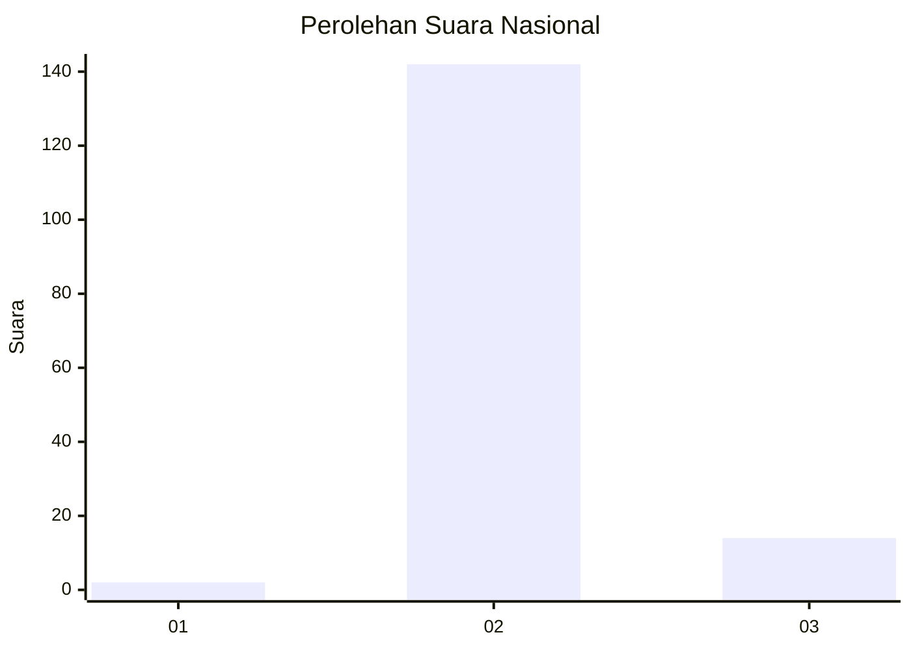
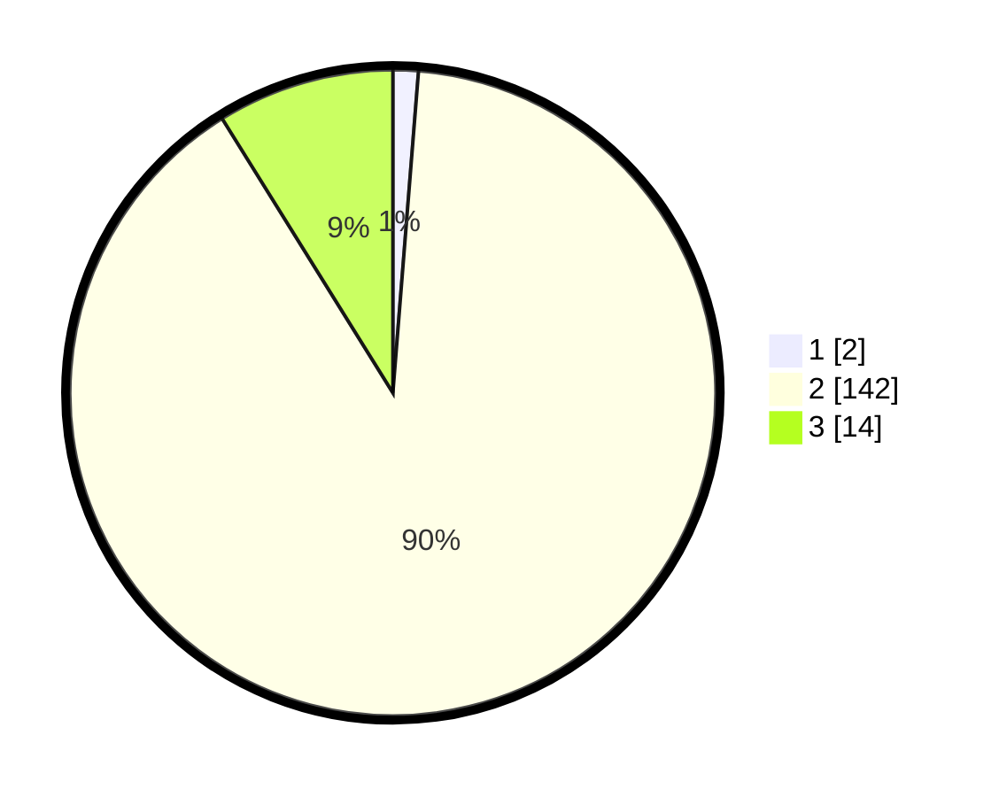

# Hasil

## Grafik

## Tabel

| No. | Nama Paslon    | Suara | Suara (raw) | Persentase |
|:--- |:-------------- | -----:| -----------:| ----------:|
| 1   | ANIES MUHAIMIN | 2     | [2][p-1]    | 1,27       |
| 2   | PRABOWO GIBRAN | 142   | [142][p-2]  | 89,87      |
| 3   | GANJAR MAHFUD  | 14    | [14][p-3]   | 8,86       |

[p-1]: https://github.com/gigit-pemilu/pemilu-2024/blob/main/pilpres/hitung-suara/sub/51-bali/sub/07-karangasem/sub/08-kubu/sub/2002-dukuh/sub/012-tps/sub/paslon-1.txt
[p-2]: https://github.com/gigit-pemilu/pemilu-2024/blob/main/pilpres/hitung-suara/sub/51-bali/sub/07-karangasem/sub/08-kubu/sub/2002-dukuh/sub/012-tps/sub/paslon-2.txt
[p-3]: https://github.com/gigit-pemilu/pemilu-2024/blob/main/pilpres/hitung-suara/sub/51-bali/sub/07-karangasem/sub/08-kubu/sub/2002-dukuh/sub/012-tps/sub/paslon-3.txt

## Foto C Plano

https://sirekap-obj-formc.kpu.go.id/cb38/pemilu/ppwp/51/07/08/20/02/5107082002012-20240214-193714--bb865e18-6ea6-44e7-9a24-8d86501d11e4.jpg

https://sirekap-obj-formc.kpu.go.id/cb38/pemilu/ppwp/51/07/08/20/02/5107082002012-20240214-193821--e4c226fa-fd22-4da7-8898-2ad62abd3c8c.jpg

https://sirekap-obj-formc.kpu.go.id/cb38/pemilu/ppwp/51/07/08/20/02/5107082002012-20240214-203427--ab04d507-e0b6-433c-9b9f-47b168b591bb.jpg

## Metadata

| Key        | Value               |
| ---------- | ------------------- |
| Time Stamp | 2024-02-14 21:46:01 |

