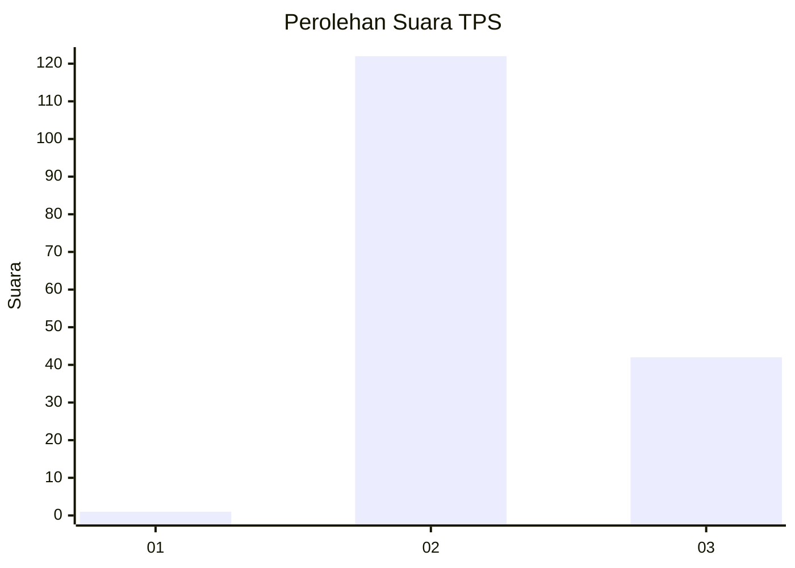
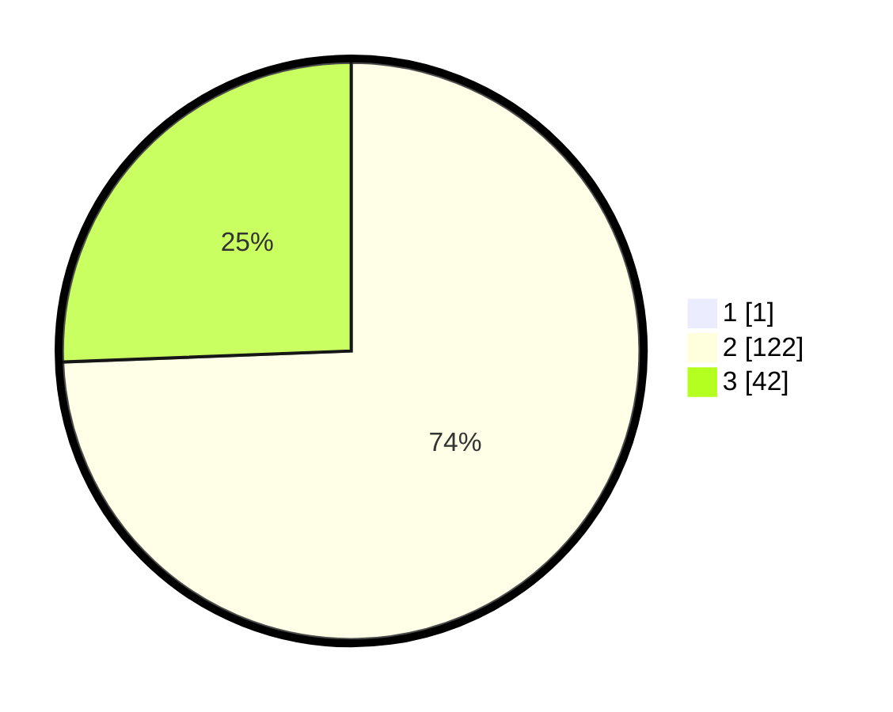

# Hasil

## Grafik

## Tabel

| No. | Nama Paslon    | Suara | Suara (raw) | Persentase |
|:--- |:-------------- | -----:| -----------:| ----------:|
| 1   | ANIES MUHAIMIN | 1     | [1][p-1]    | 0,61       |
| 2   | PRABOWO GIBRAN | 122   | [122][p-2]  | 73,94      |
| 3   | GANJAR MAHFUD  | 42    | [42][p-3]   | 25,45      |

[p-1]: https://github.com/gigit-pemilu/pemilu-2024-51-bali/blob/main/pilpres/hitung-suara/sub/51-bali/sub/07-karangasem/sub/08-kubu/sub/2003-kubu/sub/001-tps/sub/paslon-1.txt
[p-2]: https://github.com/gigit-pemilu/pemilu-2024-51-bali/blob/main/pilpres/hitung-suara/sub/51-bali/sub/07-karangasem/sub/08-kubu/sub/2003-kubu/sub/001-tps/sub/paslon-2.txt
[p-3]: https://github.com/gigit-pemilu/pemilu-2024-51-bali/blob/main/pilpres/hitung-suara/sub/51-bali/sub/07-karangasem/sub/08-kubu/sub/2003-kubu/sub/001-tps/sub/paslon-3.txt

## Foto C Plano

https://sirekap-obj-formc.kpu.go.id/fd1a/pemilu/ppwp/51/07/08/20/03/5107082003001-20240214-132339--83a4613f-5d6d-4e1f-8af0-8505ef6aff5c.jpg

https://sirekap-obj-formc.kpu.go.id/fd1a/pemilu/ppwp/51/07/08/20/03/5107082003001-20240214-132447--342fbf72-c75e-455b-87eb-2fd4f07b238c.jpg

https://sirekap-obj-formc.kpu.go.id/fd1a/pemilu/ppwp/51/07/08/20/03/5107082003001-20240214-132527--cd2b646e-2acc-4412-96db-62e7c9d5f935.jpg

## Metadata

| Key        | Value               |
| ---------- | ------------------- |
| Time Stamp | 2024-02-15 00:41:44 |

