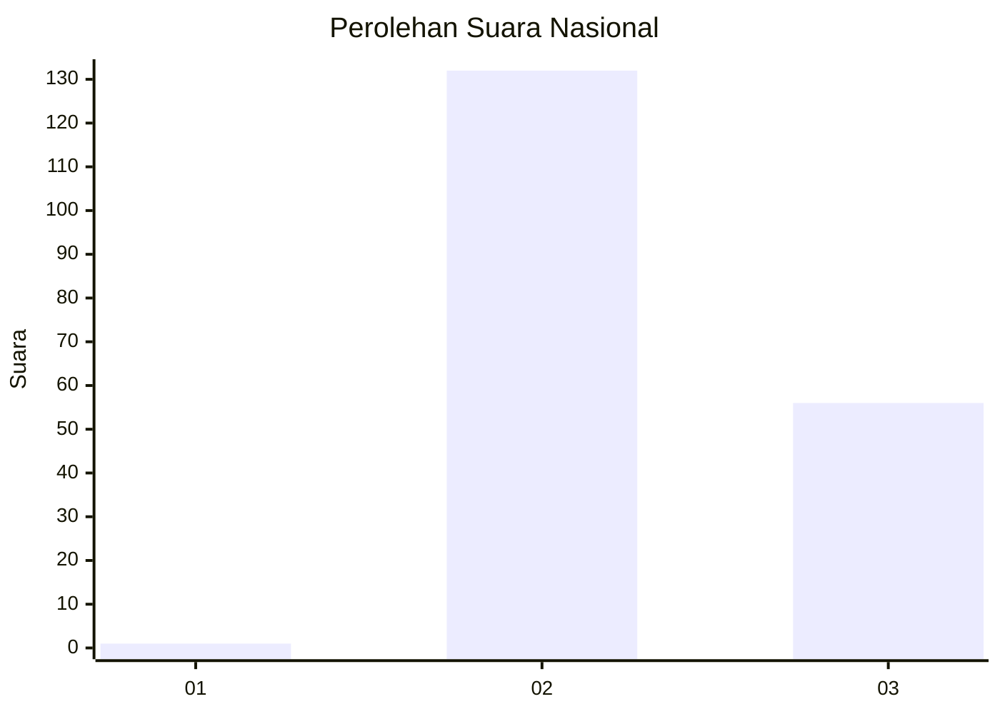
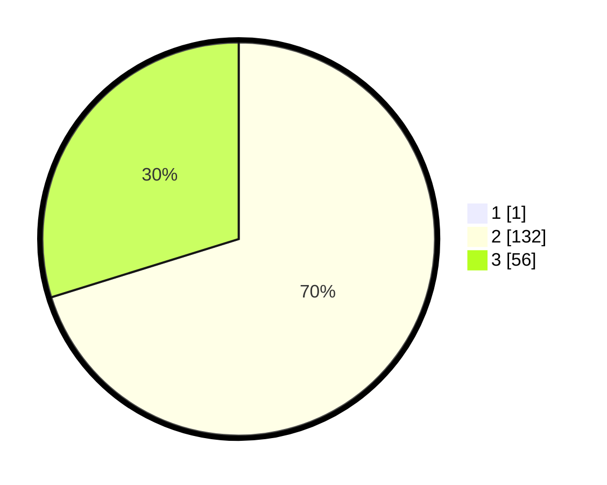

# Hasil

## Grafik

## Tabel

| No. | Nama Paslon    | Suara | Suara (raw) | Persentase |
|:--- |:-------------- | -----:| -----------:| ----------:|
| 1   | ANIES MUHAIMIN | 1     | [1][p-1]    | 0,53       |
| 2   | PRABOWO GIBRAN | 132   | [132][p-2]  | 69,84      |
| 3   | GANJAR MAHFUD  | 56    | [56][p-3]   | 29,63      |

[p-1]: https://github.com/gigit-pemilu/pemilu-2024/blob/main/pilpres/hitung-suara/sub/51-bali/sub/07-karangasem/sub/08-kubu/sub/2003-kubu/sub/003-tps/sub/paslon-1.txt
[p-2]: https://github.com/gigit-pemilu/pemilu-2024/blob/main/pilpres/hitung-suara/sub/51-bali/sub/07-karangasem/sub/08-kubu/sub/2003-kubu/sub/003-tps/sub/paslon-2.txt
[p-3]: https://github.com/gigit-pemilu/pemilu-2024/blob/main/pilpres/hitung-suara/sub/51-bali/sub/07-karangasem/sub/08-kubu/sub/2003-kubu/sub/003-tps/sub/paslon-3.txt

## Foto C Plano

https://sirekap-obj-formc.kpu.go.id/a9b8/pemilu/ppwp/51/07/08/20/03/5107082003003-20240214-130603--6e439de0-6e06-457f-9a5a-9baa45c3f38f.jpg

https://sirekap-obj-formc.kpu.go.id/a9b8/pemilu/ppwp/51/07/08/20/03/5107082003003-20240214-130732--d32eca8a-14ee-4f17-9ceb-65a0e2904129.jpg

https://sirekap-obj-formc.kpu.go.id/a9b8/pemilu/ppwp/51/07/08/20/03/5107082003003-20240214-130649--b1337296-b0c5-43c1-95b9-7ee235f85258.jpg

## Metadata

| Key        | Value               |
| ---------- | ------------------- |
| Time Stamp | 2024-02-15 15:00:29 |

