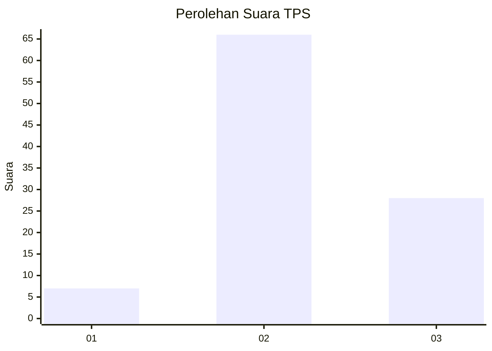
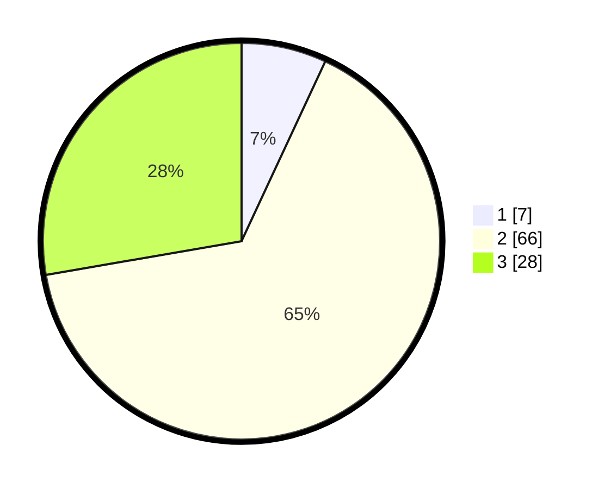

# Hasil

## Grafik

## Tabel

| No. | Nama Paslon    | Suara | Suara (raw) | Persentase |
|:--- |:-------------- | -----:| -----------:| ----------:|
| 1   | ANIES MUHAIMIN | 7     | [7][p-1]    | 6,93       |
| 2   | PRABOWO GIBRAN | 66    | [66][p-2]   | 65,35      |
| 3   | GANJAR MAHFUD  | 28    | [28][p-3]   | 27,72      |

[p-1]: https://github.com/gigit-pemilu/pemilu-2024-51-bali/blob/main/pilpres/hitung-suara/sub/51-bali/sub/07-karangasem/sub/08-kubu/sub/2004-tianyar/sub/005-tps/sub/paslon-1.txt
[p-2]: https://github.com/gigit-pemilu/pemilu-2024-51-bali/blob/main/pilpres/hitung-suara/sub/51-bali/sub/07-karangasem/sub/08-kubu/sub/2004-tianyar/sub/005-tps/sub/paslon-2.txt
[p-3]: https://github.com/gigit-pemilu/pemilu-2024-51-bali/blob/main/pilpres/hitung-suara/sub/51-bali/sub/07-karangasem/sub/08-kubu/sub/2004-tianyar/sub/005-tps/sub/paslon-3.txt

## Foto C Plano

https://sirekap-obj-formc.kpu.go.id/b3f3/pemilu/ppwp/51/07/08/20/04/5107082004005-20240214-194131--6df17a2a-201d-4257-9151-f9586fa2f2e6.jpg

https://sirekap-obj-formc.kpu.go.id/b3f3/pemilu/ppwp/51/07/08/20/04/5107082004005-20240214-210323--9441f38c-da3a-4725-b849-9539e377f67e.jpg

https://sirekap-obj-formc.kpu.go.id/b3f3/pemilu/ppwp/51/07/08/20/04/5107082004005-20240214-194257--546d734d-2744-4167-9526-4dc38dce5a05.jpg

## Metadata

| Key        | Value               |
| ---------- | ------------------- |
| Time Stamp | 2024-02-15 15:00:29 |

