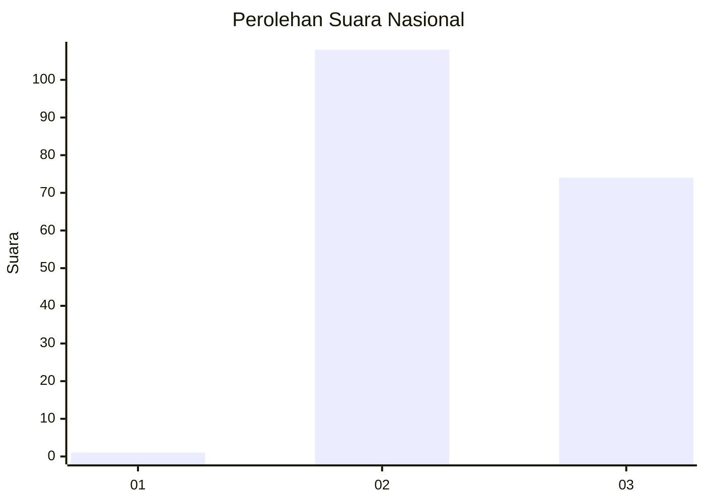
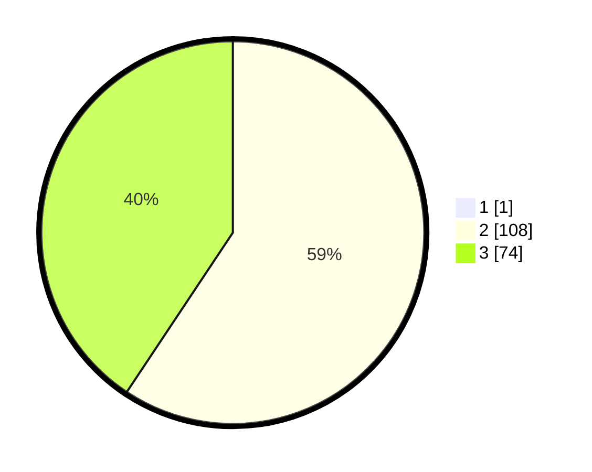

# Hasil

## Grafik

## Tabel

| No. | Nama Paslon    | Suara | Suara (raw) | Persentase |
|:--- |:-------------- | -----:| -----------:| ----------:|
| 1   | ANIES MUHAIMIN | 1     | [1][p-1]    | 0,55       |
| 2   | PRABOWO GIBRAN | 108   | [108][p-2]  | 59,02      |
| 3   | GANJAR MAHFUD  | 74    | [74][p-3]   | 40,44      |

[p-1]: https://github.com/gigit-pemilu/pemilu-2024/blob/main/pilpres/hitung-suara/sub/51-bali/sub/07-karangasem/sub/08-kubu/sub/2004-tianyar/sub/013-tps/sub/paslon-1.txt
[p-2]: https://github.com/gigit-pemilu/pemilu-2024/blob/main/pilpres/hitung-suara/sub/51-bali/sub/07-karangasem/sub/08-kubu/sub/2004-tianyar/sub/013-tps/sub/paslon-2.txt
[p-3]: https://github.com/gigit-pemilu/pemilu-2024/blob/main/pilpres/hitung-suara/sub/51-bali/sub/07-karangasem/sub/08-kubu/sub/2004-tianyar/sub/013-tps/sub/paslon-3.txt

## Foto C Plano

https://sirekap-obj-formc.kpu.go.id/2fa5/pemilu/ppwp/51/07/08/20/04/5107082004013-20240214-200114--7ab9ad38-802f-418c-bba7-e6cbb2dfb467.jpg

https://sirekap-obj-formc.kpu.go.id/2fa5/pemilu/ppwp/51/07/08/20/04/5107082004013-20240214-200317--0a85a194-fffa-4cec-94f0-cb9c8d3b374c.jpg

https://sirekap-obj-formc.kpu.go.id/2fa5/pemilu/ppwp/51/07/08/20/04/5107082004013-20240214-200726--4ae9aeaa-9037-4c4e-acf6-86ab8ce7c049.jpg

## Metadata

| Key        | Value               |
| ---------- | ------------------- |
| Time Stamp | 2024-02-15 15:00:29 |

