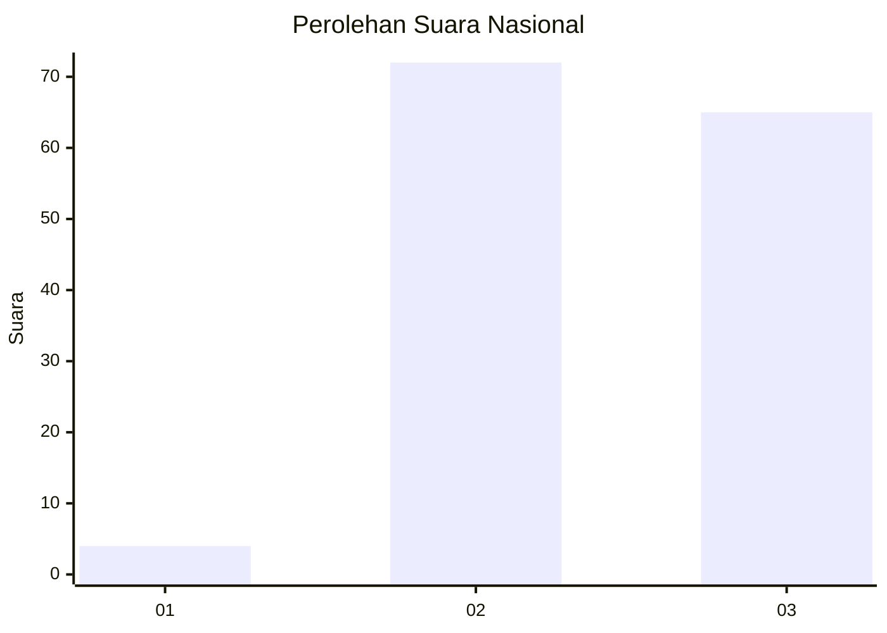
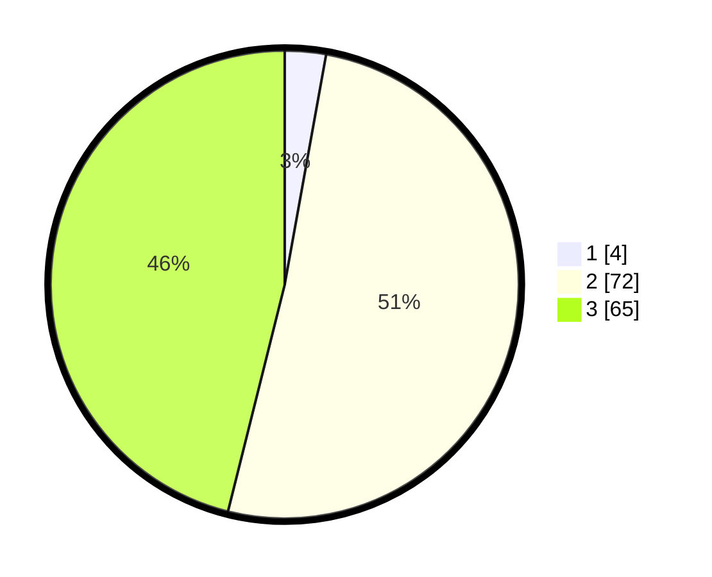

# Hasil

## Grafik

## Tabel

| No. | Nama Paslon    | Suara | Suara (raw) | Persentase |
|:--- |:-------------- | -----:| -----------:| ----------:|
| 1   | ANIES MUHAIMIN | 4     | [4][p-1]    | 2,84       |
| 2   | PRABOWO GIBRAN | 72    | [72][p-2]   | 51,06      |
| 3   | GANJAR MAHFUD  | 65    | [65][p-3]   | 46,10      |

[p-1]: https://github.com/gigit-pemilu/pemilu-2024/blob/main/pilpres/hitung-suara/sub/51-bali/sub/07-karangasem/sub/08-kubu/sub/2004-tianyar/sub/024-tps/sub/paslon-1.txt
[p-2]: https://github.com/gigit-pemilu/pemilu-2024/blob/main/pilpres/hitung-suara/sub/51-bali/sub/07-karangasem/sub/08-kubu/sub/2004-tianyar/sub/024-tps/sub/paslon-2.txt
[p-3]: https://github.com/gigit-pemilu/pemilu-2024/blob/main/pilpres/hitung-suara/sub/51-bali/sub/07-karangasem/sub/08-kubu/sub/2004-tianyar/sub/024-tps/sub/paslon-3.txt

## Foto C Plano

https://sirekap-obj-formc.kpu.go.id/e6e1/pemilu/ppwp/51/07/08/20/04/5107082004024-20240214-132730--d29ea761-cbdd-44f0-914a-5457a6f1c965.jpg

https://sirekap-obj-formc.kpu.go.id/e6e1/pemilu/ppwp/51/07/08/20/04/5107082004024-20240214-132845--fffebdc0-c2b1-4967-b070-f61106e59b2d.jpg

## Metadata

| Key        | Value               |
| ---------- | ------------------- |
| Time Stamp | 2024-02-15 07:00:44 |

