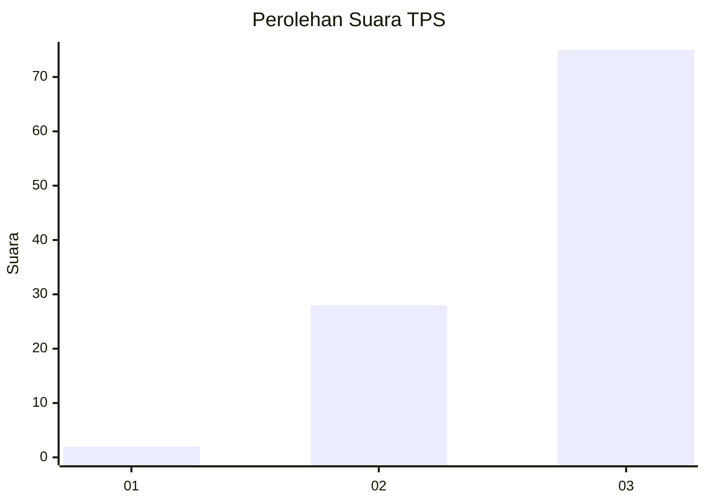
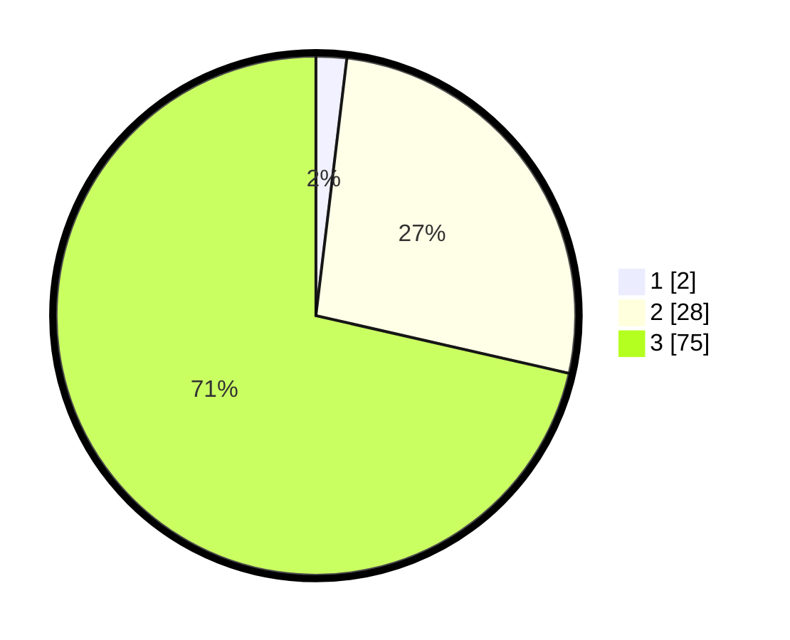

# Hasil

## Grafik

## Tabel

| No. | Nama Paslon    | Suara | Suara (raw) | Persentase |
|:--- |:-------------- | -----:| -----------:| ----------:|
| 1   | ANIES MUHAIMIN | 2     | [2][p-1]    | 1,90       |
| 2   | PRABOWO GIBRAN | 28    | [28][p-2]   | 26,67      |
| 3   | GANJAR MAHFUD  | 75    | [75][p-3]   | 71,43      |

[p-1]: https://github.com/gigit-pemilu/pemilu-2024-51-bali/blob/main/pilpres/hitung-suara/sub/51-bali/sub/07-karangasem/sub/08-kubu/sub/2004-tianyar/sub/029-tps/sub/paslon-1.txt
[p-2]: https://github.com/gigit-pemilu/pemilu-2024-51-bali/blob/main/pilpres/hitung-suara/sub/51-bali/sub/07-karangasem/sub/08-kubu/sub/2004-tianyar/sub/029-tps/sub/paslon-2.txt
[p-3]: https://github.com/gigit-pemilu/pemilu-2024-51-bali/blob/main/pilpres/hitung-suara/sub/51-bali/sub/07-karangasem/sub/08-kubu/sub/2004-tianyar/sub/029-tps/sub/paslon-3.txt

## Foto C Plano

https://sirekap-obj-formc.kpu.go.id/3db2/pemilu/ppwp/51/07/08/20/04/5107082004029-20240214-213016--fc34a78c-26eb-423a-a416-e56767c97b59.jpg

https://sirekap-obj-formc.kpu.go.id/3db2/pemilu/ppwp/51/07/08/20/04/5107082004029-20240214-213237--642aa522-c4ab-44d1-92ae-303c4e2d8871.jpg

https://sirekap-obj-formc.kpu.go.id/3db2/pemilu/ppwp/51/07/08/20/04/5107082004029-20240214-213457--989bf153-c9b4-49d5-b6fe-7e07c5dcdcda.jpg

## Metadata

| Key        | Value               |
| ---------- | ------------------- |
| Time Stamp | 2024-02-19 06:16:00 |

