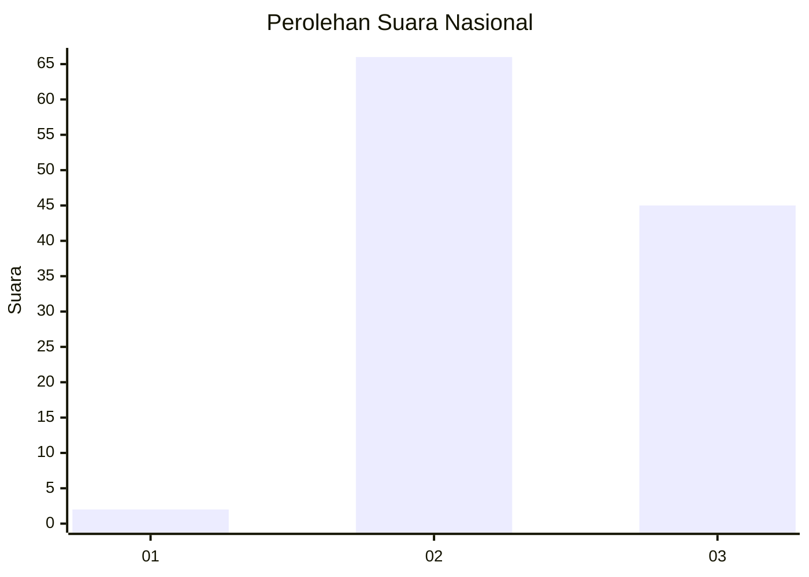
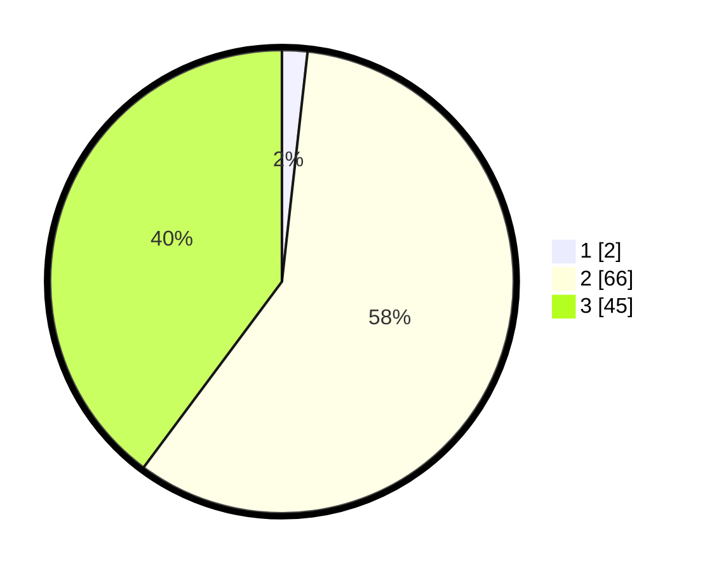

# Hasil

## Grafik

## Tabel

| No. | Nama Paslon    | Suara | Suara (raw) | Persentase |
|:--- |:-------------- | -----:| -----------:| ----------:|
| 1   | ANIES MUHAIMIN | 2     | [2][p-1]    | 1,77       |
| 2   | PRABOWO GIBRAN | 66    | [66][p-2]   | 58,41      |
| 3   | GANJAR MAHFUD  | 45    | [45][p-3]   | 39,82      |

[p-1]: https://github.com/gigit-pemilu/pemilu-2024/blob/main/pilpres/hitung-suara/sub/51-bali/sub/07-karangasem/sub/08-kubu/sub/2004-tianyar/sub/030-tps/sub/paslon-1.txt
[p-2]: https://github.com/gigit-pemilu/pemilu-2024/blob/main/pilpres/hitung-suara/sub/51-bali/sub/07-karangasem/sub/08-kubu/sub/2004-tianyar/sub/030-tps/sub/paslon-2.txt
[p-3]: https://github.com/gigit-pemilu/pemilu-2024/blob/main/pilpres/hitung-suara/sub/51-bali/sub/07-karangasem/sub/08-kubu/sub/2004-tianyar/sub/030-tps/sub/paslon-3.txt

## Foto C Plano

https://sirekap-obj-formc.kpu.go.id/105c/pemilu/ppwp/51/07/08/20/04/5107082004030-20240214-132754--d37535b0-7a87-4430-9576-26928cf69fee.jpg

https://sirekap-obj-formc.kpu.go.id/105c/pemilu/ppwp/51/07/08/20/04/5107082004030-20240214-132847--64da4f67-073c-4d23-9d29-d3da040569a2.jpg

https://sirekap-obj-formc.kpu.go.id/105c/pemilu/ppwp/51/07/08/20/04/5107082004030-20240214-132931--7204fde1-daa9-4307-9f23-71f833a27fe9.jpg

## Metadata

| Key        | Value               |
| ---------- | ------------------- |
| Time Stamp | 2024-02-14 21:46:01 |

## DATA PEMILIH TETAP

Jumlah pemilih dalam DPT: **171**.
 * L: **82**.
 * P: **89**.

## DATA PENGGUNA HAK PILIH

Jumlah pengguna hak pilih dalam DPT: **114**.
 * L: **62**.
 * P: **52**.

Jumlah pengguna hak pilih dalam DPTb: **0**.
 * L: **0**.
 * P: **0**.

Jumlah pengguna hak pilih dalam DPK: **1**.
 * L: **0**.
 * P: **1**.

Jumlah pengguna hak pilih: **115**.
 * L: **62**.
 * P: **53**.

## JUMLAH SUARA SAH DAN TIDAK SAH

JUMLAH SELURUH SUARA SAH: **113**.

JUMLAH SUARA TIDAK SAH: **2**.

JUMLAH SELURUH SUARA SAH DAN SUARA TIDAK SAH: **115**.

