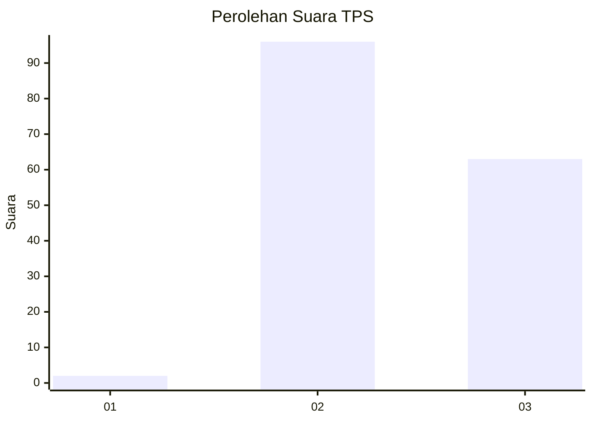
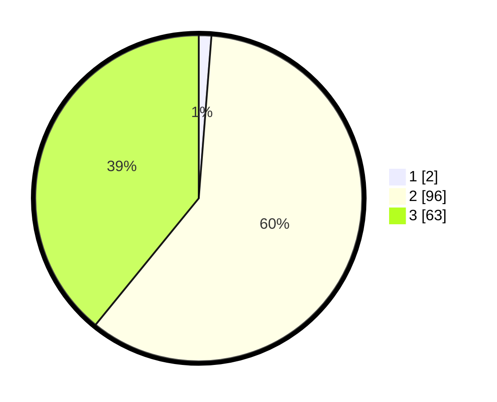

# Hasil

## Grafik

## Tabel

| No. | Nama Paslon    | Suara | Suara (raw) | Persentase |
|:--- |:-------------- | -----:| -----------:| ----------:|
| 1   | ANIES MUHAIMIN | 2     | [2][p-1]    | 1,24       |
| 2   | PRABOWO GIBRAN | 96    | [96][p-2]   | 59,63      |
| 3   | GANJAR MAHFUD  | 63    | [63][p-3]   | 39,13      |

[p-1]: https://github.com/gigit-pemilu/pemilu-2024-51-bali/blob/main/pilpres/hitung-suara/sub/51-bali/sub/07-karangasem/sub/08-kubu/sub/2004-tianyar/sub/032-tps/sub/paslon-1.txt
[p-2]: https://github.com/gigit-pemilu/pemilu-2024-51-bali/blob/main/pilpres/hitung-suara/sub/51-bali/sub/07-karangasem/sub/08-kubu/sub/2004-tianyar/sub/032-tps/sub/paslon-2.txt
[p-3]: https://github.com/gigit-pemilu/pemilu-2024-51-bali/blob/main/pilpres/hitung-suara/sub/51-bali/sub/07-karangasem/sub/08-kubu/sub/2004-tianyar/sub/032-tps/sub/paslon-3.txt

## Foto C Plano

https://sirekap-obj-formc.kpu.go.id/af6f/pemilu/ppwp/51/07/08/20/04/5107082004032-20240214-205914--df5316c2-f482-4ead-a2f3-f19131bf0ec8.jpg

https://sirekap-obj-formc.kpu.go.id/af6f/pemilu/ppwp/51/07/08/20/04/5107082004032-20240214-210333--9c193165-dd8e-443f-83bb-24f39e0799fb.jpg

https://sirekap-obj-formc.kpu.go.id/af6f/pemilu/ppwp/51/07/08/20/04/5107082004032-20240214-210452--7c15113f-a537-4911-a951-10a58015a663.jpg

## Metadata

| Key        | Value               |
| ---------- | ------------------- |
| Time Stamp | 2024-02-17 04:30:02 |

## DATA PEMILIH TETAP

Jumlah pemilih dalam DPT: **232**.
 * L: **123**.
 * P: **109**.

## DATA PENGGUNA HAK PILIH

Jumlah pengguna hak pilih dalam DPT: **168**.
 * L: **93**.
 * P: **75**.

Jumlah pengguna hak pilih dalam DPTb: **0**.
 * L: **0**.
 * P: **0**.

Jumlah pengguna hak pilih dalam DPK: **0**.
 * L: **0**.
 * P: **0**.

Jumlah pengguna hak pilih: **168**.
 * L: **93**.
 * P: **75**.

## JUMLAH SUARA SAH DAN TIDAK SAH

JUMLAH SELURUH SUARA SAH: **161**.

JUMLAH SUARA TIDAK SAH: **7**.

JUMLAH SELURUH SUARA SAH DAN SUARA TIDAK SAH: **168**.

