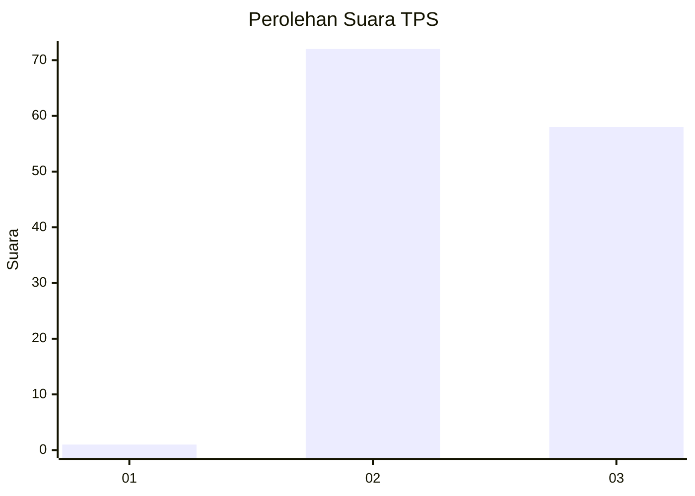
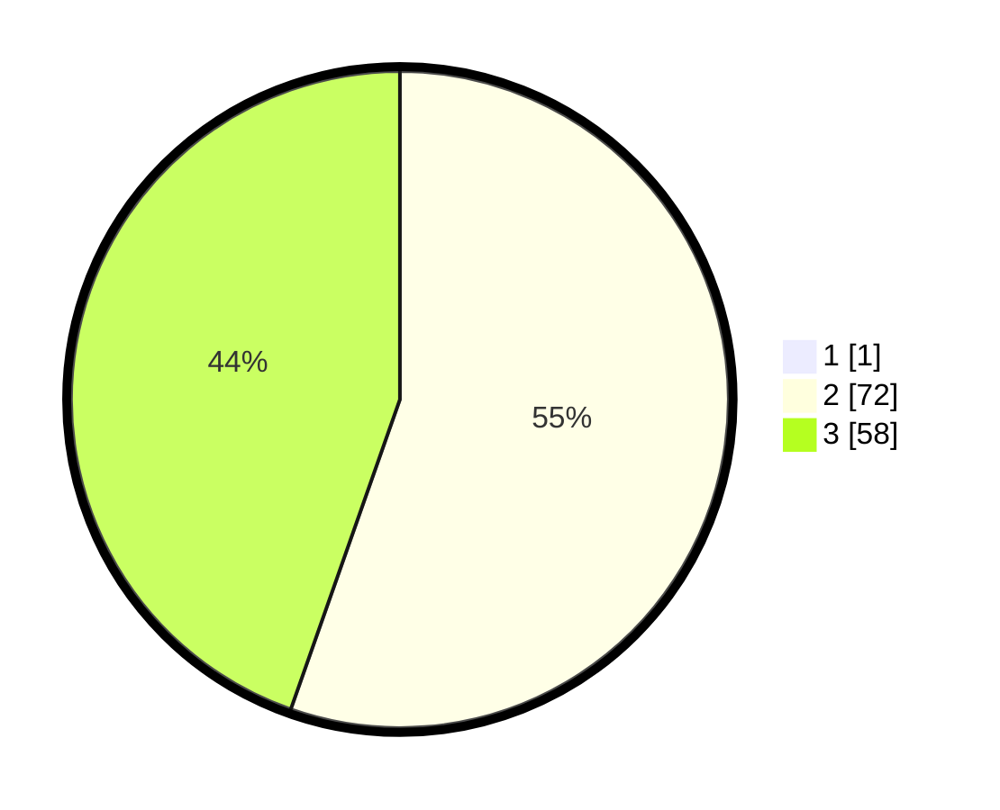

# Hasil

## Grafik

## Tabel

| No. | Nama Paslon    | Suara | Suara (raw) | Persentase |
|:--- |:-------------- | -----:| -----------:| ----------:|
| 1   | ANIES MUHAIMIN | 1     | [1][p-1]    | 0,76       |
| 2   | PRABOWO GIBRAN | 72    | [72][p-2]   | 54,96      |
| 3   | GANJAR MAHFUD  | 58    | [58][p-3]   | 44,27      |

[p-1]: https://github.com/gigit-pemilu/pemilu-2024-51-bali/blob/main/pilpres/hitung-suara/sub/51-bali/sub/07-karangasem/sub/08-kubu/sub/2004-tianyar/sub/037-tps/sub/paslon-1.txt
[p-2]: https://github.com/gigit-pemilu/pemilu-2024-51-bali/blob/main/pilpres/hitung-suara/sub/51-bali/sub/07-karangasem/sub/08-kubu/sub/2004-tianyar/sub/037-tps/sub/paslon-2.txt
[p-3]: https://github.com/gigit-pemilu/pemilu-2024-51-bali/blob/main/pilpres/hitung-suara/sub/51-bali/sub/07-karangasem/sub/08-kubu/sub/2004-tianyar/sub/037-tps/sub/paslon-3.txt

## Foto C Plano

https://sirekap-obj-formc.kpu.go.id/ebea/pemilu/ppwp/51/07/08/20/04/5107082004037-20240214-202232--762758a3-5fdd-4b27-8c87-56beb62eb82f.jpg

https://sirekap-obj-formc.kpu.go.id/ebea/pemilu/ppwp/51/07/08/20/04/5107082004037-20240214-200005--82b1b473-118e-4a56-92fb-48c7745528de.jpg

https://sirekap-obj-formc.kpu.go.id/ebea/pemilu/ppwp/51/07/08/20/04/5107082004037-20240214-200121--2c1cc7d6-d8f9-48f9-b8fe-163cfdd7840c.jpg

## Metadata

| Key        | Value               |
| ---------- | ------------------- |
| Time Stamp | 2024-02-19 06:16:00 |

