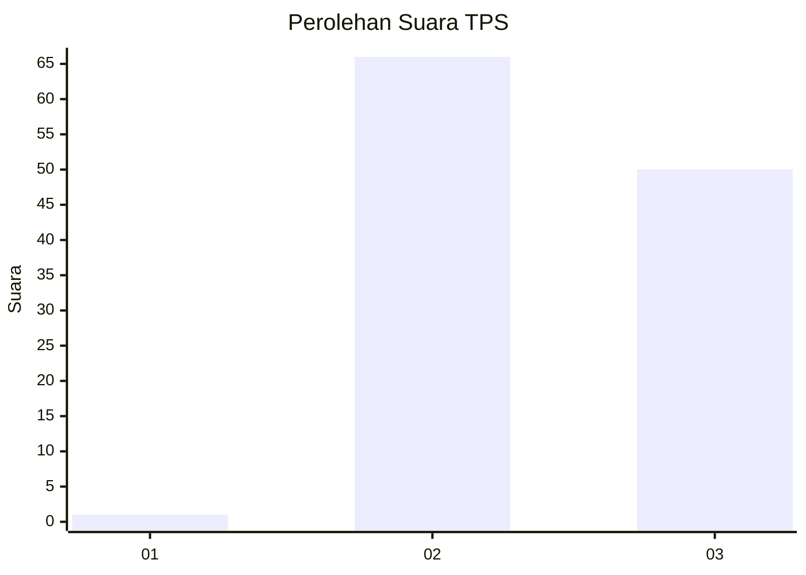
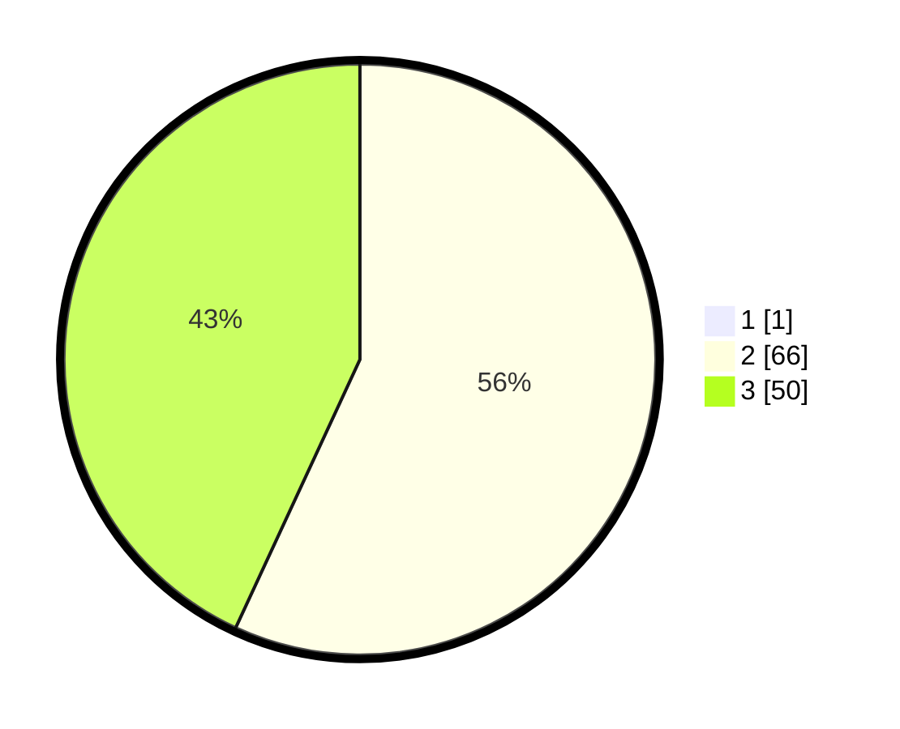

# Hasil

## Grafik

## Tabel

| No. | Nama Paslon    | Suara | Suara (raw) | Persentase |
|:--- |:-------------- | -----:| -----------:| ----------:|
| 1   | ANIES MUHAIMIN | 1     | [1][p-1]    | 0,85       |
| 2   | PRABOWO GIBRAN | 66    | [66][p-2]   | 56,41      |
| 3   | GANJAR MAHFUD  | 50    | [50][p-3]   | 42,74      |

[p-1]: https://github.com/gigit-pemilu/pemilu-2024-51-bali/blob/main/pilpres/hitung-suara/sub/51-bali/sub/07-karangasem/sub/08-kubu/sub/2004-tianyar/sub/039-tps/sub/paslon-1.txt
[p-2]: https://github.com/gigit-pemilu/pemilu-2024-51-bali/blob/main/pilpres/hitung-suara/sub/51-bali/sub/07-karangasem/sub/08-kubu/sub/2004-tianyar/sub/039-tps/sub/paslon-2.txt
[p-3]: https://github.com/gigit-pemilu/pemilu-2024-51-bali/blob/main/pilpres/hitung-suara/sub/51-bali/sub/07-karangasem/sub/08-kubu/sub/2004-tianyar/sub/039-tps/sub/paslon-3.txt

## Foto C Plano

https://sirekap-obj-formc.kpu.go.id/a6c2/pemilu/ppwp/51/07/08/20/04/5107082004039-20240214-141055--c88f5e5c-9f1e-45c7-81b4-e3a99c1c60ed.jpg

https://sirekap-obj-formc.kpu.go.id/a6c2/pemilu/ppwp/51/07/08/20/04/5107082004039-20240214-141124--61037eb9-21eb-48d8-be98-2f4eaa182ed3.jpg

https://sirekap-obj-formc.kpu.go.id/a6c2/pemilu/ppwp/51/07/08/20/04/5107082004039-20240214-141139--a0cfd5ea-eb1e-4236-8111-103c87564fa1.jpg

## Metadata

| Key        | Value               |
| ---------- | ------------------- |
| Time Stamp | 2024-02-17 16:00:02 |

## DATA PEMILIH TETAP

Jumlah pemilih dalam DPT: **162**.
 * L: **76**.
 * P: **86**.

## DATA PENGGUNA HAK PILIH

Jumlah pengguna hak pilih dalam DPT: **121**.
 * L: **67**.
 * P: **54**.

Jumlah pengguna hak pilih dalam DPTb: **0**.
 * L: **0**.
 * P: **0**.

Jumlah pengguna hak pilih dalam DPK: **0**.
 * L: **0**.
 * P: **0**.

Jumlah pengguna hak pilih: **121**.
 * L: **67**.
 * P: **54**.

## JUMLAH SUARA SAH DAN TIDAK SAH

JUMLAH SELURUH SUARA SAH: **117**.

JUMLAH SUARA TIDAK SAH: **4**.

JUMLAH SELURUH SUARA SAH DAN SUARA TIDAK SAH: **121**.

