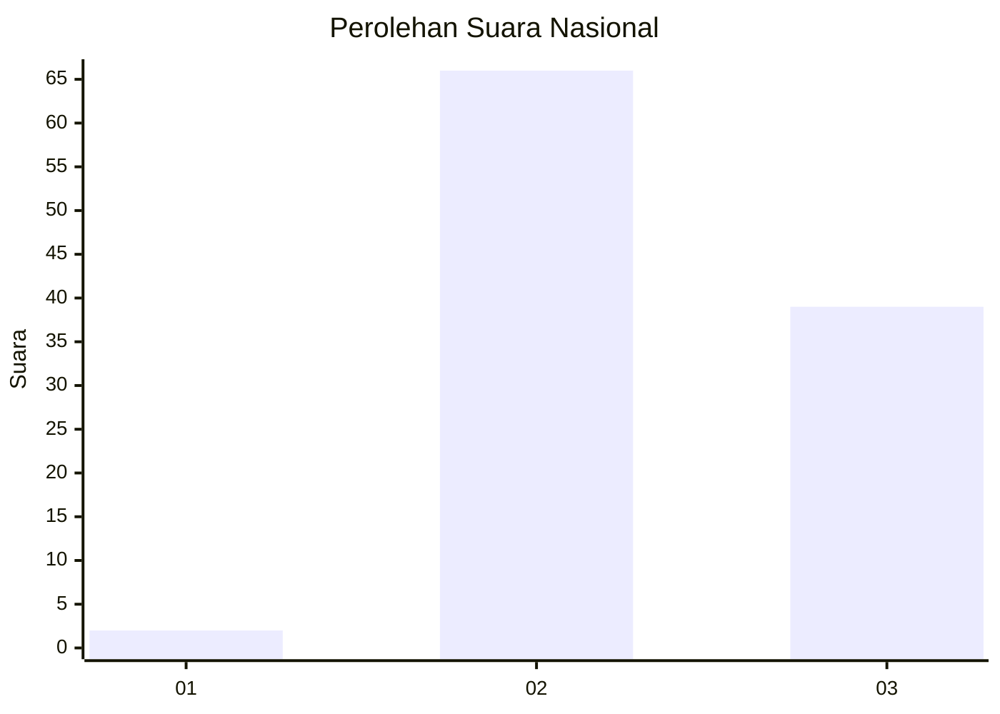
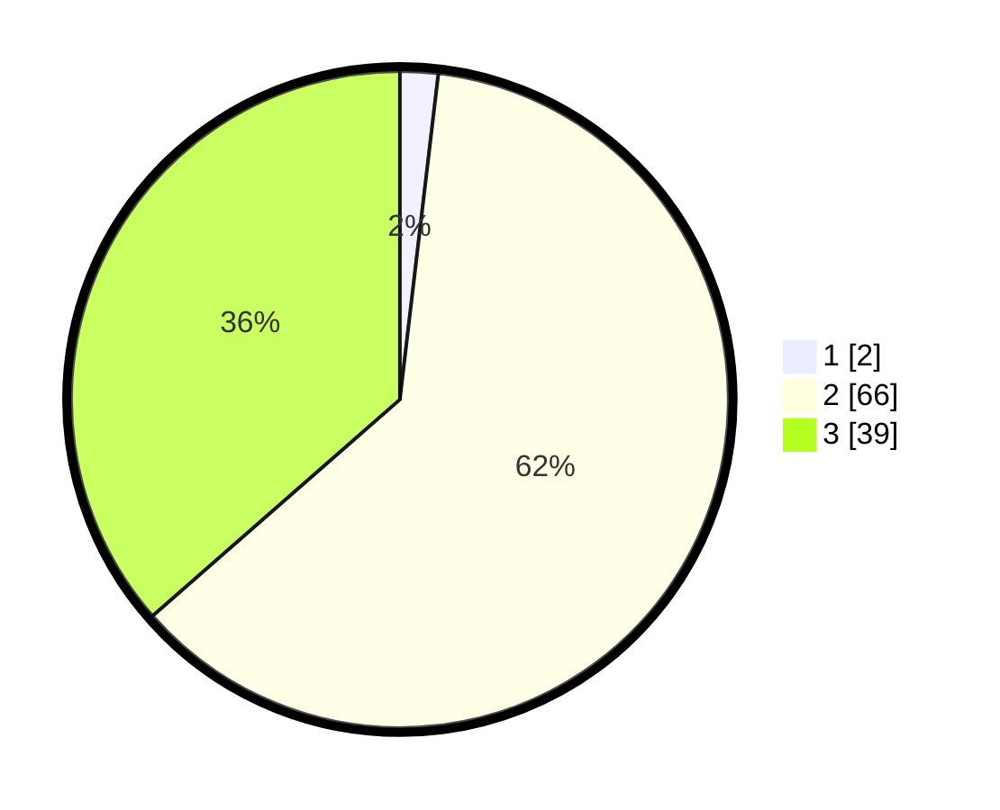

# Hasil

## Grafik

## Tabel

| No. | Nama Paslon    | Suara | Suara (raw) | Persentase |
|:--- |:-------------- | -----:| -----------:| ----------:|
| 1   | ANIES MUHAIMIN | 2     | [2][p-1]    | 1,87       |
| 2   | PRABOWO GIBRAN | 66    | [66][p-2]   | 61,68      |
| 3   | GANJAR MAHFUD  | 39    | [39][p-3]   | 36,45      |

[p-1]: https://github.com/gigit-pemilu/pemilu-2024/blob/main/pilpres/hitung-suara/sub/51-bali/sub/07-karangasem/sub/08-kubu/sub/2004-tianyar/sub/040-tps/sub/paslon-1.txt
[p-2]: https://github.com/gigit-pemilu/pemilu-2024/blob/main/pilpres/hitung-suara/sub/51-bali/sub/07-karangasem/sub/08-kubu/sub/2004-tianyar/sub/040-tps/sub/paslon-2.txt
[p-3]: https://github.com/gigit-pemilu/pemilu-2024/blob/main/pilpres/hitung-suara/sub/51-bali/sub/07-karangasem/sub/08-kubu/sub/2004-tianyar/sub/040-tps/sub/paslon-3.txt

## Foto C Plano

https://sirekap-obj-formc.kpu.go.id/e988/pemilu/ppwp/51/07/08/20/04/5107082004040-20240214-140945--c72b3d0b-f15f-4e16-934d-9a531be501d3.jpg

https://sirekap-obj-formc.kpu.go.id/e988/pemilu/ppwp/51/07/08/20/04/5107082004040-20240214-141830--d7652f92-4170-41e5-ba00-042b804269bd.jpg

https://sirekap-obj-formc.kpu.go.id/e988/pemilu/ppwp/51/07/08/20/04/5107082004040-20240214-140954--b908f0ec-61c9-4504-96a7-af5ae495a42a.jpg

## Metadata

| Key        | Value               |
| ---------- | ------------------- |
| Time Stamp | 2024-02-17 16:00:02 |

## DATA PEMILIH TETAP

Jumlah pemilih dalam DPT: **177**.
 * L: **90**.
 * P: **87**.

## DATA PENGGUNA HAK PILIH

Jumlah pengguna hak pilih dalam DPT: **116**.
 * L: **63**.
 * P: **53**.

Jumlah pengguna hak pilih dalam DPTb: **0**.
 * L: **0**.
 * P: **0**.

Jumlah pengguna hak pilih dalam DPK: **1**.
 * L: **1**.
 * P: **0**.

Jumlah pengguna hak pilih: **117**.
 * L: **64**.
 * P: **53**.

## JUMLAH SUARA SAH DAN TIDAK SAH

JUMLAH SELURUH SUARA SAH: **107**.

JUMLAH SUARA TIDAK SAH: **10**.

JUMLAH SELURUH SUARA SAH DAN SUARA TIDAK SAH: **117**.

