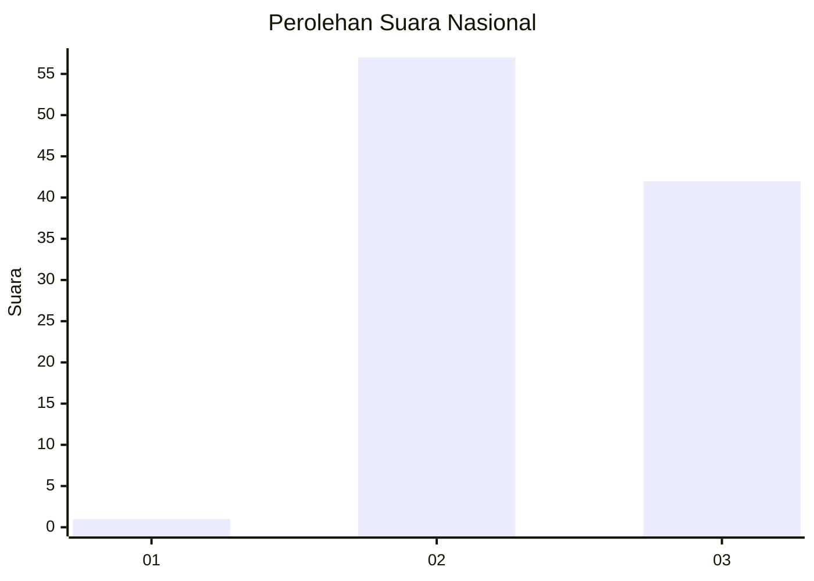
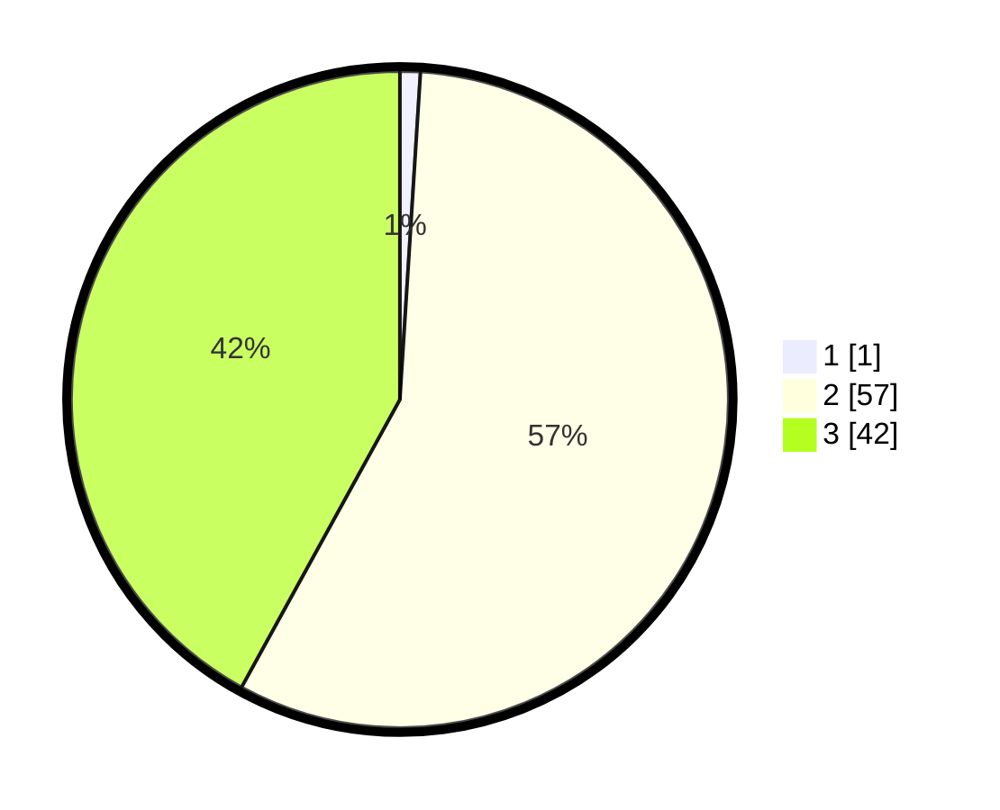

# Hasil

## Grafik

## Tabel

| No. | Nama Paslon    | Suara | Suara (raw) | Persentase |
|:--- |:-------------- | -----:| -----------:| ----------:|
| 1   | ANIES MUHAIMIN | 1     | [1][p-1]    | 1,00       |
| 2   | PRABOWO GIBRAN | 57    | [57][p-2]   | 57,00      |
| 3   | GANJAR MAHFUD  | 42    | [42][p-3]   | 42,00      |

[p-1]: https://github.com/gigit-pemilu/pemilu-2024/blob/main/pilpres/hitung-suara/sub/51-bali/sub/07-karangasem/sub/08-kubu/sub/2004-tianyar/sub/041-tps/sub/paslon-1.txt
[p-2]: https://github.com/gigit-pemilu/pemilu-2024/blob/main/pilpres/hitung-suara/sub/51-bali/sub/07-karangasem/sub/08-kubu/sub/2004-tianyar/sub/041-tps/sub/paslon-2.txt
[p-3]: https://github.com/gigit-pemilu/pemilu-2024/blob/main/pilpres/hitung-suara/sub/51-bali/sub/07-karangasem/sub/08-kubu/sub/2004-tianyar/sub/041-tps/sub/paslon-3.txt

## Foto C Plano

https://sirekap-obj-formc.kpu.go.id/9898/pemilu/ppwp/51/07/08/20/04/5107082004041-20240214-130333--b08645d0-f3e6-4e17-a0df-0db5c5f8174a.jpg

https://sirekap-obj-formc.kpu.go.id/9898/pemilu/ppwp/51/07/08/20/04/5107082004041-20240214-130802--da554ea4-35a3-4355-a299-e560eec71eb6.jpg

https://sirekap-obj-formc.kpu.go.id/9898/pemilu/ppwp/51/07/08/20/04/5107082004041-20240214-130923--52b6a734-afe8-4cc9-9c82-b72654ec7c34.jpg

## Metadata

| Key        | Value               |
| ---------- | ------------------- |
| Time Stamp | 2024-02-14 21:46:01 |

## DATA PEMILIH TETAP

Jumlah pemilih dalam DPT: **139**.
 * L: **58**.
 * P: **81**.

## DATA PENGGUNA HAK PILIH

Jumlah pengguna hak pilih dalam DPT: **103**.
 * L: **47**.
 * P: **56**.

Jumlah pengguna hak pilih dalam DPTb: **0**.
 * L: **0**.
 * P: **0**.

Jumlah pengguna hak pilih dalam DPK: **0**.
 * L: **0**.
 * P: **0**.

Jumlah pengguna hak pilih: **103**.
 * L: **47**.
 * P: **56**.

## JUMLAH SUARA SAH DAN TIDAK SAH

JUMLAH SELURUH SUARA SAH: **100**.

JUMLAH SUARA TIDAK SAH: **3**.

JUMLAH SELURUH SUARA SAH DAN SUARA TIDAK SAH: **103**.

