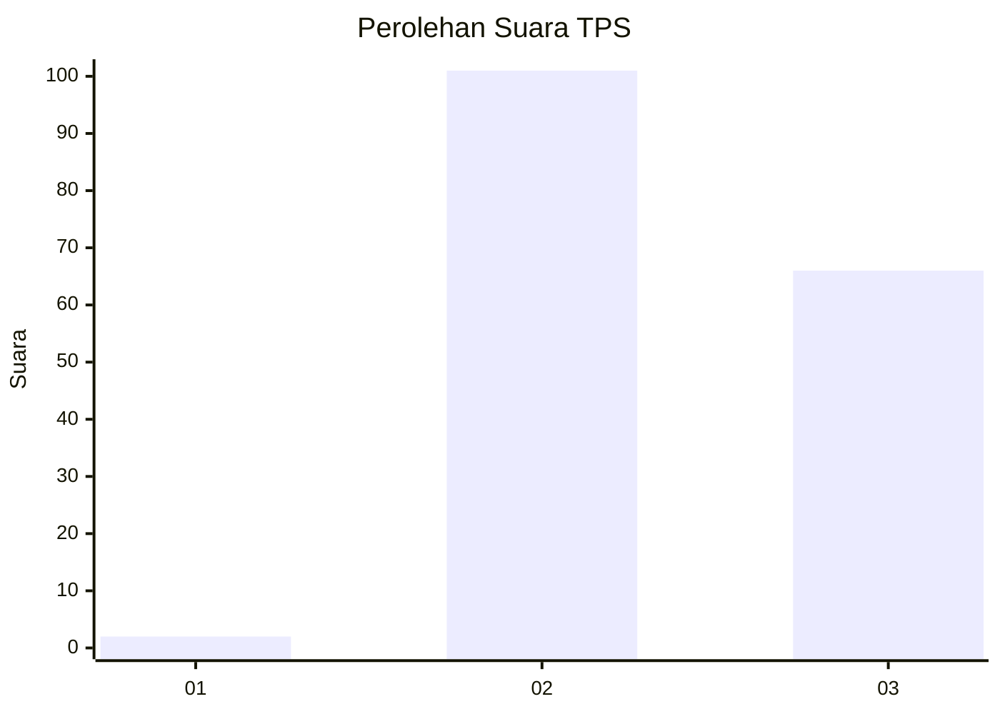
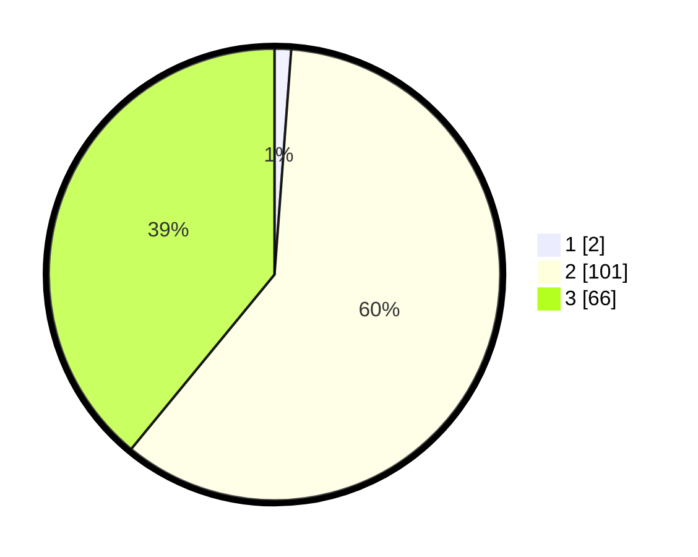

# Hasil

## Grafik

## Tabel

| No. | Nama Paslon    | Suara | Suara (raw) | Persentase |
|:--- |:-------------- | -----:| -----------:| ----------:|
| 1   | ANIES MUHAIMIN | 2     | [2][p-1]    | 1,18       |
| 2   | PRABOWO GIBRAN | 101   | [101][p-2]  | 59,76      |
| 3   | GANJAR MAHFUD  | 66    | [66][p-3]   | 39,05      |

[p-1]: https://github.com/gigit-pemilu/pemilu-2024-51-bali/blob/main/pilpres/hitung-suara/sub/51-bali/sub/07-karangasem/sub/08-kubu/sub/2004-tianyar/sub/042-tps/sub/paslon-1.txt
[p-2]: https://github.com/gigit-pemilu/pemilu-2024-51-bali/blob/main/pilpres/hitung-suara/sub/51-bali/sub/07-karangasem/sub/08-kubu/sub/2004-tianyar/sub/042-tps/sub/paslon-2.txt
[p-3]: https://github.com/gigit-pemilu/pemilu-2024-51-bali/blob/main/pilpres/hitung-suara/sub/51-bali/sub/07-karangasem/sub/08-kubu/sub/2004-tianyar/sub/042-tps/sub/paslon-3.txt

## Foto C Plano

https://sirekap-obj-formc.kpu.go.id/9e50/pemilu/ppwp/51/07/08/20/04/5107082004042-20240214-191630--37423a3a-45dd-4392-9fd8-389cd9d43498.jpg

https://sirekap-obj-formc.kpu.go.id/9e50/pemilu/ppwp/51/07/08/20/04/5107082004042-20240214-191822--bfc5c54f-690e-476d-8098-28ee74907ef9.jpg

https://sirekap-obj-formc.kpu.go.id/9e50/pemilu/ppwp/51/07/08/20/04/5107082004042-20240214-191836--bfa3a825-1e7f-4dc9-923c-2cd241f22f15.jpg

## Metadata

| Key        | Value               |
| ---------- | ------------------- |
| Time Stamp | 2024-02-15 15:00:29 |

