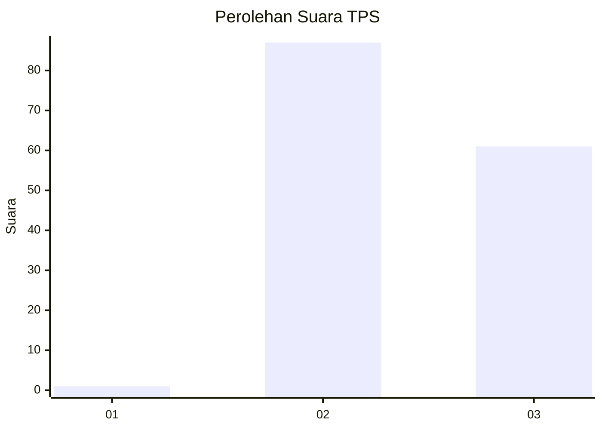
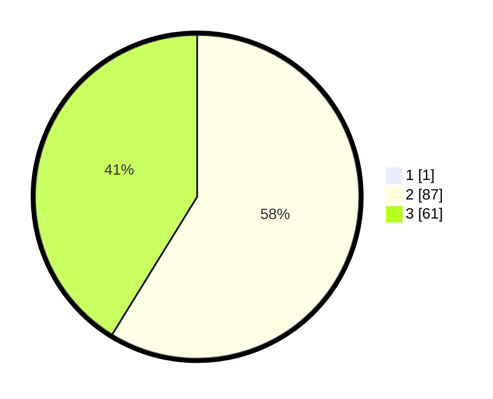

# Hasil

## Grafik

## Tabel

| No. | Nama Paslon    | Suara | Suara (raw) | Persentase |
|:--- |:-------------- | -----:| -----------:| ----------:|
| 1   | ANIES MUHAIMIN | 1     | [1][p-1]    | 0,67       |
| 2   | PRABOWO GIBRAN | 87    | [87][p-2]   | 58,39      |
| 3   | GANJAR MAHFUD  | 61    | [61][p-3]   | 40,94      |

[p-1]: https://github.com/gigit-pemilu/pemilu-2024-51-bali/blob/main/pilpres/hitung-suara/sub/51-bali/sub/07-karangasem/sub/08-kubu/sub/2005-tianyar-barat/sub/003-tps/sub/paslon-1.txt
[p-2]: https://github.com/gigit-pemilu/pemilu-2024-51-bali/blob/main/pilpres/hitung-suara/sub/51-bali/sub/07-karangasem/sub/08-kubu/sub/2005-tianyar-barat/sub/003-tps/sub/paslon-2.txt
[p-3]: https://github.com/gigit-pemilu/pemilu-2024-51-bali/blob/main/pilpres/hitung-suara/sub/51-bali/sub/07-karangasem/sub/08-kubu/sub/2005-tianyar-barat/sub/003-tps/sub/paslon-3.txt

## Foto C Plano

https://sirekap-obj-formc.kpu.go.id/f894/pemilu/ppwp/51/07/08/20/05/5107082005003-20240214-194947--e4c69d3d-699a-4ded-a42f-431fd6c397aa.jpg

https://sirekap-obj-formc.kpu.go.id/f894/pemilu/ppwp/51/07/08/20/05/5107082005003-20240214-195007--60bebd1d-6665-48d0-abc1-b4f216ae65d2.jpg

https://sirekap-obj-formc.kpu.go.id/f894/pemilu/ppwp/51/07/08/20/05/5107082005003-20240214-195021--07a1faf8-63a9-40a8-a909-b9037aba146e.jpg

## Metadata

| Key        | Value               |
| ---------- | ------------------- |
| Time Stamp | 2024-02-15 15:00:29 |

