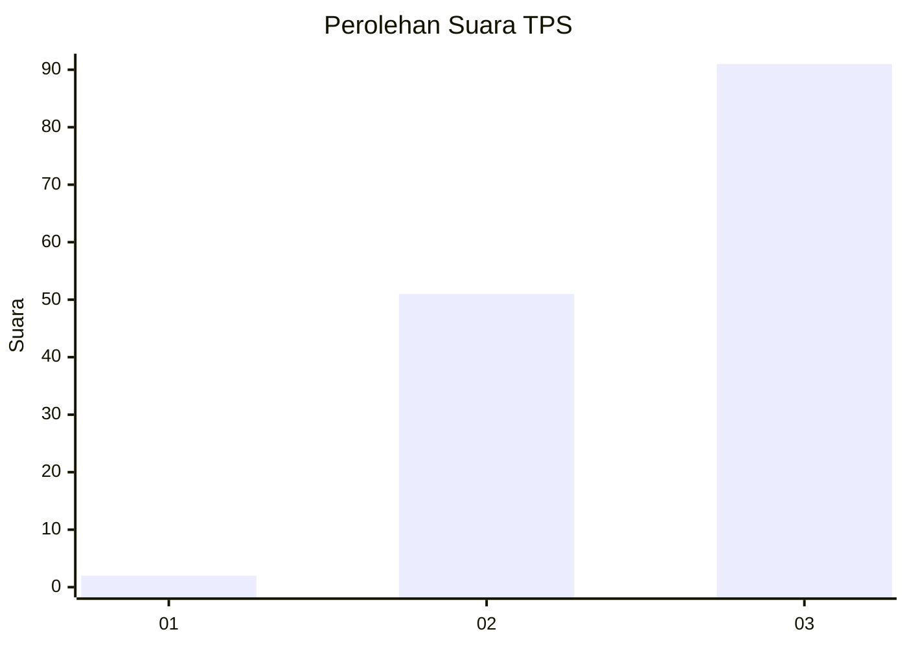
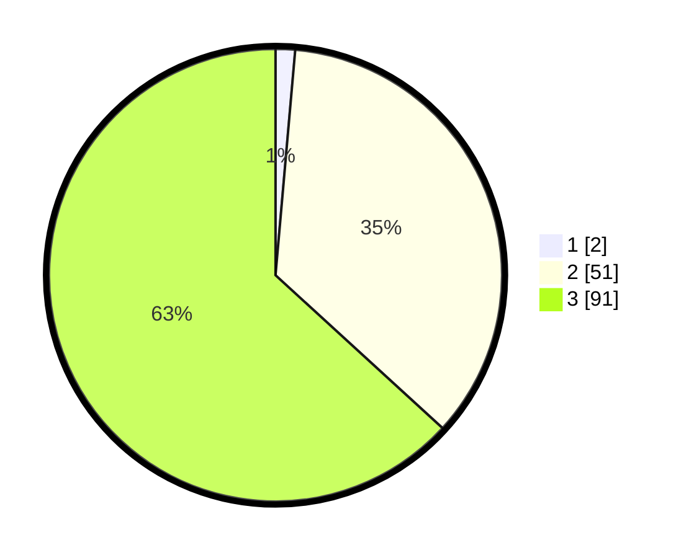

# Hasil

## Grafik

## Tabel

| No. | Nama Paslon    | Suara | Suara (raw) | Persentase |
|:--- |:-------------- | -----:| -----------:| ----------:|
| 1   | ANIES MUHAIMIN | 2     | [2][p-1]    | 1,39       |
| 2   | PRABOWO GIBRAN | 51    | [51][p-2]   | 35,42      |
| 3   | GANJAR MAHFUD  | 91    | [91][p-3]   | 63,19      |

[p-1]: https://github.com/gigit-pemilu/pemilu-2024-51-bali/blob/main/pilpres/hitung-suara/sub/51-bali/sub/07-karangasem/sub/08-kubu/sub/2005-tianyar-barat/sub/007-tps/sub/paslon-1.txt
[p-2]: https://github.com/gigit-pemilu/pemilu-2024-51-bali/blob/main/pilpres/hitung-suara/sub/51-bali/sub/07-karangasem/sub/08-kubu/sub/2005-tianyar-barat/sub/007-tps/sub/paslon-2.txt
[p-3]: https://github.com/gigit-pemilu/pemilu-2024-51-bali/blob/main/pilpres/hitung-suara/sub/51-bali/sub/07-karangasem/sub/08-kubu/sub/2005-tianyar-barat/sub/007-tps/sub/paslon-3.txt

## Foto C Plano

https://sirekap-obj-formc.kpu.go.id/6059/pemilu/ppwp/51/07/08/20/05/5107082005007-20240214-221359--8ac8b0e3-a3f9-4927-808f-486d09b25fe7.jpg

https://sirekap-obj-formc.kpu.go.id/6059/pemilu/ppwp/51/07/08/20/05/5107082005007-20240214-221741--3668af07-5e55-4c75-8d5c-8611699f2658.jpg

## Metadata

| Key        | Value               |
| ---------- | ------------------- |
| Time Stamp | 2024-02-25 19:00:00 |

