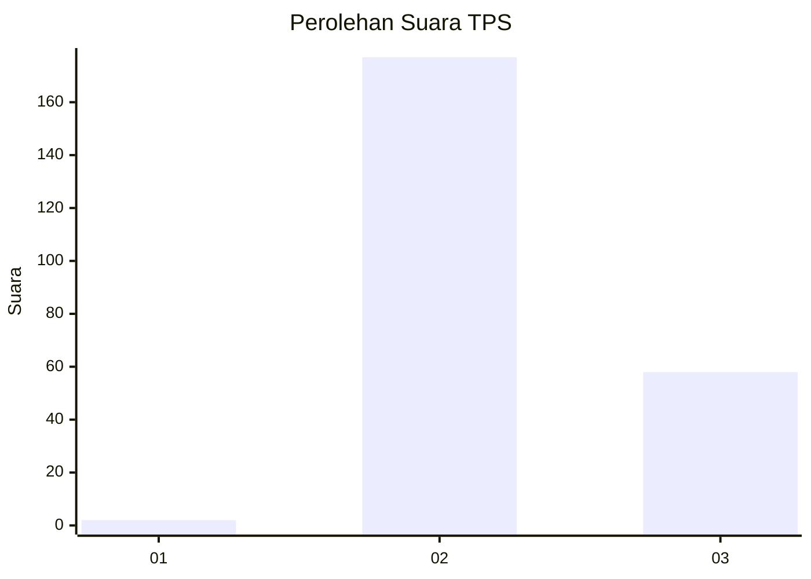
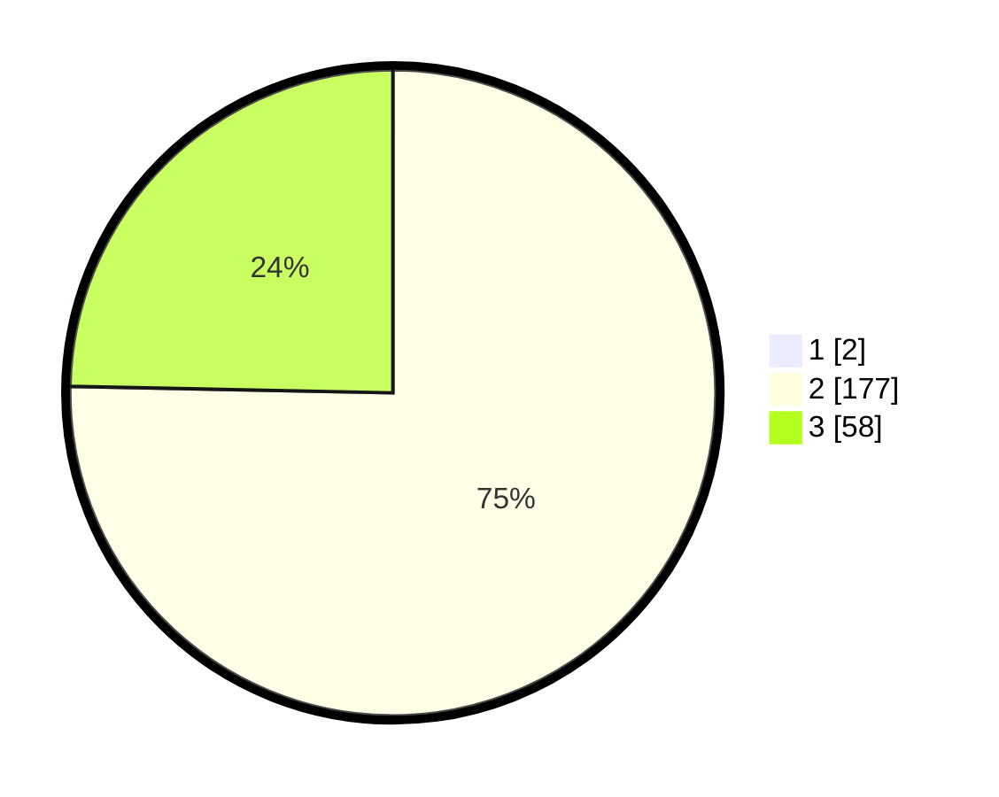

# Hasil

## Grafik

## Tabel

| No. | Nama Paslon    | Suara | Suara (raw) | Persentase |
|:--- |:-------------- | -----:| -----------:| ----------:|
| 1   | ANIES MUHAIMIN | 2     | [2][p-1]    | 0,84       |
| 2   | PRABOWO GIBRAN | 177   | [177][p-2]  | 74,68      |
| 3   | GANJAR MAHFUD  | 58    | [58][p-3]   | 24,47      |

[p-1]: https://github.com/gigit-pemilu/pemilu-2024-51-bali/blob/main/pilpres/hitung-suara/sub/51-bali/sub/07-karangasem/sub/08-kubu/sub/2005-tianyar-barat/sub/035-tps/sub/paslon-1.txt
[p-2]: https://github.com/gigit-pemilu/pemilu-2024-51-bali/blob/main/pilpres/hitung-suara/sub/51-bali/sub/07-karangasem/sub/08-kubu/sub/2005-tianyar-barat/sub/035-tps/sub/paslon-2.txt
[p-3]: https://github.com/gigit-pemilu/pemilu-2024-51-bali/blob/main/pilpres/hitung-suara/sub/51-bali/sub/07-karangasem/sub/08-kubu/sub/2005-tianyar-barat/sub/035-tps/sub/paslon-3.txt

## Foto C Plano

https://sirekap-obj-formc.kpu.go.id/e7c9/pemilu/ppwp/51/07/08/20/05/5107082005035-20240214-231726--090c36bc-4713-40c4-87d3-d66ab615cbfe.jpg

https://sirekap-obj-formc.kpu.go.id/e7c9/pemilu/ppwp/51/07/08/20/05/5107082005035-20240214-231940--104a7e6f-3cbb-480b-9ced-b95500b956f6.jpg

https://sirekap-obj-formc.kpu.go.id/e7c9/pemilu/ppwp/51/07/08/20/05/5107082005035-20240214-232055--c0c70236-1015-4b86-96cc-7cd324c9cd73.jpg

## Metadata

| Key        | Value               |
| ---------- | ------------------- |
| Time Stamp | 2024-02-15 15:00:29 |

