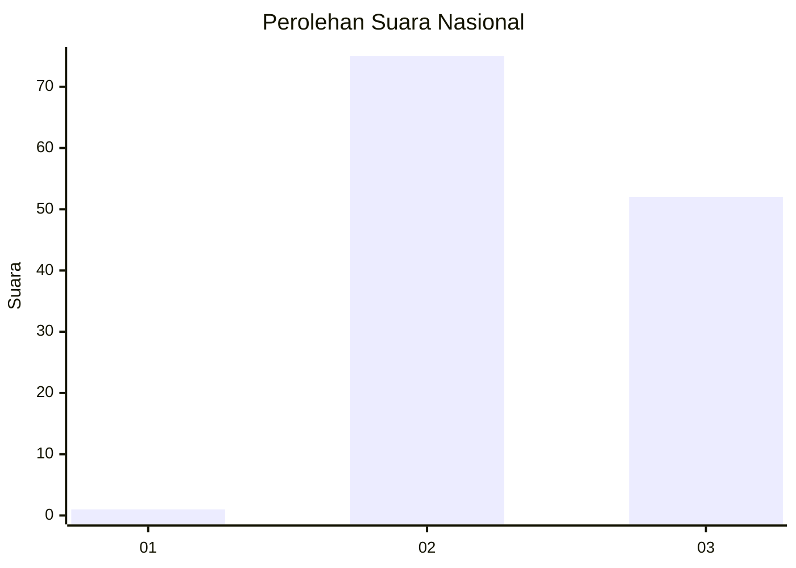
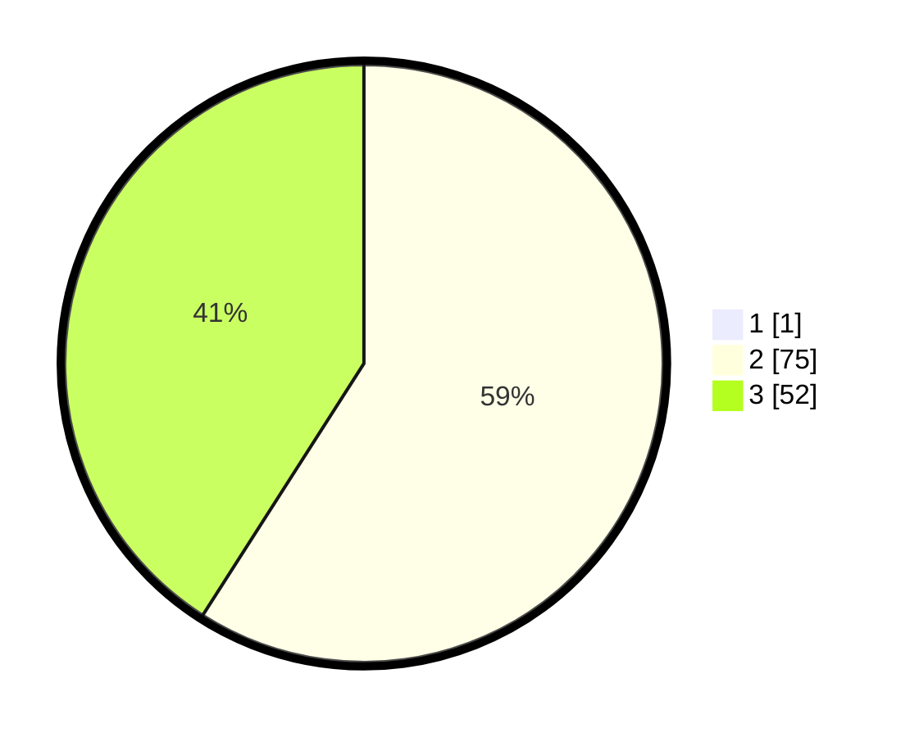

# Hasil

## Grafik

## Tabel

| No. | Nama Paslon    | Suara | Suara (raw) | Persentase |
|:--- |:-------------- | -----:| -----------:| ----------:|
| 1   | ANIES MUHAIMIN | 1     | [1][p-1]    | 0,78       |
| 2   | PRABOWO GIBRAN | 75    | [75][p-2]   | 58,59      |
| 3   | GANJAR MAHFUD  | 52    | [52][p-3]   | 40,63      |

[p-1]: https://github.com/gigit-pemilu/pemilu-2024/blob/main/pilpres/hitung-suara/sub/51-bali/sub/07-karangasem/sub/08-kubu/sub/2005-tianyar-barat/sub/042-tps/sub/paslon-1.txt
[p-2]: https://github.com/gigit-pemilu/pemilu-2024/blob/main/pilpres/hitung-suara/sub/51-bali/sub/07-karangasem/sub/08-kubu/sub/2005-tianyar-barat/sub/042-tps/sub/paslon-2.txt
[p-3]: https://github.com/gigit-pemilu/pemilu-2024/blob/main/pilpres/hitung-suara/sub/51-bali/sub/07-karangasem/sub/08-kubu/sub/2005-tianyar-barat/sub/042-tps/sub/paslon-3.txt

## Foto C Plano

https://sirekap-obj-formc.kpu.go.id/3f0e/pemilu/ppwp/51/07/08/20/05/5107082005042-20240214-130725--0cf877a7-da77-4794-8d7e-5b68e2f2bb3c.jpg

https://sirekap-obj-formc.kpu.go.id/3f0e/pemilu/ppwp/51/07/08/20/05/5107082005042-20240214-131641--0e7757d3-ce1f-4557-ae87-08a7a68af83f.jpg

https://sirekap-obj-formc.kpu.go.id/3f0e/pemilu/ppwp/51/07/08/20/05/5107082005042-20240214-131658--b4278a1c-82b0-4fa2-984c-5f2b0ee0016a.jpg

## Metadata

| Key        | Value               |
| ---------- | ------------------- |
| Time Stamp | 2024-02-17 16:00:02 |

## DATA PEMILIH TETAP

Jumlah pemilih dalam DPT: **296**.
 * L: **96**.
 * P: **200**.

## DATA PENGGUNA HAK PILIH

Jumlah pengguna hak pilih dalam DPT: **228**.
 * L: **67**.
 * P: **63**.

Jumlah pengguna hak pilih dalam DPTb: **8**.
 * L: **0**.
 * P: **0**.

Jumlah pengguna hak pilih dalam DPK: **0**.
 * L: **0**.
 * P: **0**.

Jumlah pengguna hak pilih: **128**.
 * L: **67**.
 * P: **62**.

## JUMLAH SUARA SAH DAN TIDAK SAH

JUMLAH SELURUH SUARA SAH: **128**.

JUMLAH SUARA TIDAK SAH: **0**.

JUMLAH SELURUH SUARA SAH DAN SUARA TIDAK SAH: **128**.

