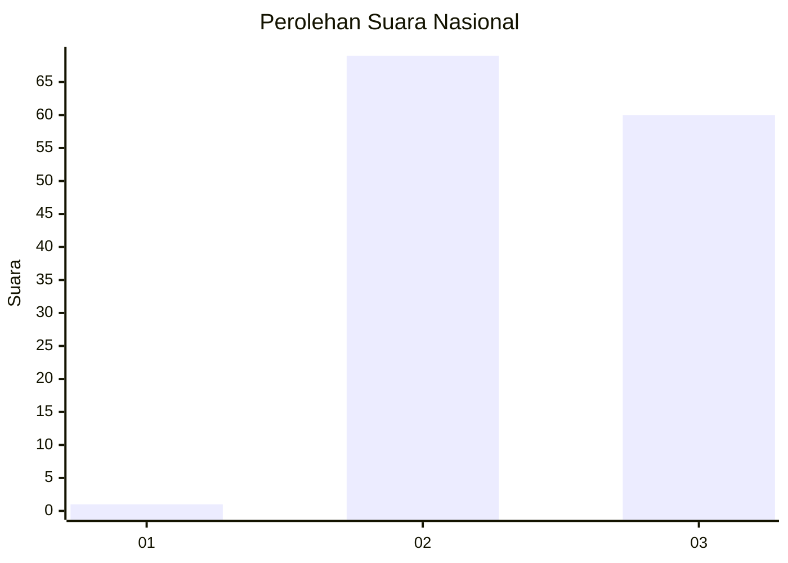
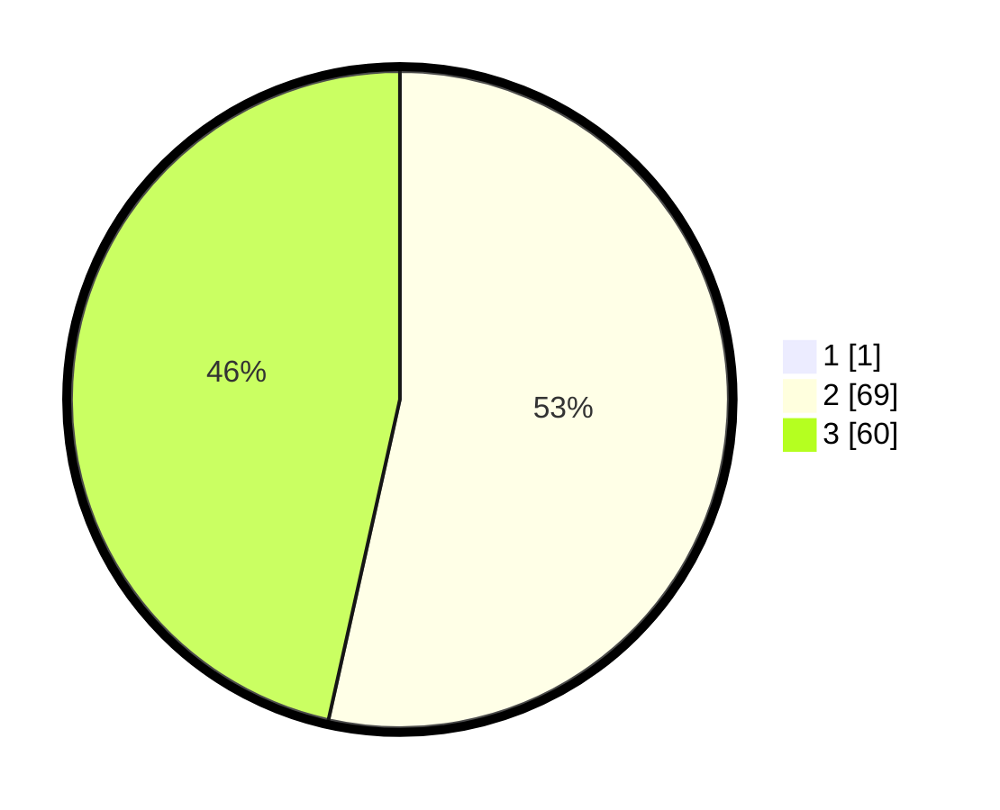

# Hasil

## Grafik

## Tabel

| No. | Nama Paslon    | Suara | Suara (raw) | Persentase |
|:--- |:-------------- | -----:| -----------:| ----------:|
| 1   | ANIES MUHAIMIN | 1     | [1][p-1]    | 0,77       |
| 2   | PRABOWO GIBRAN | 69    | [69][p-2]   | 53,08      |
| 3   | GANJAR MAHFUD  | 60    | [60][p-3]   | 46,15      |

[p-1]: https://github.com/gigit-pemilu/pemilu-2024/blob/main/pilpres/hitung-suara/sub/51-bali/sub/07-karangasem/sub/08-kubu/sub/2005-tianyar-barat/sub/044-tps/sub/paslon-1.txt
[p-2]: https://github.com/gigit-pemilu/pemilu-2024/blob/main/pilpres/hitung-suara/sub/51-bali/sub/07-karangasem/sub/08-kubu/sub/2005-tianyar-barat/sub/044-tps/sub/paslon-2.txt
[p-3]: https://github.com/gigit-pemilu/pemilu-2024/blob/main/pilpres/hitung-suara/sub/51-bali/sub/07-karangasem/sub/08-kubu/sub/2005-tianyar-barat/sub/044-tps/sub/paslon-3.txt

## Foto C Plano

https://sirekap-obj-formc.kpu.go.id/acd2/pemilu/ppwp/51/07/08/20/05/5107082005044-20240214-131531--44bfb424-af53-4534-9f36-34a36bbea14b.jpg

https://sirekap-obj-formc.kpu.go.id/acd2/pemilu/ppwp/51/07/08/20/05/5107082005044-20240214-130935--dcafea3a-527f-4a72-9d38-6311c9d9d737.jpg

https://sirekap-obj-formc.kpu.go.id/acd2/pemilu/ppwp/51/07/08/20/05/5107082005044-20240214-132228--ac5fd53e-2903-4841-8c93-1f8d078b0ba6.jpg

## Metadata

| Key        | Value               |
| ---------- | ------------------- |
| Time Stamp | 2024-02-24 22:31:28 |

