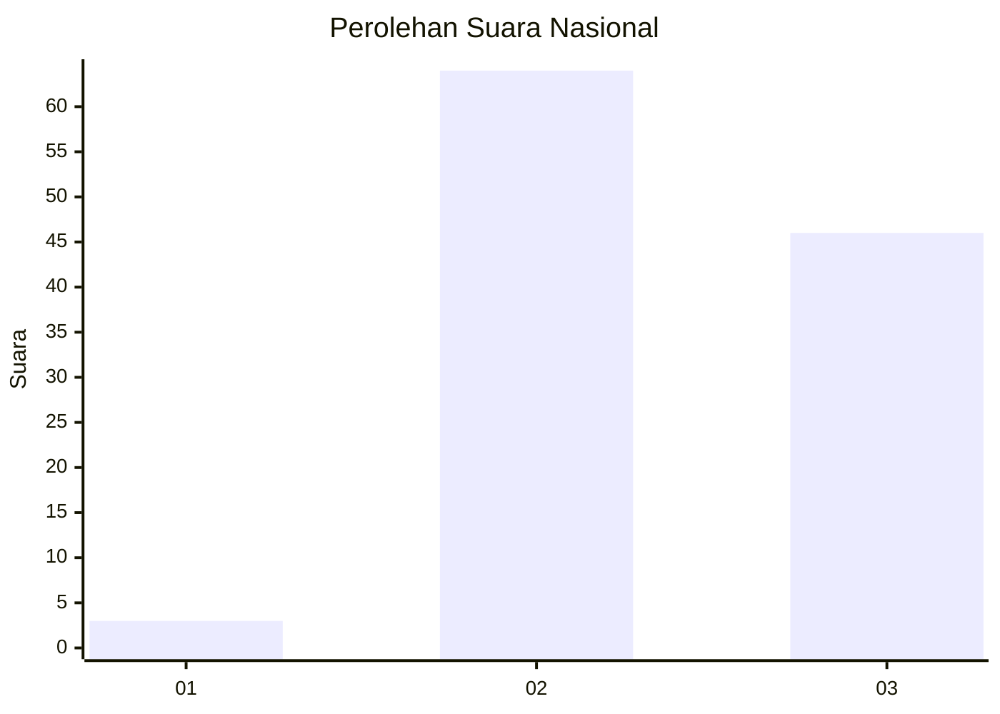
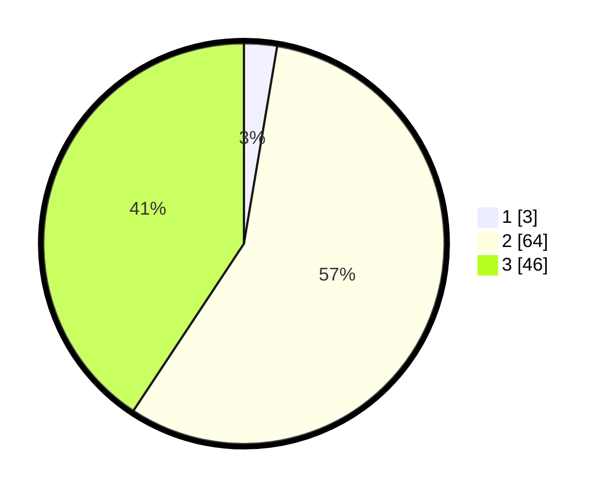

# Hasil

## Grafik

## Tabel

| No. | Nama Paslon    | Suara | Suara (raw) | Persentase |
|:--- |:-------------- | -----:| -----------:| ----------:|
| 1   | ANIES MUHAIMIN | 3     | [3][p-1]    | 2,65       |
| 2   | PRABOWO GIBRAN | 64    | [64][p-2]   | 56,64      |
| 3   | GANJAR MAHFUD  | 46    | [46][p-3]   | 40,71      |

[p-1]: https://github.com/gigit-pemilu/pemilu-2024/blob/main/pilpres/hitung-suara/sub/51-bali/sub/07-karangasem/sub/08-kubu/sub/2005-tianyar-barat/sub/047-tps/sub/paslon-1.txt
[p-2]: https://github.com/gigit-pemilu/pemilu-2024/blob/main/pilpres/hitung-suara/sub/51-bali/sub/07-karangasem/sub/08-kubu/sub/2005-tianyar-barat/sub/047-tps/sub/paslon-2.txt
[p-3]: https://github.com/gigit-pemilu/pemilu-2024/blob/main/pilpres/hitung-suara/sub/51-bali/sub/07-karangasem/sub/08-kubu/sub/2005-tianyar-barat/sub/047-tps/sub/paslon-3.txt

## Foto C Plano

https://sirekap-obj-formc.kpu.go.id/c925/pemilu/ppwp/51/07/08/20/05/5107082005047-20240214-141725--8c38c92c-852f-4c55-b6b5-96a0b1986e15.jpg

https://sirekap-obj-formc.kpu.go.id/c925/pemilu/ppwp/51/07/08/20/05/5107082005047-20240214-132216--64b0edf8-2eda-46b4-b7ff-bae928266712.jpg

https://sirekap-obj-formc.kpu.go.id/c925/pemilu/ppwp/51/07/08/20/05/5107082005047-20240214-141608--ab840645-c91f-4a71-acf2-350557d5a253.jpg

## Metadata

| Key        | Value               |
| ---------- | ------------------- |
| Time Stamp | 2024-02-17 16:00:02 |

