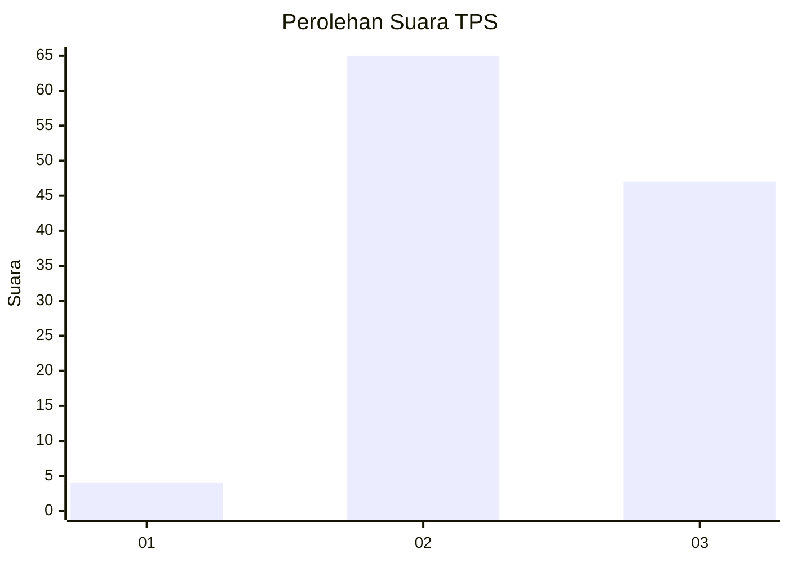
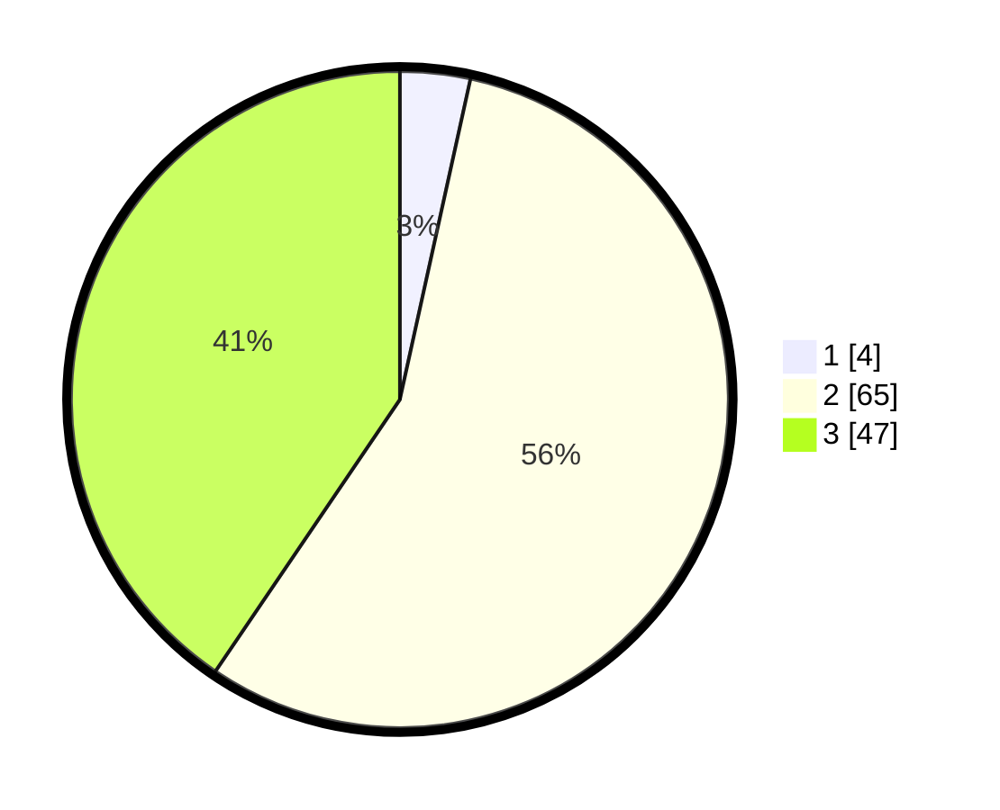

# Hasil

## Grafik

## Tabel

| No. | Nama Paslon    | Suara | Suara (raw) | Persentase |
|:--- |:-------------- | -----:| -----------:| ----------:|
| 1   | ANIES MUHAIMIN | 4     | [4][p-1]    | 3,45       |
| 2   | PRABOWO GIBRAN | 65    | [65][p-2]   | 56,03      |
| 3   | GANJAR MAHFUD  | 47    | [47][p-3]   | 40,52      |

[p-1]: https://github.com/gigit-pemilu/pemilu-2024-51-bali/blob/main/pilpres/hitung-suara/sub/51-bali/sub/07-karangasem/sub/08-kubu/sub/2006-tianyar-tengah/sub/023-tps/sub/paslon-1.txt
[p-2]: https://github.com/gigit-pemilu/pemilu-2024-51-bali/blob/main/pilpres/hitung-suara/sub/51-bali/sub/07-karangasem/sub/08-kubu/sub/2006-tianyar-tengah/sub/023-tps/sub/paslon-2.txt
[p-3]: https://github.com/gigit-pemilu/pemilu-2024-51-bali/blob/main/pilpres/hitung-suara/sub/51-bali/sub/07-karangasem/sub/08-kubu/sub/2006-tianyar-tengah/sub/023-tps/sub/paslon-3.txt

## Foto C Plano

https://sirekap-obj-formc.kpu.go.id/5e93/pemilu/ppwp/51/07/08/20/06/5107082006023-20240214-223244--790918c0-385c-4cba-ab32-0a63d67573be.jpg

https://sirekap-obj-formc.kpu.go.id/5e93/pemilu/ppwp/51/07/08/20/06/5107082006023-20240214-223340--aca56549-da86-405f-b835-fa9fbbde1eb2.jpg

https://sirekap-obj-formc.kpu.go.id/5e93/pemilu/ppwp/51/07/08/20/06/5107082006023-20240214-223450--eb749bb5-c127-4992-bea2-aa2c1ae475aa.jpg

## Metadata

| Key        | Value               |
| ---------- | ------------------- |
| Time Stamp | 2024-02-15 15:00:29 |

