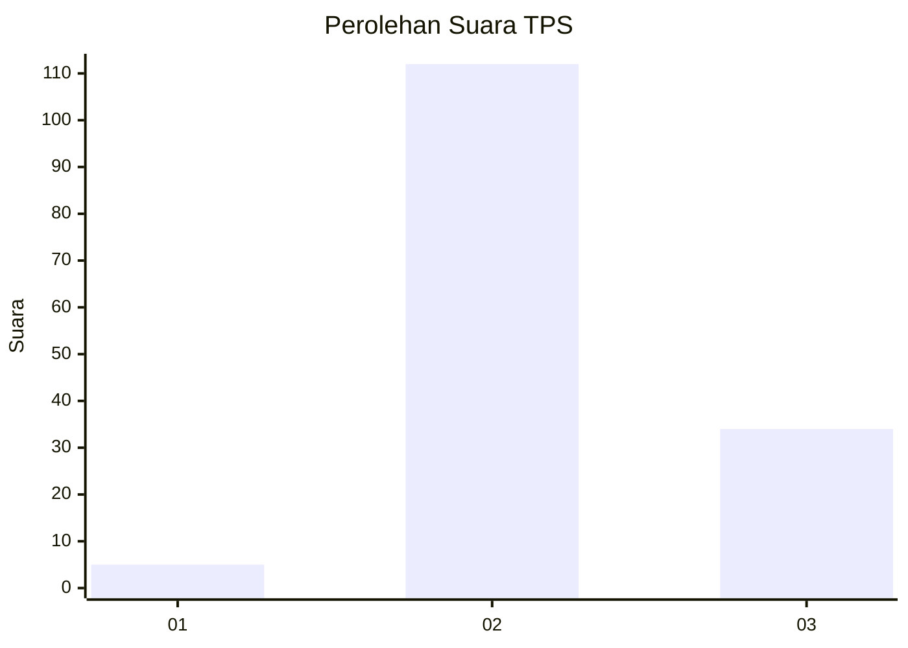
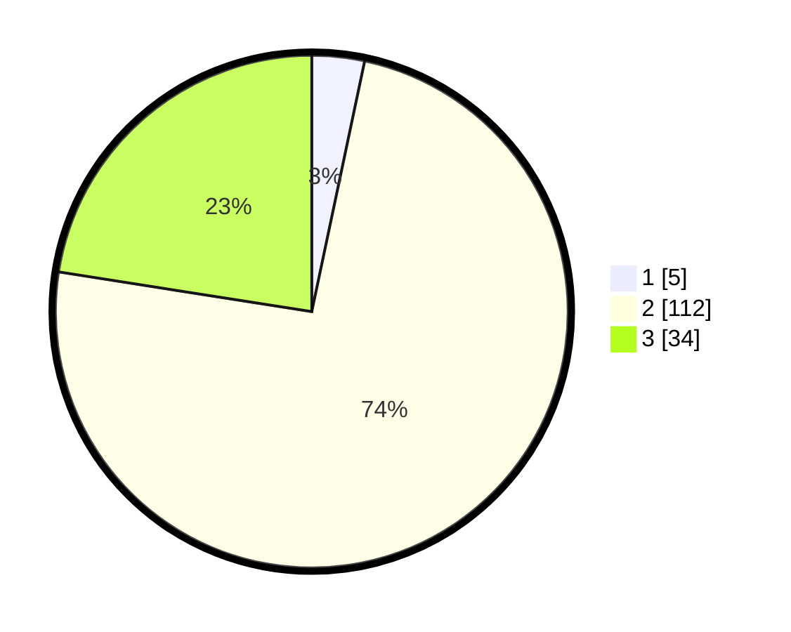

# Hasil

## Grafik

## Tabel

| No. | Nama Paslon    | Suara | Suara (raw) | Persentase |
|:--- |:-------------- | -----:| -----------:| ----------:|
| 1   | ANIES MUHAIMIN | 5     | [5][p-1]    | 3,31       |
| 2   | PRABOWO GIBRAN | 112   | [112][p-2]  | 74,17      |
| 3   | GANJAR MAHFUD  | 34    | [34][p-3]   | 22,52      |

[p-1]: https://github.com/gigit-pemilu/pemilu-2024-51-bali/blob/main/pilpres/hitung-suara/sub/51-bali/sub/07-karangasem/sub/08-kubu/sub/2006-tianyar-tengah/sub/026-tps/sub/paslon-1.txt
[p-2]: https://github.com/gigit-pemilu/pemilu-2024-51-bali/blob/main/pilpres/hitung-suara/sub/51-bali/sub/07-karangasem/sub/08-kubu/sub/2006-tianyar-tengah/sub/026-tps/sub/paslon-2.txt
[p-3]: https://github.com/gigit-pemilu/pemilu-2024-51-bali/blob/main/pilpres/hitung-suara/sub/51-bali/sub/07-karangasem/sub/08-kubu/sub/2006-tianyar-tengah/sub/026-tps/sub/paslon-3.txt

## Foto C Plano

https://sirekap-obj-formc.kpu.go.id/8cc4/pemilu/ppwp/51/07/08/20/06/5107082006026-20240214-132945--462a4658-6ef3-4c88-ab04-cfc2115b81de.jpg

https://sirekap-obj-formc.kpu.go.id/8cc4/pemilu/ppwp/51/07/08/20/06/5107082006026-20240214-132615--9440eb64-036a-4734-8920-1aef7397134e.jpg

https://sirekap-obj-formc.kpu.go.id/8cc4/pemilu/ppwp/51/07/08/20/06/5107082006026-20240214-132721--4fb0aa38-863b-41ca-97d2-c4fef5cf6182.jpg

## Metadata

| Key        | Value               |
| ---------- | ------------------- |
| Time Stamp | 2024-02-15 15:00:29 |

