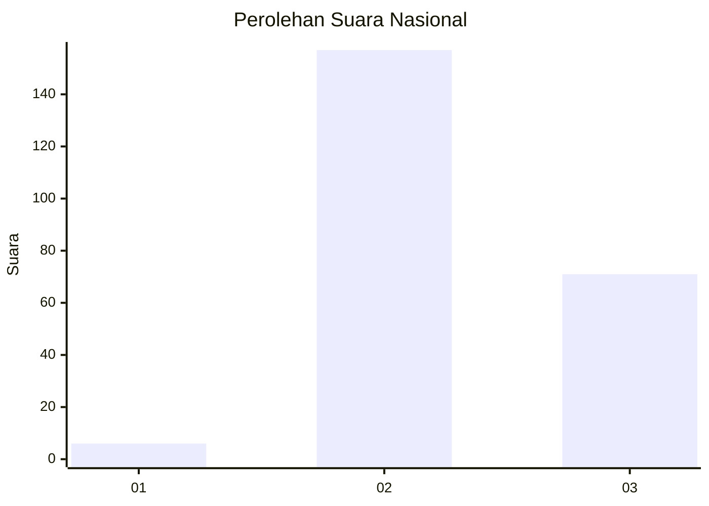

# Hasil

## Grafik

## Tabel

| No. | Nama Paslon    | Suara | Suara (raw) | Persentase |
|:--- |:-------------- | -----:| -----------:| ----------:|
| 1   | ANIES MUHAIMIN | 6     | [6][p-1]    | 2,56       |
| 2   | PRABOWO GIBRAN | 157   | [157][p-2]  | 67,09      |
| 3   | GANJAR MAHFUD  | 71    | [71][p-3]   | 30,34      |

[p-1]: https://github.com/gigit-pemilu/pemilu-2024/blob/main/pilpres/hitung-suara/sub/51-bali/sub/07-karangasem/sub/08-kubu/sub/2007-tulamben/sub/001-tps/sub/paslon-1.txt
[p-2]: https://github.com/gigit-pemilu/pemilu-2024/blob/main/pilpres/hitung-suara/sub/51-bali/sub/07-karangasem/sub/08-kubu/sub/2007-tulamben/sub/001-tps/sub/paslon-2.txt
[p-3]: https://github.com/gigit-pemilu/pemilu-2024/blob/main/pilpres/hitung-suara/sub/51-bali/sub/07-karangasem/sub/08-kubu/sub/2007-tulamben/sub/001-tps/sub/paslon-3.txt

## Foto C Plano

https://sirekap-obj-formc.kpu.go.id/3986/pemilu/ppwp/51/07/08/20/07/5107082007001-20240214-141350--78ff6aee-41ab-40d1-b0bd-529644eb7ad7.jpg

https://sirekap-obj-formc.kpu.go.id/3986/pemilu/ppwp/51/07/08/20/07/5107082007001-20240214-141509--d20f79ed-ea22-47bd-9e9a-e8366c956b2b.jpg

https://sirekap-obj-formc.kpu.go.id/3986/pemilu/ppwp/51/07/08/20/07/5107082007001-20240214-141654--f0c18abb-f699-49c9-ab9e-fab95075efce.jpg

## Metadata

| Key        | Value               |
| ---------- | ------------------- |
| Time Stamp | 2024-02-15 15:00:29 |

